# IO流

### 1.字符集概述

​		在学习IO流之前，我们要了解一下字符集。字符集是为了让计算机能够处理字符，就把每一个字符进行编码，一个字符对应一个二进制数据。

​		其中ASCLL码表中，英文和数字为1个字节。中国人为了能方便使用计算机，也编写了GBK字符集，其中的英文字母还是一个1字节，汉字用两个字节来存储。

​		为了解决各个国家字符集互不兼容的问题，由国际化标准组织牵头，设计了一套全世界通用的字符集，叫做Unicode字符集。在Unicode字符集中包含了世界上所有国家的文字，一个字符采用4个字节存储。

​		在Unicode字符集中，采用一个字符4个字节的编码方案，又造成另一个问题：如果是说英语的国家，他们只需要用到26大小写字母，加上一些标点符号就够了，本身一个字节就可以表示完，用4个字节就有点浪费。于是又对Unicode字符集中的字符进行了重新编码，一共设计了三种编码方案。分别是UTF-32、UTF-16、UTF-8;  **其中比较常用的编码方案是UTF-8。**UTF-8中的英文字母、数字占1个字节，汉字字符占3个字节。

##### 	1.1编码和解码

​		什么是编码和解码？其实String类类中就提供了相应的方法，可以完成编码和解码的操作。总结如下：

- 编码：把字符串按照指定的字符集转换为字节数组

- 解码：把字节数组按照指定的字符集转换为字符串

  ```java
  /**
   * 目标：掌握如何使用Java代码完成对字符的编码和解码。
   */
  public class Test {
      public static void main(String[] args) throws Exception {
          // 1、编码
          String data = "a我b";
          byte[] bytes = data.getBytes(); // 默认是按照平台字符集（UTF-8）进行编码的。
          System.out.println(Arrays.toString(bytes));
  
          // 按照指定字符集进行编码。
          byte[] bytes1 = data.getBytes("GBK");
          System.out.println(Arrays.toString(bytes1));
  
          // 2、解码
          String s1 = new String(bytes); // 按照平台默认编码（UTF-8）解码
          System.out.println(s1);
  
          String s2 = new String(bytes1, "GBK");
          System.out.println(s2);
      }
  }
  ```

  

### 2. IO流概述

​		什么是IO流？IO流的作用：就是可以对文件或者网络中的数据进行读、写的操作。如下图所示

- 把数据从磁盘、网络中读取到程序中来，用到的是输入流。
- 把程序中的数据写入磁盘、网络中，用到的是输出流。
- **简单记：输入流（读数据）、输出流（写数据）**

​		IO流的分类，按流的方向分为：输入流和输出流。按字节和字符的话，分为：

​				1.字节流：字节流又分为字节输入流、字节输出流
​				2.字符流：字符流由分为字符输入流、字符输出流

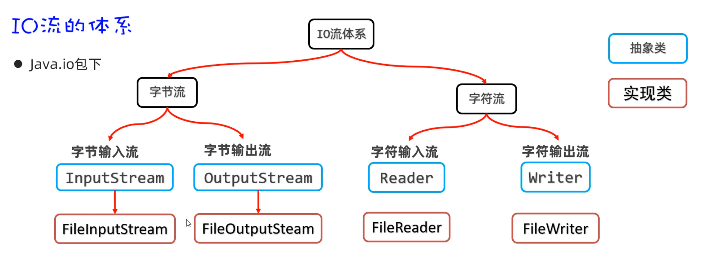

##### 2.1FileInputStream字节输入流

​		什么是FileInputStream字节输入流？，一般用InputStream来表示。但是InputStream是抽象类，我们用的是它的子类，叫FileInputStream，这个类**可以把磁盘文件中的数据以字节的形式读取到内存中。**有如下构造方法和成员方法：

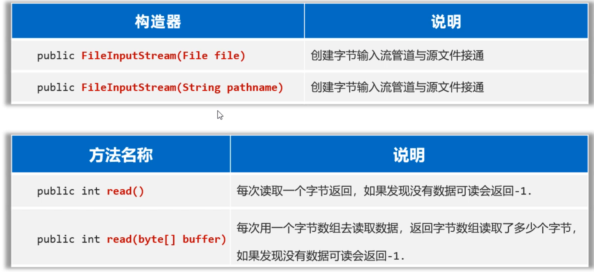

​		使用FileInputStream读取文件中的字节数据，步骤如下：

+ 第一步：创建FileInputStream文件字节输入流管道，与源文件接通。
+ 第二步：调用read()方法开始读取文件的字节数据。
+ 第三步：调用close()方法释放资源。

这里有一个问题，由于一个中文在UTF-8编码方案中是占3个字节，采用一次读取一个字节的方式，读一个字节就相当于读了1/3个汉字，此时将这个字节转换为字符，是会有乱码的。 

所以为了避免读取数据出现乱码，我们可以调用（byte[]  byte）方法一次读取多个字节，步骤如下：

+ 第一步：创建FileInputStream文件字节输入流管道，与源文件接通。
+ 第二步：调用read(byte[] bytes)方法开始读取文件的字节数据。
+ 第三步：调用close()方法释放资源。

```java
/**
 * 目标：掌握使用FileInputStream每次读取多个字节。
 */
public class FileInputStreamTest2 {
    public static void main(String[] args) throws Exception {
        // 1、创建一个字节输入流对象代表字节输入流管道与源文件接通。
        InputStream is = new FileInputStream("file-io-app\\src\\itheima02.txt");

        // 2、开始读取文件中的字节数据：每次读取多个字节。
        //  public int read(byte b[]) throws IOException
        //  每次读取多个字节到字节数组中去，返回读取的字节数量，读取完毕会返回-1.

        // 3、使用循环改造。
        byte[] buffer = new byte[3];
        int len; // 记住每次读取了多少个字节。  abc 66
        while ((len = is.read(buffer)) != -1){
            // 注意：读取多少，倒出多少。
            String rs = new String(buffer, 0 , len);
            System.out.print(rs);
        }
        // 性能得到了明显的提升！！
        // 这种方案也不能避免读取汉字输出乱码的问题！！

        is.close(); // 关闭流
    }
}
```

##### 2.2FileInputStream读取全部字节

​		即使是一次读取多个字节，仍然有可能会出现乱码，那么怎么解决呢？如果我们可以一次性读取文件中的全部字节，然后把全部字节转换为一个字符串，就不会有乱码了。

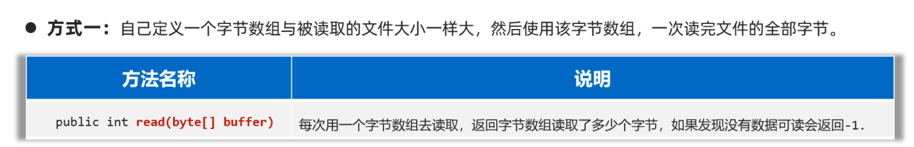

```java
// 1、一次性读取完文件的全部字节到一个字节数组中去。
// 创建一个字节输入流管道与源文件接通
InputStream is = new FileInputStream("file-io-app\\src\\itheima03.txt");

// 2、准备一个字节数组，大小与文件的大小正好一样大。
File f = new File("file-io-app\\src\\itheima03.txt");
//获取到文件的字节长度size
long size = f.length();
//定义一个和文件字节长度一样的数组，一次性读取这个数组，就不会出现乱码了
byte[] buffer = new byte[(int) size];

int len = is.read(buffer);
System.out.println(new String(buffer));

//3、关闭流
is.close(); 
```

##### 2.3FileOutputStream存数据

​		使用FileOutputStream往文件中写数据的步骤如下：

```java
第一步：创建FileOutputStream文件字节输出流管道，与目标文件接通。
第二步：调用wirte()方法往文件中写数据
第三步：调用close()方法释放资源
```

```java
/**
 * 目标：掌握文件字节输出流FileOutputStream的使用。
 */
public class FileOutputStreamTest4 {
    public static void main(String[] args) throws Exception {
        // 1、创建一个字节输出流管道与目标文件接通。
        // 覆盖管道：覆盖之前的数据
//        OutputStream os =
//                new FileOutputStream("file-io-app/src/itheima04out.txt");

        // 追加数据的管道
        OutputStream os =
                new FileOutputStream("file-io-app/src/itheima04out.txt", true);

        // 2、开始写字节数据出去了
        os.write(97); // 97就是一个字节，代表a
        os.write('b'); // 'b'也是一个字节
        // os.write('中'); // [ooo] 默认只能写出去一个字节

        byte[] bytes = "我爱你中国abc".getBytes();
        os.write(bytes);

        os.write(bytes, 0, 15);

        // 换行符
        os.write("\r\n".getBytes());

        os.close(); // 关闭流
    }
}
```

##### 2.4字节流复制文件

​		配合字节输入流和字节输出流就可以复制文件了，

```java
/**
 * 目标：使用字节流完成对文件的复制操作。
 */
public class CopyTest5 {
    public static void main(String[] args) throws Exception {
        // 需求：复制照片。
        // 1、创建一个字节输入流管道与源文件接通
        InputStream is = new FileInputStream("D:/resource/meinv.png");
        // 2、创建一个字节输出流管道与目标文件接通。
        OutputStream os = new FileOutputStream("C:/data/meinv.png");

        System.out.println(10 / 0);
        // 3、创建一个字节数组，负责转移字节数据。
        byte[] buffer = new byte[1024]; // 1KB.
        // 4、从字节输入流中读取字节数据，写出去到字节输出流中。读多少写出去多少。
        int len; // 记住每次读取了多少个字节。
        while ((len = is.read(buffer)) != -1){
            os.write(buffer, 0, len);
        }

        os.close();
        is.close();
        System.out.println("复制完成！！");
    }
}
```

##### 2.5 IO流资源释放

​		Java在JDK7版本之前，一般使用try...catch...finally语句来处理异常，并在finall语句中释放资源(因为不管异常是否发生，finall里的代码都会执行)。Java在JDK7版本为我们提供了一种简化的是否资源的操作，它会自动释放资源。格式如下：

```java
try(资源对象1; 资源对象2;){
    使用资源的代码
}catch(异常类 e){
    处理异常的代码
}
//只需要将需要释放资源对象放在try后面的小括号内，它会自动释放资源
```

```java
/**
 * 目标：掌握释放资源的方式：try-with-resource
 */
public class Test3 {
    public static void main(String[] args)  {
    	try (
          // 1、创建一个字节输入流管道与源文件接通
          InputStream is = new FileInputStream("D:/resource/meinv.png");
          // 2、创建一个字节输出流管道与目标文件接通。
          OutputStream os = new FileOutputStream("C:/data/meinv.png");
        ){
            // 3、创建一个字节数组，负责转移字节数据。
            byte[] buffer = new byte[1024]; // 1KB.
            // 4、从字节输入流中读取字节数据，写出去到字节输出流中。读多少写出去多少。
            int len; // 记住每次读取了多少个字节。
            while ((len = is.read(buffer)) != -1){
                os.write(buffer, 0, len);
            }
            System.out.println(conn);
            System.out.println("复制完成！！");

        } catch (Exception e) {
            e.printStackTrace();
        }
    }
}
```

### 3.字符流

##### 3.1FileReader类

​		什么是FileReader类？这是字符输入流，用来将文件中的字符数据读取到程序中来。

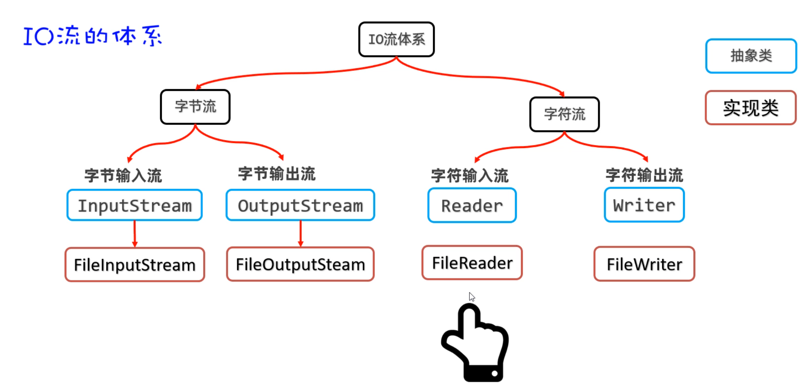

​		FileReader读取文件的步骤如下：

```java
第一步：创建FileReader对象与要读取的源文件接通
第二步：调用read()方法读取文件中的字符
第三步：调用close()方法关闭流
```

​		下面是简单示例：

```java
/**
 * 目标：掌握文件字符输入流。
 */
public class FileReaderTest1 {
    public static void main(String[] args)  {
        try (
                // 1、创建一个文件字符输入流管道与源文件接通
                Reader fr = new FileReader("io-app2\\src\\itheima01.txt");
                ){
            // 2、一个字符一个字符的读（性能较差）
//            int c; // 记住每次读取的字符编号。
//            while ((c = fr.read()) != -1){
//                System.out.print((char) c);
//            }
            // 每次读取一个字符的形式，性能肯定是比较差的。

            // 3、每次读取多个字符。（性能是比较不错的！）
            char[] buffer = new char[3];
            int len; // 记住每次读取了多少个字符。
            while ((len = fr.read(buffer)) != -1){
                // 读取多少倒出多少
                System.out.print(new String(buffer, 0, len));
            }
        } catch (Exception e) {
            e.printStackTrace();
        }
    }
}
```

##### 3.2FileWriter类

​		什么是FileWriter类？它于FileReader相对应，它可以将文件中的字符数据读取到程序中来，FileWriter往文件中写字符数据的步骤如下：

```java
第一步：创建FileWirter对象与要读取的目标文件接通
第二步：调用write(字符数据/字符数组/字符串)方法读取文件中的字符
第三步：调用close()方法关闭流
```

​		所需要用到的构造器有如下图，都是用来创建对象以便于调用write方法写数据到文件的：

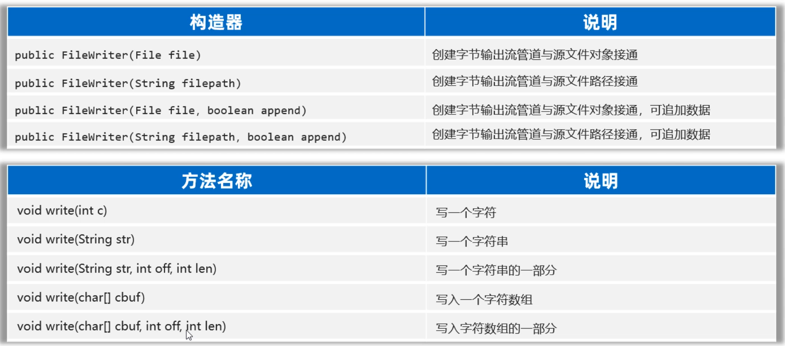

​		用一个简单示例来演示一下：

​	

```java
/**
 * 目标：掌握文件字符输出流：写字符数据出去
 */
public class FileWriterTest2 {
    public static void main(String[] args) {
        try (
                // 0、创建一个文件字符输出流管道与目标文件接通。
                // 覆盖管道
                // Writer fw = new FileWriter("io-app2/src/itheima02out.txt");
                // 追加数据的管道
                Writer fw = new FileWriter("io-app2/src/itheima02out.txt", true);
                ){
            // 1、public void write(int c):写一个字符出去
            fw.write('a');
            fw.write(97);
            //fw.write('磊'); // 写一个字符出去
            fw.write("\r\n"); // 换行

            // 2、public void write(String c)写一个字符串出去
            fw.write("我爱你中国abc");
            fw.write("\r\n");

            // 3、public void write(String c ,int pos ,int len):写字符串的一部分出去
            fw.write("我爱你中国abc", 0, 5);
            fw.write("\r\n");

            // 4、public void write(char[] buffer):写一个字符数组出去
            char[] buffer = {'黑', '马', 'a', 'b', 'c'};
            fw.write(buffer);
            fw.write("\r\n");

            // 5、public void write(char[] buffer ,int pos ,int len):写字符数组的一部分出去
            fw.write(buffer, 0, 2);
            fw.write("\r\n");
        } catch (Exception e) {
            e.printStackTrace();
        }
    }
}
```

##### 3.3FileWriter类的注意事项

​		上面介绍了FileWriter字符输出流的基本使用。但是用这个类写完数据后任然需要注意一些点。

+ **FileWriter写完数据之后，必须刷新或者关闭，写出去的数据才能生效。**

+ **加上flush()方法之后，数据就会立即到目标文件中去。调用了close()方法，数据也会立即到文件中去。因为close()方法在关闭流之前，会将内存中缓存的数据先刷新到文件，再关流。**

+ **需要注意的是，关闭流之后，就不能在对流进行操作了，否则会出异常。**

### 4.缓冲流

​		什么是缓冲流呢？缓冲流共有四种，如下图所示：

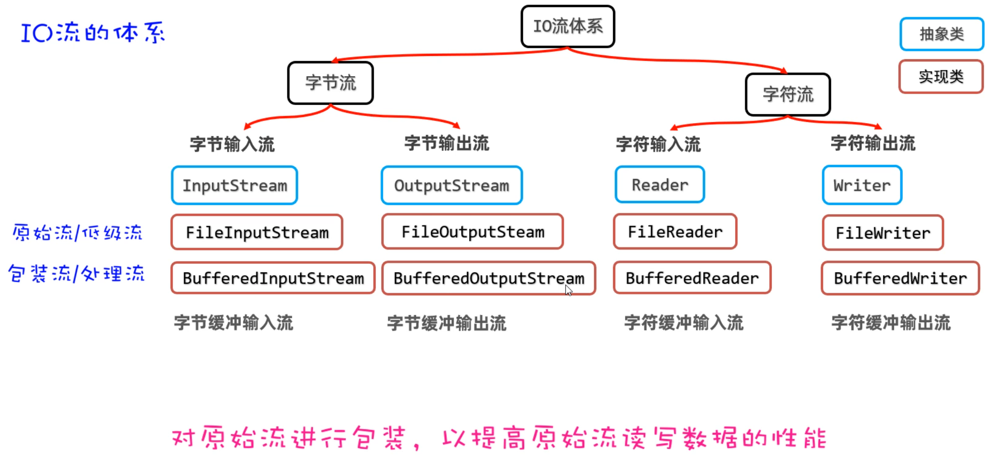

​		**缓冲流的作用**：可以对原始流进行包装，提高原始流读写数据的性能。

##### 4.1缓冲字节流

​		字节缓冲流是如何提高读写数据的性能的，原理如下图所示。是因为在缓冲流的底层自己封装了一个长度为8KB（8129byte）的字节数组，但是缓冲流不能单独使用，它需要依赖于原始流。

**读数据时：**它先用原始字节输入流一次性读取8KB的数据存入缓冲流内部的数组中（ps: 先一次多囤点货），再从8KB的字节数组中读取一个字节或者多个字节（把消耗屯的货）。

**写数据时：** 它是先把数据写到缓冲流内部的8BK的数组中（ps: 先攒一车货），等数组存满了，再通过原始的字节输出流，一次性写到目标文件中去（把囤好的货，一次性运走）。

​		创建缓冲字节流对象时，需要封装一个原始流对象进来，它的构造方法如下：

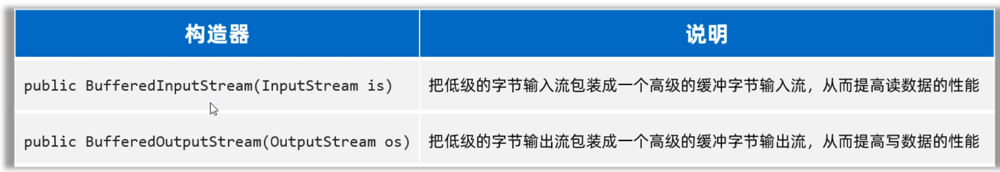

​		用缓冲流复制文件，代码写法如下：

```java
public class BufferedInputStreamTest1 {
    public static void main(String[] args) {
        try (
                InputStream is = new FileInputStream("io-app2/src/itheima01.txt");
                // 1、定义一个字节缓冲输入流包装原始的字节输入流
                InputStream bis = new BufferedInputStream(is);

                OutputStream os = new FileOutputStream("io-app2/src/itheima01_bak.txt");
                // 2、定义一个字节缓冲输出流包装原始的字节输出流
                OutputStream bos = new BufferedOutputStream(os);
        ){

            byte[] buffer = new byte[1024];
            int len;
            while ((len = bis.read(buffer)) != -1){
                bos.write(buffer, 0, len);
            }
            System.out.println("复制完成！！");

        } catch (Exception e) {
            e.printStackTrace();
        }
    }
}
```

##### 4.2字符缓冲流

​		什么是字符缓冲流呢？它的原理和字节缓冲流是类似的，它底层也会有一个8KB的数组，但是这里是字符数组。字符缓冲流也不能单独使用，需要依赖于原始字符流使用。

​		创建BufferedReader对象需要用到BufferedReader的构造方法，内部需要封装一个原始的字符输入流，我们可以传入FileReader。BufferedReader还有特有的方法，一次可以读取文本文件中的一行。


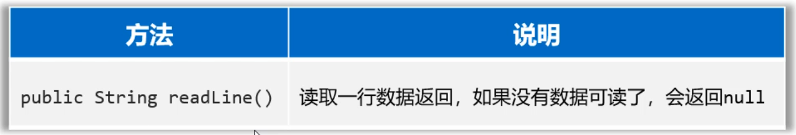

使用BufferedReader读取数据的代码如下：

```java
public class BufferedReaderTest2 {
    public static void main(String[] args)  {
        try (
                Reader fr = new FileReader("io-app2\\src\\itheima04.txt");
                // 创建一个字符缓冲输入流包装原始的字符输入流
                BufferedReader br = new BufferedReader(fr);
        ){
//            char[] buffer = new char[3];
//            int len;
//            while ((len = br.read(buffer)) != -1){
//                System.out.print(new String(buffer, 0, len));
//            }
//            System.out.println(br.readLine());
//            System.out.println(br.readLine());
//            System.out.println(br.readLine());
//            System.out.println(br.readLine());

            String line; // 记住每次读取的一行数据
            while ((line = br.readLine()) != null){
                System.out.println(line);
            }
        } catch (Exception e) {
            e.printStackTrace();
        }
    }
}
```

- **BufferedWriter写入数据时：** 它是先把数据写到字符缓冲流内部的8BK的数组中（ps: 先攒一车货），等数组存满了，再通过原始的字符输出流，一次性写到目标文件中去（把囤好的货，一次性运走）。如下图所示：

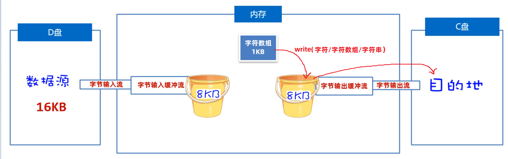

​		创建BufferedWriter对象时需要用到BufferedWriter的构造方法，而且内部需要封装一个原始的字符输出流，我们这里可以传递FileWriter。


​		而且BufferedWriter新增了一个功能，可以用来写一个换行符


简单演示一下，使用BufferedWriter往文件中写入字符数据。

```java
public class BufferedWriterTest3 {
    public static void main(String[] args) {
        try (
                Writer fw = new FileWriter("io-app2/src/itheima05out.txt", true);
                // 创建一个字符缓冲输出流管道包装原始的字符输出流
                BufferedWriter bw = new BufferedWriter(fw);
        ){

            bw.write('a');
            bw.write(97);
            bw.write('磊');
            bw.newLine();

            bw.write("我爱你中国abc");
            bw.newLine();

        } catch (Exception e) {
            e.printStackTrace();
        }
    }
}
```

##### 4.3缓冲流新能分析

​		我们说缓冲流内部多了一个数组，可以提高原始流的读写性能。讲到这一定有同学有这么一个疑问，它和我们使用原始流，自己加一个8BK数组不是一样的吗？ 缓冲流就一定能提高性能吗？先告诉同学们答案，**缓冲流不一定能提高性能**。

​		经过测试，能大致得出结论：

+ **默认情况下，采用一次复制1024个字节，缓冲流完胜。**
+ **一次读取8192个字节时，低级流和缓冲流性能相当。**
+ **数组越大性能越高，低级流和缓冲流性能相当。**

### 5.转换流

​		什么是转换流？FileReader默认只能读取UTF-8编码格式的文件。如果使用FileReader读取GBK格式的文件，可能存在乱码，因为FileReader它遇到汉字默认是按照3个字节来读取的，而GBK格式的文件一个汉字是占2个字节，这样就会导致乱码。Java给我们提供了另外两种流InputStreamReader，OutputStreamWriter，这两个流我们把它叫做转换流。它们可以将字节流转换为字符流，并且可以指定编码方案。

##### 5.1InputStreamReader类		

​		什么是InputStreamReader类？这个类名比较有意思，前面是InputStream表示字节输入流，后面是Reader表示字符输入流，合在一起意思就是表示可以把InputStream转换为Reader，最终InputStreamReader其实也是Reader的子类，所以也算是字符输入流。而且这个类也不能单独使用，它的内部需要封装一个InputStream的子类对象，再指定一个编码表，如果不指定编码表，默认会按照UTF-8形式进行转换。

​		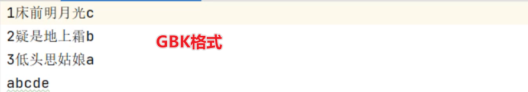

​		准备一个GBK格式地文件，用下面代码进行读取，看是否会有乱码：

```java
public class InputStreamReaderTest2 {
    public static void main(String[] args) {
        try (
                // 1、得到文件的原始字节流（GBK的字节流形式）
                InputStream is = new FileInputStream("io-app2/src/itheima06.txt");
                // 2、把原始的字节输入流按照指定的字符集编码转换成字符输入流
                Reader isr = new InputStreamReader(is, "GBK");
                // 3、把字符输入流包装成缓冲字符输入流
                BufferedReader br = new BufferedReader(isr);
                ){
            String line;
            while ((line = br.readLine()) != null){
                System.out.println(line);
            }


        } catch (Exception e) {
            e.printStackTrace();
        }
    }
}
```

##### 5.2 OutputStreamWriter类

​		什么是 OutputStreamWriter类？这个类名也比较有意思，前面是OutputStream表示字节输出流，后面是Writer表示字符输出流，合在一起意思就是表示可以把OutputStream转换为Writer，最终OutputStreamWriter其实也是Writer的子类，所以也算是字符输出流。OutputStreamReader也是不能单独使用的，它内部需要封装一个OutputStream的子类对象，再指定一个编码表，如果不指定编码表，默认会按照UTF-8形式进行转换。

​		下面是按照指定的字符集向一个文件中写入数据:

```java
public class OutputStreamWriterTest3 {
    public static void main(String[] args) {
        // 指定写出去的字符编码。
        try (
                // 1、创建一个文件字节输出流
                OutputStream os = new FileOutputStream("io-app2/src/itheima07out.txt");
                // 2、把原始的字节输出流，按照指定的字符集编码转换成字符输出转换流。
                Writer osw = new OutputStreamWriter(os, "GBK");
                // 3、把字符输出流包装成缓冲字符输出流
                BufferedWriter bw = new BufferedWriter(osw);
                ){
            bw.write("我是中国人abc");
            bw.write("我爱你中国123");

        } catch (Exception e) {
            e.printStackTrace();
        }
    }
}
```

### 6.打印流

##### 6.1打印流的基本使用

​		什么是打印流？打印流其实就是写数据的方式，它和普通的write方法写数据还不太一样，一般会使用打印流特有的方法叫`print(数据)`或者`println(数据)`，它打印啥就输出啥。打印流有两个，一个是字节打印流PrintStream，一个是字符打印流PrintWriter，如下图所示：

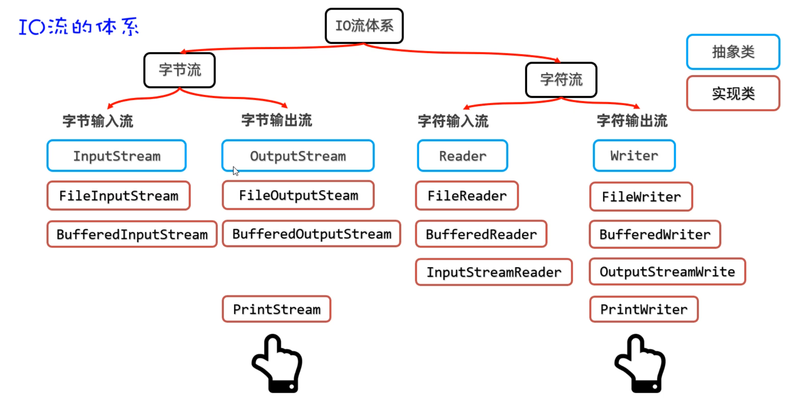

​		

​		PrintStream和PrintWriter的用法基本相同，都能想文件中输入内容，如下：

```java
public class PrintTest1 {
    public static void main(String[] args) {
        try (
                // 1、创建一个打印流管道
//                PrintStream ps =
//                        new PrintStream("io-app2/src/itheima08.txt", Charset.forName("GBK"));
//                PrintStream ps =
//                        new PrintStream("io-app2/src/itheima08.txt");
                PrintWriter ps =
                        new PrintWriter(new FileOutputStream("io-app2/src/itheima08.txt", true));
                ){
                ps.print(97);	//文件中显示的就是:97
                ps.print('a'); //文件中显示的就是:a
                ps.println("我爱你中国abc");	//文件中显示的就是:我爱你中国abc
                ps.println(true);//文件中显示的就是:true
                ps.println(99.5);//文件中显示的就是99.5

                ps.write(97); //文件中显示a，发现和前面println方法的区别了吗？

        } catch (Exception e) {
            e.printStackTrace();
        }
    }
}
```

##### 6.2重定向输出语句

​		sout为什么可以打印语句，是因为System类中有一个静态方法叫out，out的数据类型就是PrintStream，它就是一个打印流，而且这个打印流的默认输出目的地是控制台，所以我们调用`System.out.pirnln()`就可以往控制台打印输出任意类型的数据，而且打印啥就输出啥。

​		当然System还提供了一个方法，可以修改底层的打印流，这样就可以重定向打印语句的输出目的地了，如下代码所示，重定向输出语句修改打印地址到文件中：

```java
public class PrintTest2 {
    public static void main(String[] args) {
        System.out.println("老骥伏枥");
        System.out.println("志在千里");

        try ( PrintStream ps = new PrintStream("io-app2/src/itheima09.txt"); ){
            // 把系统默认的打印流对象改成自己设置的打印流
            System.setOut(ps);

            System.out.println("烈士暮年");	
            System.out.println("壮心不已");
        } catch (Exception e) {
            e.printStackTrace();
        }
    }
}
```

### 7.数据流

​		什么是数据流？开发也能偶尔遇到，比如，我们想把数据和数据的类型一并写到文件中去，读取的时候也将数据和数据类型一并读出来。这就可以用到数据流，有两个DataInputStream和DataOutputStream。

##### 7.1DataOutputStream类

​		什么是DataOutputStream类？它也是一种包装流，创建DataOutputStream对象时，底层需要依赖于一个原始的OutputStream流对象。然后调用它的wirteXxx方法，写的是特定类型的数据。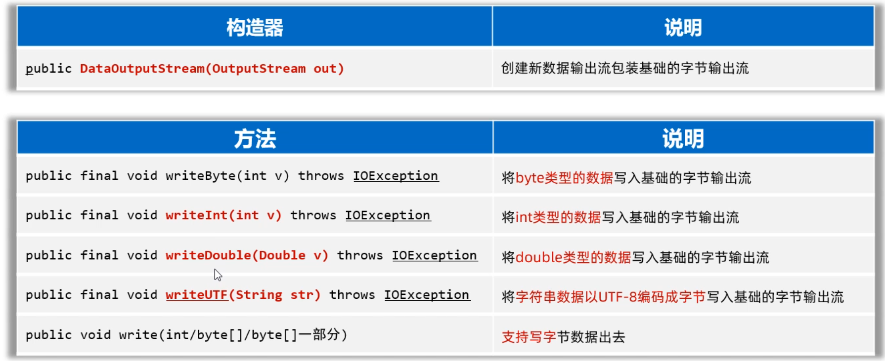

​		例如如何往文件中写整数、小数、布尔类型数据和字符串数据？

```java
public class DataOutputStreamTest1 {
    public static void main(String[] args) {
        try (
                // 1、创建一个数据输出流包装低级的字节输出流
                DataOutputStream dos =
                        new DataOutputStream(new FileOutputStream("io-app2/src/itheima10out.txt"));
                ){
            dos.writeInt(97);
            dos.writeDouble(99.5);
            dos.writeBoolean(true);
            dos.writeUTF("黑马程序员666！");

        } catch (Exception e) {
            e.printStackTrace();
        }
    }
}
```

##### 7.2 DataInputStream类

​		什么是DataInputStream类？它也是一种包装流，创建DataInputStream对象时，底层需要依赖于一个原始的InputStream流对象。然后调用它的readXxx()方法就可以读取特定类型的数据。

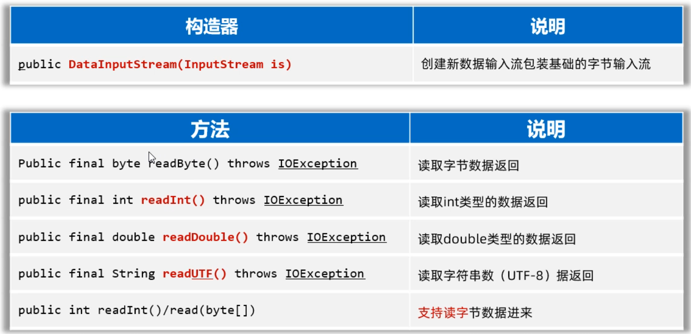

​			例如如何读取文件中的整数、小数、布尔类型数据和字符串数据？

```java
public class DataInputStreamTest2 {
    public static void main(String[] args) {
        try (
                DataInputStream dis =
                        new DataInputStream(new FileInputStream("io-app2/src/itheima10out.txt"));
                ){
            int i = dis.readInt();
            System.out.println(i);

            double d = dis.readDouble();
            System.out.println(d);

            boolean b = dis.readBoolean();
            System.out.println(b);

            String rs = dis.readUTF();
            System.out.println(rs);
        } catch (Exception e) {
            e.printStackTrace();
        }
    }
}
```

### 8.序列化流

​		什么是序列化流？ 就像字节流是以字节为单位来读写数据、字符流是按照字符为单位来读写数据、而对象流是以对象为单位来读写数据。也就是把对象当做一个整体，可以写一个对象到文件，也可以从文件中把对象读取出来。

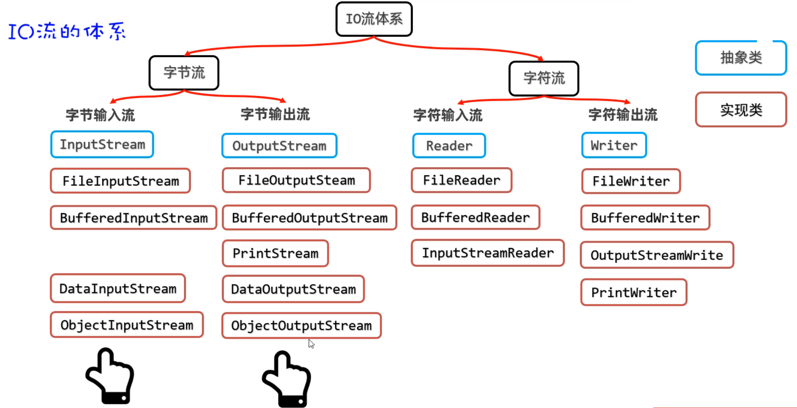

​		那么到底什么是序列化和反序列化呢？

+ **序列化：意思就是把对象写到文件或者网络中去。（简单记：写对象）**
+ **反序列化：意思就是把对象从文件或者网络中读取出来。（简单记：读对象）**

ObjectOutputStream流，它也是一个包装流，不能单独使用，需要结合原始的字节输出流使用。需求如下：将一个User对象写到文件中去

- 第一步：先准备一个User类，必须让其实现Serializable接口。

```java
// 注意：对象如果需要序列化，必须实现序列化接口。
public class User implements Serializable {
    private String loginName;
    private String userName;
    private int age;
    // transient 这个成员变量将不参与序列化。
    private transient String passWord;

    public User() {
    }

    public User(String loginName, String userName, int age, String passWord) {
        this.loginName = loginName;
        this.userName = userName;
        this.age = age;
        this.passWord = passWord;
    }

    @Override
    public String toString() {
        return "User{" +
                "loginName='" + loginName + '\'' +
                ", userName='" + userName + '\'' +
                ", age=" + age +
                ", passWord='" + passWord + '\'' +
                '}';
    }
}
```

- 第二步：再创建ObjectOutputStream流对象，调用writeObject方法对象到文件。

```java
public class Test1ObjectOutputStream {
    public static void main(String[] args) {
        try (
                // 2、创建一个对象字节输出流包装原始的字节 输出流。
                ObjectOutputStream oos =
                        new ObjectOutputStream(new FileOutputStream("io-app2/src/itheima11out.txt"));
                ){
            // 1、创建一个Java对象。
            User u = new User("admin", "张三", 32, "666888xyz");

            // 3、序列化对象到文件中去
            oos.writeObject(u);
            System.out.println("序列化对象成功！！");

        } catch (Exception e) {
            e.printStackTrace();
        }
    }
}
```

**注意：写到文件中的对象，是不能用记事本打开看的。因为对象本身就不是文本数据，打开是乱码**

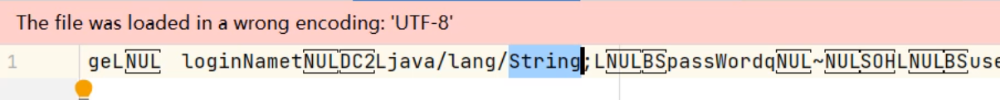

​		怎样才能读懂文件中的对象以及属性呢？这里必须用反序列化，如何进行反序列化呢?

下面举个例子，创建一个Student类，对其进行序列化和反序列化。

+ Student类

```java
import java.io.Serializable;
//注意这里必须要实现Serializable接口，否则将不能对序列化后的文件进行反序列化
public class Student implements Serializable {
    private String name;
    private transient int phone;
    private int age;
    private double score;

    static final long serialVersionUID = 5167984652382577273L;

    public Student() {
    }

    public Student(String name, int phone, int age, double score) {
        this.name = name;
        this.phone = phone;
        this.age = age;
        this.score = score;
    }

    public String getName() {
        return name;
    }

    public void setName(String name) {
        this.name = name;
    }

    public int getPhone() {
        return phone;
    }

    public void setPhone(int phone) {
        this.phone = phone;
    }

    public int getAge() {
        return age;
    }

    public void setAge(int age) {
        this.age = age;
    }

    public double getScore() {
        return score;
    }

    public void setScore(double score) {
        this.score = score;
    }

    @Override
    public String toString() {
        return "Student{" +
                "name='" + name + '\'' +
                ", phone=" + phone +
                ", age=" + age +
                ", score=" + score +
                '}';
    }
}
```

+ 添加三个学生对象，并将三个对象序列化。

```java
public class Test7 {
    public static void main(String[] args) {
        ArrayList<Student> list = new ArrayList<>();
        Student s1 = new Student("Ivan", 123456789, 20, 4.5);
        Student s2 = new Student("Petr", 987654321, 19, 4.0);
        Student s3 = new Student("Sidor", 123456789, 18, 3.5);
        list.add(s1);
        list.add(s2);
        list.add(s3);

        //序列化
        try (OutputStream os = new FileOutputStream("/NewClass/student.dat");
             ObjectOutputStream oos = new ObjectOutputStream(os)
        ) { oos.writeObject(s1);
            oos.writeObject(s2);
            oos.writeObject(s3);
        } catch (IOException e) {
            e.printStackTrace();
        }
    }
}
```

+ 反序列化

```java
public class Test8 {
    public static void main(String[] args) {
        try (ObjectInputStream ois = new ObjectInputStream(new FileInputStream("/NewClass/student.dat"))) {
            Student s1 = (Student) ois.readObject();
            Student s2 = (Student) ois.readObject();
            Student s3 = (Student) ois.readObject();
            System.out.println(s1);
            System.out.println(s2);
            System.out.println(s3);
        } catch (IOException | ClassNotFoundException e) {
            e.printStackTrace();
        }
    }
}
```

​		执行结果如下，反序列化后即可读取student.dat文件中的属性了：

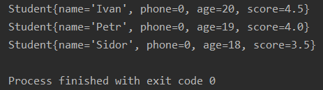

### 9.IO框架

​		什么是IO框架？它有什么用呢？相较于传统对IO的各种流的操作，IO框架大大简化了对IO操作，**由apache开源基金组织提供了一组有关IO流小框架，可以提高IO流的开发效率。**

​		这个框架的名字叫commons-io：其本质是别人写好的一些字节码文件（class文件），打包成了一个jar包。我们只需要把jar包引入到我们的项目中，就可以直接用了。 这个jar包中提供的工具类叫FileUtils，它的部分功能如下，使用起来十分方便。

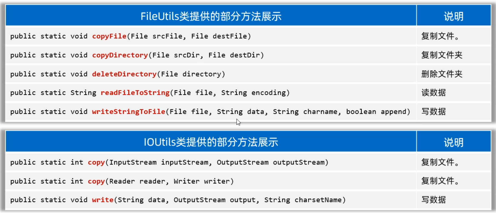

在写代码之前，先需要引入jar包，具体步骤如下

```java
1.在模块的目录下，新建一个lib文件夹
2.把jar包复制粘贴到lib文件夹下
3.选择lib下的jar包，右键点击Add As Library，然后就可以用了。
```

代码如下：

```java
public class CommonsIOTest1 {
    public static void main(String[] args) throws Exception {
        //1.复制文件
        FileUtils.copyFile(new File("io-app2\\src\\itheima01.txt"), new File("io-app2/src/a.txt"));
        
        //2.复制文件夹
        FileUtils.copyDirectory(new File("D:\\resource\\私人珍藏"), new File("D:\\resource\\私人珍藏3"));
        
        //3.删除文件夹
        FileUtils.deleteDirectory(new File("D:\\resource\\私人珍藏3"));

        // Java提供的原生的一行代码搞定很多事情
         Files.copy(Path.of("io-app2\\src\\itheima01.txt"), Path.of("io-app2\\src\\b.txt"));
        System.out.println(Files.readString(Path.of("io-app2\\src\\itheima01.txt")));
    }
}
```
