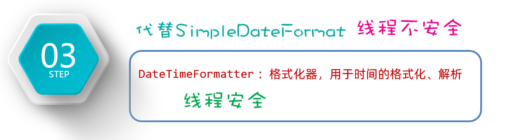

# JDK8特性

### 1.JDK8新特性-Lambda表达式

##### 1.1Lambda表达式

什么是Lambda表达式？它的作用是用于简化匿名内部类代码的书写。

那么如何简化书写？Lambda是有特有格式的，按照下面的格式来编写Lambda。

```java
(被重写方法的形参列表) -> {
被重写方法的方法体代码;
}
```

注意：使用Lambda表达式之前，必须有一个接口，**并且接口中只能有一个抽象方法**。（**不能是抽象类，只能是接口**）

像这项的接口，我们称之为函数式接口（可以用@FunctionalInterface来校验），只有基于函数式接口的匿名内部类才可以被Lambda表达式简化。

```java
//函数式接口
public interface Swimming{
void swim();
}
```

有了上面的Swimming函数式接口后，下面的测试类中，可以用Lambda表达式简化匿名内部类书写。

```java
public class LambdaTest1 {
public static void main(String[] args) {
// 目标：认识Lambda表达式.
//1.创建一个Swimming接口的匿名内部类对象
Swimming s = new Swimming(){
@Override
public void swim() {
System.out.println("学生快乐的游泳~~~~");
}
};
    
s.swim();
//2.使用Lambda表达式对Swimming接口的匿名内部类进行简化
Swimming s1 = () -> {
System.out.println("学生快乐的游泳~~~~");
};
s1.swim();
}
}

```


##### 1.2Lambda表达式省略规则

​		Lambda表达式的几种简化写法，规则如下：

```java
1.Lambda的标准格式
(参数类型1 参数名1, 参数类型2 参数名2)->{
...方法体的代码...
return 返回值;
}

2.在标准格式的基础上()中的参数类型可以直接省略
(参数名1, 参数名2)->{
...方法体的代码...
return 返回值;
}

3.如果{}总的语句只有一条语句，则{}可以省略、return关键字、以及最后的“;”都可以省略
(参数名1, 参数名2)-> 结果

4.如果()里面只有一个参数，则()可以省略
(参数名)->结果

```

+ 匿名内部类的书写

​		例子如下：

```java
//定义一个int数组，要对里面的元素乘2并返回
int[] arr = {1,4,6,9,15,19};

        //调用Arrays的setAll方法，传入第一个参数--数组，new出第二个参数——函数式接口IntUnaryOperator()
        Arrays.setAll(arr, new IntUnaryOperator() {
            @Override
            //设置参数名(及数组索引)，对每一个元素*2并返回
            public int applyAsInt(int Index) {
                return arr[Index]*2;
            }
        });
```

+ 利用Lambda表达式简化上面的书写

```java
//简化格式1——省略参数类型
Arrays.setAll(arr,(num)->{return arr[num]*2;});

//简化格式2——省略小括号()
Arrays.setAll(arr,num->{return arr[num]*2;});

//简化格式3——省略大括号，return和语句后面的分号
Arrays.setAll(arr,num-> arr[num]*2);
```

### 2.JDK8新特性-方法引用

##### 2.1静态方法引用

​		**JDK8的另外一个新特性叫做方法引用**，方法引用是用来进一步简化Lambda表达式的，可以再次减少代码量，例子如下：

​		我们要对一个学生对象数组，按年龄升序排序：

```java
Student[] students = new Student[4];
        students[0] = new Student("蜘蛛精", 169.5, 23);
        students[1] = new Student("紫霞", 163.8, 26);
        students[2] = new Student("紫霞", 163.8, 26);
        students[3] = new Student("至尊宝", 167.5, 24);
        
        //原始匿名内部类写法
        Arrays.sort(students, new Comparator<Student>() {
            @Override
            public int compare(Student o1, Student o2) {
                return o1.getAge()- o2.getAge();
            }
        });
        
        //用Lambda表达式简化后
        Arrays.sort(students, (o1, o2) -> o1.getAge() - o2.getAge());
```

如果想要把Lambda表达式中的方法体用一个静态方法封装起来，用于替代，那么需要另外准备一个CompareByDate类，用于封装Lambda表达式中的方法体，代码如下：

```java
public class CompareByData {
    public static int compareByData(Student o1, Student o2) {
        return o1.getAge() - o2.getAge();//升序排序的规则
    }
}
```

然后我们可以调用CompareByData类中的静态方法compareByAge()来替换Lambda表达式中的方法体。

```java
Arrays.sort(students, (o1, o2) -> CompareByData.compareByAge(o1, o2));
```

Java为了简化上面Lambda表达式的写法，利用方法引用可以改进为下面的样子。**实际上就是用类名调用方法，但 是把参数给省略了。**这就是静态方法引用，格式为：**类名：：方法名**

```java
Arrays.sort(students, CompareByData::compareByAge)
```

##### 2.2实例方法引用

​		基于上面的静态方法案例，下面我想要把Lambda表达式用一个实例方法来代替。


​		**然后我们需要new一个CompareByData对象，通过对象去调用方法。**

```java
CompareByData compare = new CompareByData();
Arrays.sort(students, (o1, o2) -> compare.compareByAgeDesc(o1, o2)); // 降序
```

​		最后，再将Lambda表达式的方法体，直接改成方法引用写法。实际上就是用**类名调用方法，**但是可以省略参数。这就是实例方法引用。

```java
CompareByData compare = new CompareByData();
Arrays.sort(students, compare::compareByAgeDesc); //降序
```

##### 2.3特定类型的方法引用

​		什么式特定类型的方法引用？这是一种语法的约定，如果遇到这种场景，可以使用特定类型的方法引用，在这里简单说明就好。下面有一个字符串数组，要求忽略首字符大小写进行排序。

```java
String[] names = {"boby", "angela", "Andy" ,"dlei", "caocao", "Babo", "jack", "Cici"};

//lambda表达式写法
Arrays.sort(names, ( o1, o2) -> o1.compareToIgnoreCase(o2) );

//特定类型的方法引用！！！
Arrays.sort(names, String::compareToIgnoreCase);

```

​		Java约定：如果某个Lambda表达式里只是调用一个实例方法，并且前面参数列表中的第一个参数作为方法的主调，后面的所有 参数都是作为该实例方法的入参时，则就可以使用特定类型的方法引用。格式为  (**类型：：方法名**)

##### 2.4构造器引用

​		最后一种方法引用的形式，叫做构造器引用。还是先说明一下，构造器引用在实际开发中应 用的并不多，目前还没有找到构造器的应用场景。所以了解一下即可。

​		首先准备一个JavaBean类Car类

```java
public class Car {
	private String name;
	private double price;
    
	public Car() {
	}
    
	public Car(String name, double price) {
		this.name = name;
		this.price = price;
	}
    
	public String getName() {
		return name;
	}
    
	public void setName(String name) {
		this.name = name;
	}
    
	public double getPrice() {
		return price;
	}
    public void setPrice(double price) {
		this.price = price;
	}
@Override
	public String toString() {
		return "Car{" +
		"name='" + name + '\'' +
		", price=" + price +
		'}';
	}
}
```

​		因为方法引用是基于Lamdba表达式简化的，所以也要按照Lamdba表达式的使用前提来用，需要一个函数式接 口，接口中代码的返回值类型是Car类型。

```java
interface CreateCar{
	Car create(String name, double price);
}
```

​		最后，再创建一个测试类，在测试类中创建CreateCar接口的实现类对象，先用匿名内部类创建、再用Lambda表 达式创建，最后改用方法引用创建。了解即可，不用去思考语法。

```java
public class Test {
public static void main(String[] args) {
// 1、创建这个接口的匿名内部类对象。
CreateCar cc1 = new CreateCar(){
@Override
public Car create(String name, double price) {
return new Car(name, price);
}
};
//2、使用匿名内部类改进
CreateCar cc2 = (name, price) -> new Car(name, price);
//3、使用方法引用改进：构造器引用
CreateCar cc3 = Car::new;
//注意：以上是创建CreateCar接口实现类对象的几种形式而已，语法一步一步简化。
//4、对象调用方法
Car car = cc3.create("奔驰", 49.9);
System.out.println(car);
}
}
```

###

### 3.Stream流

​		Stream流是什么？它是从JDK8以后才有的一个新特性，是专业用于对集合或者数组进行便捷操作的。

##### 3.1 **Stream流的创建**

​		Stream流的创建只需要掌握四点：

1.如何获取List集合的Stream流？
2.如何获取Set集合的Stream流？
3.如何获取Map集合的Stream流？
4.如何获取数组的Stream流？

```java
/**
 * 目标：掌握Stream流的创建。
 */
public class StreamTest2 {
    public static void main(String[] args) {
       //1.单列集合
        List<Integer> list = new ArrayList<>();
        Collections.addAll(list,1,2,3,4,5,6);
        Stream<Integer> stream1 = list.stream();

        Set<Integer> set =new HashSet<>();
        Stream<Integer> stream2 = set.stream();
        //2.双列集合
        Map<String,Integer> map = new HashMap<>();

        Stream<String> stream3 = map.keySet().stream();

        Stream<Integer> stream4 = map.values().stream();

        //3.数组
        int[] arr={1,2,3,4,5,6};
        IntStream stream5 = Arrays.stream(arr);

        Stream<Integer> stream6 = Stream.of(1, 2, 3, 4, 5, 6);
    }
}
```


##### 3.2Stream流中间方法

​		Stream流的中间操作有哪些呢？


```java
/**
 * 目标：掌握Stream流提供的常见中间方法。
 */
public class StreamTest3 {
    public static void main(String[] args) {
       //注意:返回结果为Stream的方法都试延迟性方法,只有遇到终结性方法,才会执行。
        //下面的程序,我们使用forEach方法打印最终结果,forEach方法是终结性方法。

        //Stream<T> filter(Predicate<? super T> predicate)	用于对流中的数据进行过滤。
        /*
        Stream<Integer> stream = Stream.of(1, 2, 3, 4, 5, 6);
        Stream<Integer> stream2 = stream.filter((Integer i) -> {
            System.out.println("filter((Integer i)");
            return i % 2 == 0;
        });
        stream2.forEach((Integer i) -> {
            System.out.println(i);
        });
        */
        //Stream支持链式编程
        /*
        Stream.of(1, 2, 3, 4, 5, 6).filter((Integer i) -> {
            return i % 2 == 0;
        }).forEach((Integer i) -> {
            System.out.println(i);
        });
        */
        //简化后
        Stream.of(1, 2, 3, 4, 5, 6).filter(i -> i % 2 == 0).forEach(i -> System.out.println("filter:"+i));

        //Stream<T> sorted()	对元素进行升序排序
        Stream.of(1, 3, 2, 4, 6, 5).sorted().forEach((i -> System.out.println("sorted:"+i)));

        //Stream<T> sorted(Comparator<? super T> comparator)	按照指定规则排序
        /*Stream.of(1, 3, 2, 4, 6, 5).sorted(new Comparator<Integer>() {
            @Override
            public int compare(Integer o1, Integer o2) {
                return o2-o1;
            }
        }).forEach((i -> System.out.println("sorted-compare:"+i)));*/
        Stream.of(1, 3, 2, 4, 6, 5).sorted((o1,o2)->o2-o1).forEach((i -> System.out.println("sorted-compare:"+i)));


        //Stream<T> limit(long maxSize)	获取前几个元素
        Stream.of(1, 3, 2, 4, 6, 5).limit(3).forEach((i -> System.out.println("limit:"+i)));


        //Stream<T> skip(long n)	跳过前几个元素
        Stream.of(1, 3, 2, 4, 6, 5).skip(3).forEach((i -> System.out.println("skip:"+i)));


        //Stream<T>distinct()	去除流中重复的元素(根据存储对象的HashCode和euqals方法去重)。
        Stream.of(1, 2, 2, 2, 2, 3).distinct().forEach((i -> System.out.println("distinct:"+i)));

        //<R> Stream<R> map(Function<? super T,? extends R> mapper)	对元素进行加工，并返回对应的新流
        Stream.of(1, 2, 3).map((Integer i)->{return i*10;}).forEach((i -> System.out.println("map:"+i)));

        //static <T> Stream<T> concat(Stream a, Stream b)	合并a和b两个流为一个流
        Stream<Integer> sa = Stream.of(1, 2, 3);
        Stream<Integer> sb = Stream.of(11, 22, 33);
        Stream.concat(sa,sb).forEach((i -> System.out.println("concat:"+i)));
    }
}
```

##### 3.3Stream流终结方法

​		Stream流的终结方法有什么特点？这些方法的特点是，调用完方法之后，其结果就不再是Stream流了，所以就不再支持链式编程了，例如下面的代码：

```java
/**
 * 目标：Stream流的终结方法
 */
public class StreamTest4 {
    public static void main(String[] args) {
        //void forEach(Consumer action)	对此流运算后的元素执行遍历
        Stream.of(1, 2, 3).forEach((i) -> System.out.println(i));

        //long count()	统计此流运算后的元素个数
        long count = Stream.of(1, 2, 3).count();
        System.out.println("count = " + count);

        //Optional<T> max(Comparator<? super T> comparator)	获取此流运算后的最大值(末位)元素
        Optional<Integer> max = Stream.of(1, 2, 3).max(((o1, o2) -> o1 - o2));
        System.out.println("max.get() = " + max.get());

        //Optional<T> min(Comparator<? super T> comparator)	获取此流运算后的最小值(首位)元素
        Optional<Integer> min = Stream.of(1, 2, 3).min(((o1, o2) -> o1 - o2));
        System.out.println("min.get() = " + min.get());
    }
}
```

​		总结Stream流的几个常用的终结方法，如下图：


### 4.JDK8新增日期类

​		JDK8为什么要新增日期类呢？因为JDK8之前传统的时间API使用很不方便，设计不合理，使用起来不方便，都是可变对象，修改之后会丢失最开始的时间信息，而且线程不安全，只能精确到毫秒。

​		JDK8新增的日期类分得更细致一些，比如表示年月日用LocalDate类、表示时间秒用LocalTime类、而表示年月日时分秒用LocalDateTime类等；除了这些类还提供了对时区、时间间隔进行操作的类等。它们几乎把对日期/时间的所有操作都通过了API方法，用起来特别方便。


表示日期、时间、日期时间的类；有LocalDate、LocalTime、以及LocalDateTime类。仔细阅读代码，可以发现这三个类的用法套路都是一样的。

- LocalDate类的基本使用

```java
public class Test1_LocalDate {
    public static void main(String[] args) {
        // 0、获取本地日期对象(不可变对象)
        LocalDate ld = LocalDate.now(); // 年 月 日
        System.out.println(ld);

        // 1、获取日期对象中的信息
        int year = ld.getYear(); // 年
        int month = ld.getMonthValue(); // 月(1-12)
        int day = ld.getDayOfMonth(); // 日
        int dayOfYear = ld.getDayOfYear();  // 一年中的第几天
        int dayOfWeek = ld.getDayOfWeek().getValue(); // 星期几
        System.out.println(year);
        System.out.println(day);
        System.out.println(dayOfWeek);

        // 2、直接修改某个信息: withYear、withMonth、withDayOfMonth、withDayOfYear
        LocalDate ld2 = ld.withYear(2099);
        LocalDate ld3 = ld.withMonth(12);
        System.out.println(ld2);
        System.out.println(ld3);
        System.out.println(ld);

        // 3、把某个信息加多少: plusYears、plusMonths、plusDays、plusWeeks
        LocalDate ld4 = ld.plusYears(2);
        LocalDate ld5 = ld.plusMonths(2);

        // 4、把某个信息减多少：minusYears、minusMonths、minusDays、minusWeeks
        LocalDate ld6 = ld.minusYears(2);
        LocalDate ld7 = ld.minusMonths(2);

        // 5、获取指定日期的LocalDate对象： public static LocalDate of(int year, int month, int dayOfMonth)
        LocalDate ld8 = LocalDate.of(2099, 12, 12);
        LocalDate ld9 = LocalDate.of(2099, 12, 12);

        // 6、判断2个日期对象，是否相等，在前还是在后： equals isBefore isAfter
        System.out.println(ld8.equals(ld9));// true
        System.out.println(ld8.isAfter(ld)); // true
        System.out.println(ld8.isBefore(ld)); // false
    }
}
```

- LocalTime类的基本使用

```java
public class Test2_LocalTime {
    public static void main(String[] args) {
        // 0、获取本地时间对象
        LocalTime lt = LocalTime.now(); // 时 分 秒 纳秒 不可变的
        System.out.println(lt);

        // 1、获取时间中的信息
        int hour = lt.getHour(); //时
        int minute = lt.getMinute(); //分
        int second = lt.getSecond(); //秒
        int nano = lt.getNano(); //纳秒

        // 2、修改时间：withHour、withMinute、withSecond、withNano
        LocalTime lt3 = lt.withHour(10);
        LocalTime lt4 = lt.withMinute(10);
        LocalTime lt5 = lt.withSecond(10);
        LocalTime lt6 = lt.withNano(10);

        // 3、加多少：plusHours、plusMinutes、plusSeconds、plusNanos
        LocalTime lt7 = lt.plusHours(10);
        LocalTime lt8 = lt.plusMinutes(10);
        LocalTime lt9 = lt.plusSeconds(10);
        LocalTime lt10 = lt.plusNanos(10);

        // 4、减多少：minusHours、minusMinutes、minusSeconds、minusNanos
        LocalTime lt11 = lt.minusHours(10);
        LocalTime lt12 = lt.minusMinutes(10);
        LocalTime lt13 = lt.minusSeconds(10);
        LocalTime lt14 = lt.minusNanos(10);

        // 5、获取指定时间的LocalTime对象：
        // public static LocalTime of(int hour, int minute, int second)
        LocalTime lt15 = LocalTime.of(12, 12, 12);
        LocalTime lt16 = LocalTime.of(12, 12, 12);

        // 6、判断2个时间对象，是否相等，在前还是在后： equals isBefore isAfter
        System.out.println(lt15.equals(lt16)); // true
        System.out.println(lt15.isAfter(lt)); // false
        System.out.println(lt15.isBefore(lt)); // true

    }
}
```

- LocalDateTime类的基本使用

```java
public class Test3_LocalDateTime {
    public static void main(String[] args) {
        // 0、获取本地日期和时间对象。
        LocalDateTime ldt = LocalDateTime.now(); // 年 月 日 时 分 秒 纳秒
        System.out.println(ldt);

        // 1、可以获取日期和时间的全部信息
        int year = ldt.getYear(); // 年
        int month = ldt.getMonthValue(); // 月
        int day = ldt.getDayOfMonth(); // 日
        int dayOfYear = ldt.getDayOfYear();  // 一年中的第几天
        int dayOfWeek = ldt.getDayOfWeek().getValue();  // 获取是周几
        int hour = ldt.getHour(); //时
        int minute = ldt.getMinute(); //分
        int second = ldt.getSecond(); //秒
        int nano = ldt.getNano(); //纳秒

        // 2、修改时间信息：
        // withYear withMonth withDayOfMonth withDayOfYear withHour
        // withMinute withSecond withNano
        LocalDateTime ldt2 = ldt.withYear(2029);
        LocalDateTime ldt3 = ldt.withMinute(59);

        // 3、加多少:
        // plusYears  plusMonths plusDays plusWeeks plusHours plusMinutes plusSeconds plusNanos
        LocalDateTime ldt4 = ldt.plusYears(2);
        LocalDateTime ldt5 = ldt.plusMinutes(3);

        // 4、减多少：
        // minusDays minusYears minusMonths minusWeeks minusHours minusMinutes minusSeconds minusNanos
        LocalDateTime ldt6 = ldt.minusYears(2);
        LocalDateTime ldt7 = ldt.minusMinutes(3);


        // 5、获取指定日期和时间的LocalDateTime对象：
        // public static LocalDateTime of(int year, Month month, int dayOfMonth, int hour,
        //                                  int minute, int second, int nanoOfSecond)
        LocalDateTime ldt8 = LocalDateTime.of(2029, 12, 12, 12, 12, 12, 1222);
        LocalDateTime ldt9 = LocalDateTime.of(2029, 12, 12, 12, 12, 12, 1222);

        // 6、 判断2个日期、时间对象，是否相等，在前还是在后： equals、isBefore、isAfter
        System.out.println(ldt9.equals(ldt8));
        System.out.println(ldt9.isAfter(ldt));
        System.out.println(ldt9.isBefore(ldt));

        // 7、可以把LocalDateTime转换成LocalDate和LocalTime
        // public LocalDate toLocalDate()
        // public LocalTime toLocalTime()
        // public static LocalDateTime of(LocalDate date, LocalTime time)
        LocalDate ld = ldt.toLocalDate();
        LocalTime lt = ldt.toLocalTime();
        LocalDateTime ldt10 = LocalDateTime.of(ld, lt);

    }
}
```

##### 4.1JDK日期（时区）

​		为什么要另外了解代表时区的两个类呢?因为世界各个国家与地区的经度不同，各地区的时间也有所不同，因此会划分为不同的时区。每一个时区的时间也不太一样。

```java
public class Test4_ZoneId_ZonedDateTime {
    public static void main(String[] args) {
		// 目标：了解时区和带时区的时间。
		// 1、ZoneId的常见方法：
		// public static ZoneId systemDefault(): 获取系统默认的时区
		ZoneId zoneId = ZoneId.systemDefault();
		System.out.println(zoneId.getId());
		System.out.println(zoneId);

		// public static Set<String> getAvailableZoneIds(): 获取Java支持的全部时区Id
 	    System.out.println(ZoneId.getAvailableZoneIds());

 	    // public static ZoneId of(String zoneId) : 把某个时区id封装成ZoneId对象。
        ZoneId zoneId1 = ZoneId.of("America/New_York");

  	    // 2、ZonedDateTime：带时区的时间。
 	    // public static ZonedDateTime now(ZoneId zone): 获取某个时区的ZonedDateTime对象。
 	    ZonedDateTime now = ZonedDateTime.now(zoneId1);
  	 	System.out.println(now);

  		// 世界标准时间了
  		ZonedDateTime now1 = ZonedDateTime.now(Clock.systemUTC());
   		System.out.println(now1);

   		// public static ZonedDateTime now()：获取系统默认时区的ZonedDateTime对象
  	    ZonedDateTime now2 = ZonedDateTime.now();
        System.out.println(now2);

        // Calendar instance = Calendar.getInstance(TimeZone.getTimeZone(zoneId1));
	}
}
```
##### 4.2JDK8日期（Instant类）

​		接下来，我们来学习Instant这个类。通过获取Instant的对象可以拿到此刻的时间，该时间由两部分组成：从1970-01-01 00:00:00 开始走到此刻的总秒数+不够1秒的纳秒数。


​		该类提供的方法如下图所示，可以用来获取当前时间，也可以对时间进行加、减、获取等操作。


​		**作用：可以用来记录代码的执行时间，或用于记录用户操作某个事件的时间点。**

```java
/**
 * 目标：掌握Instant的使用。
 */
public class Test5_Instant {
    public static void main(String[] args) {
       // 1、创建Instant的对象，获取此刻时间信息
        Instant now = Instant.now(); // 不可变对象

        // 2、获取总秒数
        long second = now.getEpochSecond();
        System.out.println(second);

        // 3、不够1秒的纳秒数
        int nano = now.getNano();
        System.out.println(nano);

        System.out.println(now);

        Instant instant = now.plusNanos(111);

        // Instant对象的作用：做代码的性能分析，或者记录用户的操作时间点
        Instant now1 = Instant.now();
        // 代码执行。。。。
        Instant now2 = Instant.now();

        LocalDateTime l = LocalDateTime.now();
    }
}
```

##### 4.3JDK8日期（格式化器）

​		接下来，我们学习一个新增的日期格式化类，叫DateTimeFormater。它可以从来对日期进行格式化和解析。它代替了原来的SimpleDateFormat类。



​		需要用到的方法，如下图所示：


​		接下来，将上面的方法用代码来演示一下：

```java
/**
 *  目标：掌握JDK 8新增的DateTimeFormatter格式化器的用法。
 */
public class Test6_DateTimeFormatter {
    public static void main(String[] args) {
        // 1、创建一个日期时间格式化器对象出来。
        DateTimeFormatter formatter = DateTimeFormatter.ofPattern("yyyy年MM月dd日 HH:mm:ss");

        // 2、对时间进行格式化
        LocalDateTime now = LocalDateTime.now();
        System.out.println(now);

        String rs = formatter.format(now); // 正向格式化
        System.out.println(rs);

        // 3、格式化时间，其实还有一种方案。
        String rs2 = now.format(formatter); // 反向格式化
        System.out.println(rs2);

        // 4、解析时间：解析时间一般使用LocalDateTime提供的解析方法来解析。
        String dateStr = "2029年12月12日 12:12:11";
        LocalDateTime ldt = LocalDateTime.parse(dateStr, formatter);
        System.out.println(ldt);
    }
}

```

##### 4.4JDK8日期（Period类）

​		除以了上新增的类，JDK8还补充了两个类，一个叫Period类、一个叫Duration类；这两个类可以用来对计算两个时间点的时间间隔。其中Period用来计算日期间隔（年、月、日），Duration用来计算时间间隔（时、分、秒、纳秒）


​		先来演示Period类的用法，它的方法如下图所示。可以用来计算两个日期之间相隔的年、相隔的月、相隔的日。**只能两个计算LocalDate对象之间的间隔**


```java
/**
 * 目标：掌握Period的作用：计算机两个日期相差的年数，月数、天数。
 */
public class Test7_Period {
    public static void main(String[] args) {
        LocalDate start = LocalDate.of(2029, 8, 10);
        LocalDate end = LocalDate.of(2029, 12, 15);

        // 1、创建Period对象，封装两个日期对象。
        Period period = Period.between(start, end);

        // 2、通过period对象获取两个日期对象相差的信息。
        System.out.println(period.getYears());
        System.out.println(period.getMonths());
        System.out.println(period.getDays());
    }
}
```

##### 4.5JDK8日期（Duration类）

​		接下来，我们学习Duration类。它是用来表示两个时间对象的时间间隔。**可以用于计算两个时间对象相差的天数、小时数、分数、秒数、纳秒数；支持LocalTime、LocalDateTime、Instant等时间**


```java
public class Test8_Duration {
    public static void main(String[] args) {
        LocalDateTime start = LocalDateTime.of(2025, 11, 11, 11, 10, 10);
        LocalDateTime end = LocalDateTime.of(2025, 11, 11, 11, 11, 11);
        // 1、得到Duration对象
        Duration duration = Duration.between(start, end);

        // 2、获取两个时间对象间隔的信息
        System.out.println(duration.toDays());// 间隔多少天
        System.out.println(duration.toHours());// 间隔多少小时
        System.out.println(duration.toMinutes());// 间隔多少分
        System.out.println(duration.toSeconds());// 间隔多少秒
        System.out.println(duration.toMillis());// 间隔多少毫秒
        System.out.println(duration.toNanos());// 间隔多少纳秒

    }
}
```

