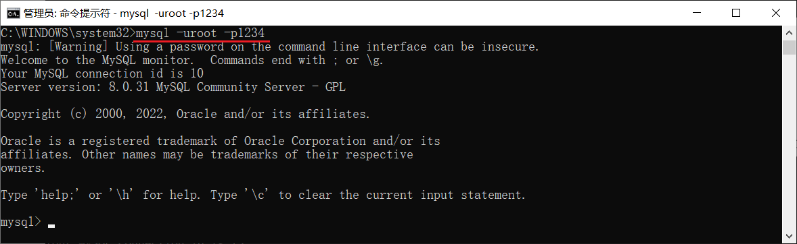
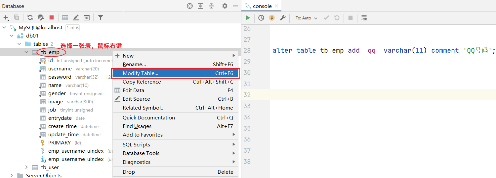
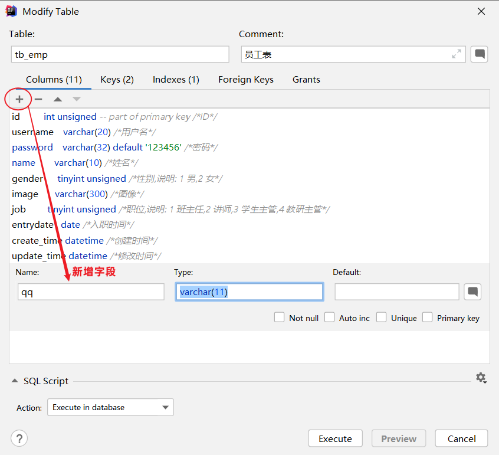
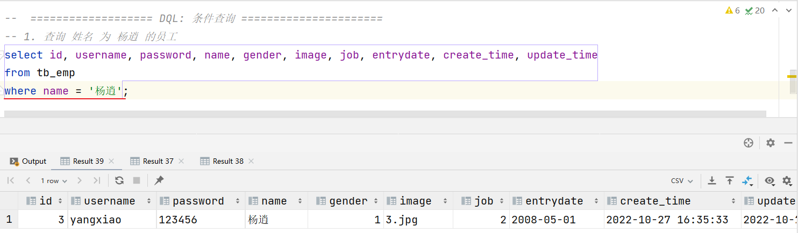
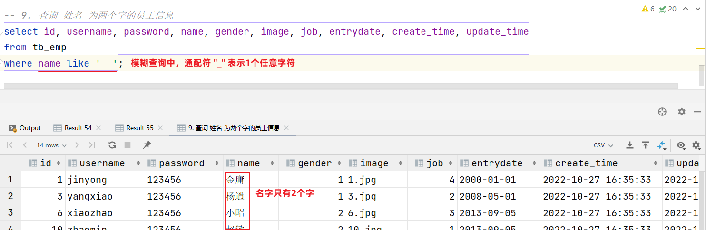
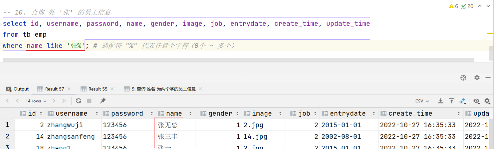

# MYSQL

​		什么是MYSQL？MYSQL指的是数据库：英文为 DataBase，简称DB，它是存储和管理数据的仓库。那么一般要怎么操作数据库和往数据库中存放数据呢？需要使用到其他的软件工具：数据库管理系统（**D**ata**B**ase **M**anagement **S**ystem，简称DBMS）

​		那么通过DBMS，又应该如何操作数据呢？需要对DBMS发送特定的指令。这个指令就是SQL语句。SQL（**S**tructured **Q**uery **L**anguage，简称SQL）：结构化查询语言，它是操作关系型数据库的编程语言，定义了一套操作关系型数据库的统一标准。

​		下面介绍下目前主流的一些数据库：

- Oracle：大型的收费数据库，Oracle公司产品，价格昂贵。（通常是不差钱的公司会选择使用这个数据库）
- MySQL：开源免费的中小型数据库，后来Sun公司收购了MySQL，而Oracle又收购了Sun公司。目前Oracle推出两个版本的Mysql：社区版(开源免费)、商业版(收费)。
- SQL Server：Microsoft 公司推出的收费的中型数据库，C#、.net等语言常用。
- PostgreSQL：开源免费的中小型数据库。
- DB2：IBM公司的大型收费数据库产品。
- SQLLite：嵌入式的微型数据库。Android内置的数据库采用的就是该数据库。
- MariaDB：开源免费的中小型数据库。是MySQL数据库的另外一个分支、另外一个衍生产品，与MySQL数据库有很好的兼容性。

### 1.MYSQL概述

##### 1.1MYSQL安装与连接

​		MYSQL安装官网是 https://dev.mysql.com/ 官网提供了两个版本，收费的商业版本和免费的社区版本。使用商业版本的话官方会提供技术支持。

​		MySQL服务启动完成后，然后再使用如下指令，来连接MySQL服务器：

```txt
mysql -u用户名 -p密码 [-h数据库服务器的IP地址 -P端口号]

// -h参数不加，默认连接的是本地127.0.0.1 的MySQL服务器
// -P  参数不加，默认连接的端口号是 3306
```

- 密码直接在-p参数之后直接指定 （这种方式不安全，密码直接以明文形式出现在命令行），应该在-p后回车再写密码。



##### 1.2数据模型

​		在学习Mysql数据模型之前，需要先了解一个概念：关系型数据库。关系型数据库是建立在关系模型的基础上的，由多张互相连接的二维表组成的数据库。那采用二维表这种数据结构的优点是什么呢？

- 使用表存储数据，格式统一，便于维护

- 使用SQL语言操作，标准统一，使用方便，可用于复杂查询

> 之前提到的MySQL、Oracle、DB2、SQLServer这些都是属于关系型数据库，里面都是基于二维表存储数据的。
>
> 结论：基于二维表存储数据的数据库就成为关系型数据库，不是基于二维表存储数据的数据库，就是非关系型数据库（后面需要学习的Redis，就属于非关系型数据库）。

在Mysql数据库中存储数据的流程大致为：

> 1. 先去创建数据库（可以创建多个数据库，之间是相互独立的）
> 2. 在数据库下再去创建数据表（一个数据库下可以创建多张表）
> 3. 再将数据存放在数据表中（一张表可以存储多行数据）

### 2.SQL

​		什么是SQL？SQL：结构化查询语言。一门操作关系型数据库的编程语言，定义操作所有关系型数据库的统一标准。**首先应该了解一下SQL的语法：1、SQL语句可以单行或多行书写，以分号结尾。2、SQL语句可以使用空格/缩进来增强语句的可读性。3、MySQL数据库的SQL语句不区分大小写。4、单行注释通过 - - 或者 # ,多行注释通过/* 注释内容 */。**

​		SQL语句一般根据其功能被分为四大类：DDL、DML、DQL、DCL 。

| **分类** | **全称**                    | **说明**                                               |
| -------- | --------------------------- | ------------------------------------------------------ |
| DDL      | Data Definition  Language   | 数据定义语言，用来定义数据库对象(数据库，表，字段)     |
| DML      | Data Manipulation  Language | 数据操作语言，用来对数据库表中的数据进行增删改         |
| DQL      | Data Query Language         | 数据查询语言，用来查询数据库中表的记录                 |
| DCL      | Data Control  Language      | 数据控制语言，用来创建数据库用户、控制数据库的访问权限 |

##### 2.1项目开发流程

​		在我们开发一个项目或者项目当中的某个模块之前，会先会拿到产品经理给我们提供的页面原型及需求文档。

**设计：**

- 拿到产品原型和需求文档之后，首先要做是进行项目的设计，其中就包括概要设计、详细设计、接口设计、数据库设计等等。
- 数据库设计根据产品原型以及需求文档，要分析各个模块涉及到的表结构以及表结构之间的关系，以及表结构的详细信息。最终需要将数据库以及数据库当中的表结构设计创建出来。

**开发/测试：**

- 参照页面原型和需求进行编码，实现业务功能。在这个过程当中，我们就需要来操作设计出来的数据库表结构，来完成业务的增删改查操作等。

**部署上线：**

- 在项目的功能开发测试完成后，项目就可以上线运行了，后期如果项目遇到性能瓶颈，还需要对项目进行优化。优化很重要的一个部分就是数据库的优化，包括数据库当中索引的建立、SQL 的优化、分库分表等操作。

在上面的流程当中，针对数据库来说，需要注意三个阶段。

1. 数据库设计阶段
   - 参照页面原型以及需求文档设计数据库表结构
2. 数据库操作阶段
   - 根据业务功能的实现，编写SQL语句对数据表中的数据进行增删改查操作
3. 数据库优化阶段
   - 通过数据库的优化来提高数据库的访问性能。优化手段：索引、SQL优化、分库分表等

##### 2.2数据库操作

​		在进行数据库设计，需要使用到刚才所介绍SQL分类中的DDL语句。DDL英文全称是Data Definition Language(数据定义语言)，用来定义数据库对象(数据库、表)。DDL中数据库的常见操作：查询、创建、使用、删除。

查询所有数据库：

```mysql
show databases; 
```

查询当前数据库：

```mysql
select database();
```

> 需要操作某一个数据库，必须要切换到对应的数据库中。 
>
> 通过指令：select  database() ，就可以查询到当前所处的数据库 

创建数据库：

```sql
-- 数据库不存在,则创建该数据库；如果存在则不创建
create datebase [if not exists] 数据库名;
```

删除数据库：

```sql
--如果存在的话，则删除数据库
drop database if exists] 数据库名
```

##### 2.3表操作

​		再来了解DDL语句当中关于表结构的操作。表结构的操作也是包含四个部分：创建表、查询表、修改表、删除表。

创建表：

```sql
create table  表名(
	字段1  字段1类型 [约束]  [comment  字段1注释 ],
	字段2  字段2类型 [约束]  [comment  字段2注释 ],
	......
	字段n  字段n类型 [约束]  [comment  字段n注释 ] 
) [ comment  表注释 ] ;

#注意： [ ] 中的内容为可选参数； 最后一个字段后面没有逗号
```

因为id字段是一行数据的唯一标识，不能有重复值。但是现在数据表中有两个相同的id值，这是为什么呢？

- 其实我们现在创建表结构的时候， id这个字段我们只加了一个备注信息说明它是一个唯一标识，但是在数据库层面呢，并没有去限制字段存储的数据。所以id这个字段没有起到唯一标识的作用。所以为了约束字段，需要用到下面的约束。

**约束：**

| **约束** | **描述**                                         | **关键字**  |
| -------- | ------------------------------------------------ | ----------- |
| 非空约束 | 限制该字段值不能为null                           | not null    |
| 唯一约束 | 保证字段的所有数据都是唯一、不重复的             | unique      |
| 主键约束 | 主键是一行数据的唯一标识，要求非空且唯一         | primary key |
| 默认约束 | 保存数据时，如果未指定该字段值，则采用默认值     | default     |
| 外键约束 | 让两张表的数据建立连接，保证数据的一致性和完整性 | foreign key |

> 注意：约束是作用于表中字段上的，可以在创建表/修改表的时候添加

​		现在有一个需求，要求根据图片创建数据库表，表格如下：


建表语句如下：

```sql
create table id_user(
	id int  primary key comment 'ID,唯一标识',
	username varchar(20) not null unique comment '用户名',
	name varchar(10) not null comment '姓名',
	age int comment '年龄',
	gender char(1) default '男' comment '性别'
) comment '用户表'
```

​		再创建表格后，可以发现添加数据时，每次都需要自己添加id，但是添加id是又要保证它是唯一的。id字段下存储的值，如果由我们自己来维护会比较麻烦(必须保证值的唯一性)。MySQL数据库为了解决这个问题，就提供了一个关键字：auto_increment（自动增长）

> 主键自增：auto_increment
>
> - 每次插入新的行记录时，数据库自动生成id字段(主键)下的值
> - 具有auto_increment的数据列是一个正数序列开始增长(从1开始自增)

##### 2.4MYSQL数据类型

MySQL中的数据类型有很多，主要分为三类：数值类型、字符串类型、日期时间类型。

**数值类型**

| 类型        | 大小   | 有符号(SIGNED)范围                                    | 无符号(UNSIGNED)范围                                       | 描述               |
| ----------- | ------ | ----------------------------------------------------- | ---------------------------------------------------------- | ------------------ |
| TINYINT     | 1byte  | (-128，127)                                           | (0，255)                                                   | 小整数值           |
| SMALLINT    | 2bytes | (-32768，32767)                                       | (0，65535)                                                 | 大整数值           |
| MEDIUMINT   | 3bytes | (-8388608，8388607)                                   | (0，16777215)                                              | 大整数值           |
| INT/INTEGER | 4bytes | (-2147483648，2147483647)                             | (0，4294967295)                                            | 大整数值           |
| BIGINT      | 8bytes | (-2^63，2^63-1)                                       | (0，2^64-1)                                                | 极大整数值         |
| FLOAT       | 4bytes | (-3.402823466 E+38，3.402823466351 E+38)              | 0 和 (1.175494351  E-38，3.402823466 E+38)                 | 单精度浮点数值     |
| DOUBLE      | 8bytes | (-1.7976931348623157 E+308，1.7976931348623157 E+308) | 0 和  (2.2250738585072014 E-308，1.7976931348623157 E+308) | 双精度浮点数值     |
| DECIMAL     |        | 依赖于M(精度)和D(标度)的值                            | 依赖于M(精度)和D(标度)的值                                 | 小数值(精确定点数) |

```sql
示例: 
    年龄字段 ---不会出现负数, 而且人的年龄不会太大
	age tinyint unsigned
	
	分数 ---总分100分, 最多出现一位小数
	score double(4,1)
```

**字符串类型**

| 类型       | 大小                  | 描述                         |
| ---------- | --------------------- | ---------------------------- |
| CHAR       | 0-255 bytes           | 定长字符串(需要指定长度)     |
| VARCHAR    | 0-65535 bytes         | 变长字符串(需要指定长度)     |
| TINYBLOB   | 0-255 bytes           | 不超过255个字符的二进制数据  |
| TINYTEXT   | 0-255 bytes           | 短文本字符串                 |
| BLOB       | 0-65 535 bytes        | 二进制形式的长文本数据       |
| TEXT       | 0-65 535 bytes        | 长文本数据                   |
| MEDIUMBLOB | 0-16 777 215 bytes    | 二进制形式的中等长度文本数据 |
| MEDIUMTEXT | 0-16 777 215 bytes    | 中等长度文本数据             |
| LONGBLOB   | 0-4 294 967 295 bytes | 二进制形式的极大文本数据     |
| LONGTEXT   | 0-4 294 967 295 bytes | 极大文本数据                 |

char 与 varchar 都可以描述字符串，char是定长字符串，指定长度多长，就占用多少个字符，和字段值的长度无关 。而varchar是变长字符串，指定的长度为最大占用长度 。相对来说，char的性能会更高些。

```sql
示例： 
    用户名 username ---长度不定, 最长不会超过50
	username varchar(50)
	
	手机号 phone ---固定长度为11
	phone char(11)
```

**日期时间类型**

| 类型      | 大小 | 范围                                       | 格式                | 描述                     |
| --------- | ---- | ------------------------------------------ | ------------------- | ------------------------ |
| DATE      | 3    | 1000-01-01 至  9999-12-31                  | YYYY-MM-DD          | 日期值                   |
| TIME      | 3    | -838:59:59 至  838:59:59                   | HH:MM:SS            | 时间值或持续时间         |
| YEAR      | 1    | 1901 至 2155                               | YYYY                | 年份值                   |
| DATETIME  | 8    | 1000-01-01 00:00:00 至 9999-12-31 23:59:59 | YYYY-MM-DD HH:MM:SS | 混合日期和时间值         |
| TIMESTAMP | 4    | 1970-01-01 00:00:01 至 2038-01-19 03:14:07 | YYYY-MM-DD HH:MM:SS | 混合日期和时间值，时间戳 |

```sql
示例: 
	生日字段  birthday ---生日只需要年月日
	birthday date
	
	创建时间 createtime --- 需要精确到时分秒
	createtime  datetime
```

##### 2.5 查询

​		关于表结构的查询，我们一般都是基于图形化界面操作的。

查询当前数据库所有表：

```sql
show tables;
```

查询指定表的建表语句：

```sql
show create table 表名;
```

修改字段：

```sql
alter table 表名 add  字段名  类型(长度)  [comment 注释]  [约束];
```

案例： 为tb_emp表添加字段qq，字段类型为 varchar(11)

```sql
alter table tb_emp add  qq  varchar(11) comment 'QQ号码';
```

图形化操作添加字段如下：





修改字段：

```mysql
#添加字段
alter table 表名 modify  字段名  新数据类型(长度);
```

```sql
alter table 表名 change  旧字段名  新字段名  类型(长度)  [comment 注释]  [约束];
```

案例：修改qq字段的字段类型，将其长度由11修改为13

```sql
alter table tb_emp modify qq varchar(13) comment 'QQ号码';
```

案例：修改qq字段名为 qq_num，字段类型varchar(13)

```sql
alter table tb_emp change qq qq_num varchar(13) comment 'QQ号码';
```

删除字段：

```sql
alter table 表名 drop 字段名;
```

案例：删除tb_emp表中的qq_num字段

```sql
alter table tb_emp drop qq_num;
```

修改表名：

```sql
rename table 表名 to  新表名;
```

案例：将当前的tb_emp表的表名修改为emp

```mysql
rename table tb_emp to emp;
```

删除表语法：

```sql
drop  table [if exists ]  表名;
```

注意：这是一个十分危险的操作，删除表时会将表中的数据全部删除。

### 3.数据库操作-DML

​		DML英文全称是Data Manipulation Language(数据操作语言)，用来对数据库中表的数据记录进行增、删、改操作。

- 添加数据（INSERT）
- 修改数据（UPDATE）
- 删除数据（DELETE） 

##### 3.1增加

insert语法:

- 向指定字段添加数据

  ~~~mysql
  insert into 表名 (字段名1, 字段名2) values (值1, 值2);
  ~~~

- 全部字段添加数据

  ~~~mysql
  insert into 表名 values (值1, 值2, ...);
  ~~~

- 批量添加数据（指定字段）

  ~~~mysql
  insert into 表名 (字段名1, 字段名2) values (值1, 值2), (值1, 值2);
  ~~~

- 批量添加数据（全部字段）

  ~~~mysql
  insert into 表名 values (值1, 值2, ...), (值1, 值2, ...);
  ~~~

  Insert操作的注意事项：

  1. 插入数据时，指定的字段顺序需要与值的顺序是一一对应的。
  2. 字符串和日期型数据应该包含在引号中。


##### 3.2修改

update语法：

```sql
update 表名 set 字段名1 = 值1 , 字段名2 = 值2 , .... [where 条件] ;
```

案例1：将tb_emp表中id为1的员工，姓名name字段更新为'张三'

```sql
update tb_emp set name='张三',update_time=now() where id=1;
```

案例2：将tb_emp表的所有员工入职日期更新为'2010-01-01'

```sql
update tb_emp set entrydate='2010-01-01',update_time=now();
```

##### 3.3删除

delete语法：

```SQL
delete from 表名  [where  条件] ;
```

案例1：删除tb_emp表中id为1的员工

```sql
delete from tb_emp where id = 1;
```

案例2：删除tb_emp表中所有员工

```sql
delete from tb_emp;
```

> 注意事项:
>
> ​	• DELETE 语句的条件可以有，也可以没有，如果没有条件，则会删除整张表的所有数据。
>
> ​	• DELETE 语句不能删除某一个字段的值(可以使用UPDATE，将该字段值置为NULL即可)。
>
> ​	• 当进行删除全部数据操作时，会提示询问是否确认删除所有数据，直接点击Execute即可。 

### 4. 数据库操作-DQL

​		上面学习了如何使用DDL语句来操作数据库以及表结构（数据库设计），使用DML语句来完成数据库中数据的增、删、改操作（数据库操作）。现在来学习DQL操作，什么时数据库DQL操作？

​		DQL英文全称是Data Query Language(数据查询语言)，用来查询数据库表中的记录。查询关键字：SELECT。

##### 4.1 查询

DQL查询语句，语法结构如下：

```mysql
SELECT
	字段列表
FROM
	表名列表
WHERE
	条件列表
GROUP  BY
	分组字段列表
HAVING
	分组后条件列表
ORDER BY
	排序字段列表
LIMIT
	分页参数
```

可以将上面的完整语法拆分为以下几个部分：

- 基本查询（不带任何条件）
- 条件查询（where）
- 分组查询（group by）
- 排序查询（order by）
- 分页查询（limit）


##### 4.2基本查询

在基本查询的DQL语句中，不带任何的查询条件，语法如下：

- 查询多个字段

  ~~~mysql
  select 字段1, 字段2, 字段3 from  表名;
  ~~~

- 查询所有字段（通配符）

  ~~~mysql
  #`*`号代表查询所有字段，在实际开发中尽量少用（不直观、影响效率）
  select *  from  表名;
  ~~~

- 设置别名

  ~~~mysql
  select 字段1 [ as 别名1 ] , 字段2 [ as 别名2 ]  from  表名;
  ~~~

- 去除重复记录

  ~~~mysql
  select distinct 字段列表 from  表名;
  ~~~

##### 4.3条件查询

```sql
select  字段列表  from   表名   where   条件列表 ; -- 条件列表：意味着可以有多个条件
```

条件查询就是学习条件的构建方式，而在SQL语句当中构造条件的运算符分为两类：

1.比较运算符

2.逻辑运算符

常用的比较运算符如下: 

| **比较运算符**       | **功能**                                 |
| -------------------- | ---------------------------------------- |
| >                    | 大于                                     |
| >=                   | 大于等于                                 |
| <                    | 小于                                     |
| <=                   | 小于等于                                 |
| =                    | 等于                                     |
| <> 或 !=             | 不等于                                   |
| between ...  and ... | 在某个范围之内(含最小、最大值)           |
| in(...)              | 在in之后的列表中的值，多选一             |
| like 占位符          | 模糊匹配(_匹配单个字符, %匹配任意个字符) |
| is null              | 是null                                   |

常用的逻辑运算符如下:

| **逻辑运算符** | **功能**                    |
| -------------- | --------------------------- |
| and 或 &&      | 并且 (多个条件同时成立)     |
| or 或 \|\|     | 或者 (多个条件任意一个成立) |
| not 或 !       | 非 , 不是                   |

案例：查询 姓名为杨逍的员工

~~~mysql
select id, username, password, name, gender, image, job, entrydate, create_time, update_time
from tb_emp
where name = '杨逍'; 
-- 字符串使用''或""包含
~~~




案例：查询 姓名 为两个字的员工信息

~~~mysql
select id, username, password, name, gender, image, job, entrydate, create_time, update_time
from tb_emp
where name like '__';  # 通配符 "_" 代表任意1个字符
~~~




案例：查询 姓 '张' 的员工信息

~~~mysql
select id, username, password, name, gender, image, job, entrydate, create_time, update_time
from tb_emp
where name like '张%'; # 通配符 "%" 代表任意个字符（0个 ~ 多个）
~~~



##### 4.4聚合函数

​		什么是聚合函数？使用聚合函数查询就是纵向查询，它是对一列的值进行计算，然后返回一个结果值。（将一列数据作为一个整体，进行纵向计算）

~~~mysql
select  聚合函数(字段列表)  from  表名 ;
~~~

> 注意 : 聚合函数会忽略空值，对NULL值不作为统计。

常用聚合函数：

| **函数** | **功能** |
| -------- | -------- |
| count    | 统计数量 |
| max      | 最大值   |
| min      | 最小值   |
| avg      | 平均值   |
| sum      | 求和     |

> count ：按照列去统计有多少行数据。
>
> - 在根据指定的列统计的时候，如果这一列中有null的行，该行不会被统计在其中。
>
> sum ：计算指定列的数值和，如果不是数值类型，那么计算结果为0
>
> max ：计算指定列的最大值
>
> min ：计算指定列的最小值
>
> avg ：计算指定列的平均值