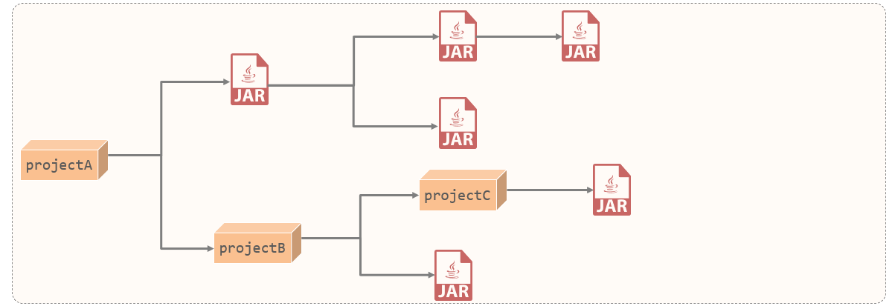
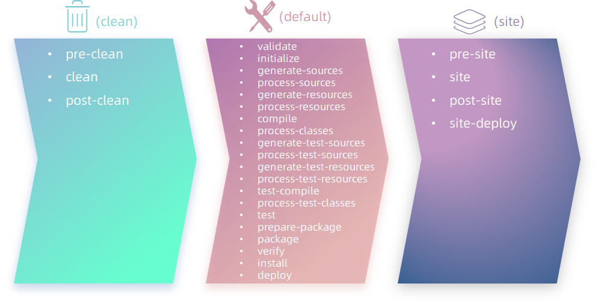

# Maven

### 1.Maven

​		什么是Maven？我们先来认识一下.Maven是Apache旗下的一个开源工具，是一款用于管理和构建Java项目的工具。首先认识Maven的三个最大的特点：**1.方便快捷的管理项目依赖的资源(jar包)，避免版本冲突问题（依赖管理）。2.提供标准、统一的项目结构（统一项目结构）。3.maven提供了标准的、跨平台(Linux、Windows、MacOS) 的自动化项目构建方式（项目构建）。**

下载地址：https://maven.apache.org/download.cgi

##### 1.1Maven模型

* 项目对象模型 (Project Object Model)
* 依赖管理模型(Dependency)
* 构建生命周期/阶段(Build lifecycle & phases)

(1). **构建生命周期/阶段**(Build lifecycle & phases)


​		以上图中紫色框起来的部分，就是用来完成标准化构建流程 。当我们需要编译，Maven提供了一个编译插件供我们使用；当我们需要打包，Maven就提供了一个打包插件供我们使用。 

(2). **项目对象模型** (Project Object Model)


​		以上图中紫色框起来的部分属于项目对象模型，就是将自己的项目抽象成一个对象模型，有自己专属的坐标，如下图所示是一个Maven项目：


​		坐标，就是资源(jar包)的唯一标识，通过坐标可以定位到所需资源(jar包)位置。

> 

(3). **依赖管理模型**(Dependency)


​		以上图中紫色框起来的部分属于依赖管理模型，是使用坐标来描述当前项目依赖哪些第三方jar包。


​		之前项目中需要jar包时，直接就把jar包复制到项目下的lib目录，而现在书写在pom.xml文件中的坐标又是怎么能找到所要的jar包文件的呢？一一通过Maven仓库。

##### 1.2POM配置详解

POM (Project Object Model) ：指的是项目对象模型，用来描述当前的maven项目。

- 使用pom.xml文件来实现

pom.xml文件：

~~~xml
<?xml version="1.0" encoding="UTF-8"?>
<project xmlns="http://maven.apache.org/POM/4.0.0"
         xmlns:xsi="http://www.w3.org/2001/XMLSchema-instance"
         xsi:schemaLocation="http://maven.apache.org/POM/4.0.0 http://maven.apache.org/xsd/maven-4.0.0.xsd">
    <!-- POM模型版本 -->
    <modelVersion>4.0.0</modelVersion>

    <!-- 当前项目坐标 -->
    <groupId>com.itheima</groupId>
    <artifactId>maven_project1</artifactId>
    <version>1.0-SNAPSHOT</version>
    
    <!-- 打包方式 -->
    <packaging>jar</packaging>
 
</project>
~~~

pom文件详解：

- <project> ：pom文件的根标签，表示当前maven项目
- <modelVersion> ：声明项目描述遵循哪一个POM模型版本
  - 虽然模型本身的版本很少改变，但它仍然是必不可少的。目前POM模型版本是4.0.0
- 坐标 ：**<groupId>、<artifactId>、<version>**
  - 定位项目在本地仓库中的位置，由以上三个标签组成一个坐标
- <packaging> ：maven项目的打包方式，通常设置为jar或war（默认值：jar）

Maven坐标主要组成

* groupId：定义当前Maven项目隶属组织名称（通常是域名反写，例如：com.itheima）。
* artifactId：定义当前Maven项目名称（通常是模块名称，例如 order-service、goods-service）。
* version：定义当前项目版本号。

##### 1.3依赖传递

​		什么是依赖传递？先举个例子：在没有Maven之前，向项目中添加依赖的jar包，需要把所有的jar包都复制到项目工程下。如下图所示，需要logback-classic时，由于logback-classic又依赖了logback-core和slf4j，所以必须把这三个jar包全部复制到项目工程下。

​		但现在我们有了Maven，在项目中需要使用logback-classic，只需要在pom.xml文件中配置logback-classic的依赖坐标，Maven会自动将它所需要的依赖也下载下来，**这就叫做Maven的依赖传递。**它会自动把所依赖的其他jar包也一起导入。

依赖传递可以分为：

1. 直接依赖：在当前项目中通过依赖配置建立的依赖关系。

2. 间接依赖：被依赖的资源如果依赖其他资源，当前项目间接依赖其他资源。

 

比如以上图中：

- projectA依赖了projectB。对于projectA 来说，projectB 就是直接依赖。
- 而projectB依赖了projectC及其他jar包。 那么此时，在projectA中也会将projectC的依赖传递下来。对于projectA 来说，projectC就是间接依赖。


+ **排除依赖**

问题：之前我们讲了依赖具有传递性。那么A依赖B，B依赖C，如果A不想将C依赖进来，是否可以做到？ 

答案：在maven项目中，我们可以通过排除依赖来实现。

什么是排除依赖？排除依赖指的是主动断开依赖的资源。（被排除的资源无需指定版本）

```xml
<dependency>
    <groupId>com.itheima</groupId>
    <artifactId>maven-projectB</artifactId>
    <version>1.0-SNAPSHOT</version>
   
    <!--排除依赖, 主动断开依赖的资源-->
    <exclusions>
    	<exclusion>
            <groupId>junit</groupId>
            <artifactId>junit</artifactId>
        </exclusion>
    </exclusions>
</dependency>
```

依赖排除示例：

​		maven-projectA依赖了maven-projectB，maven-projectB依赖了Junit。基于依赖的传递性，所以maven-projectA也依赖了Junit。


​		projectA依赖projectB后排除依赖junit。


##### 1.4依赖范围

​		在项目中导入依赖的jar包后，默认情况下，可以在任何地方使用。


​		如果希望限制依赖的使用范围，可以通过<scope>标签设置其作用范围。

作用范围：

1. 主程序范围有效（main文件夹范围内）

2. 测试程序范围有效（test文件夹范围内）

3. 是否参与打包运行（package指令范围内）


​		如上图所示，给junit依赖通过scope标签指定依赖的作用范围。 那么这个依赖就只能作用在测试环境，其他环境下不能使用。

scope标签的取值范围：

| **scope**值     | **主程序** | **测试程序** | **打包（运行）** | **范例**    |
| --------------- | ---------- | ------------ | ---------------- | ----------- |
| compile（默认） | Y          | Y            | Y                | log4j       |
| test            | -          | Y            | -                | junit       |
| provided        | Y          | Y            | -                | servlet-api |
| runtime         | -          | Y            | Y                | jdbc驱动    |

##### 1.5Maven生命周期

​		Maven的生命周期有哪些？Maven生命周期根据对项目的构建独立划分为三套：

- clean：清理工作。

- default：核心工作。如：编译、测试、打包、安装、部署等。

- site：生成报告、发布站点等。

三套生命周期具体包含哪些阶段呢？如下图所示：



​		在三套生命周期里有很多的阶段，常用的功能其实就下面几个：

+ clean：移除上一次构建生成的文件

+ compile：编译项目源代码

+ test：使用合适的单元测试框架运行测试(junit)

+ package：将编译后的文件打包，如：jar、war等

+ install：安装项目到本地仓库

​		**Maven生命周期的顺序是：clean --> validate --> compile --> test --> package --> verify --> install --> site --> deploy，我们需要关注的就是：clean -->  compile --> test --> package  --> install。**
