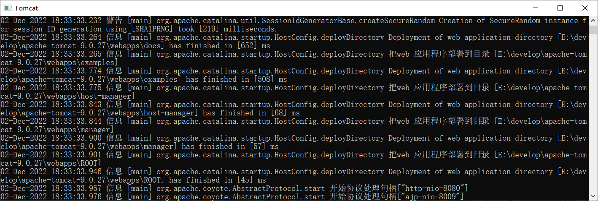
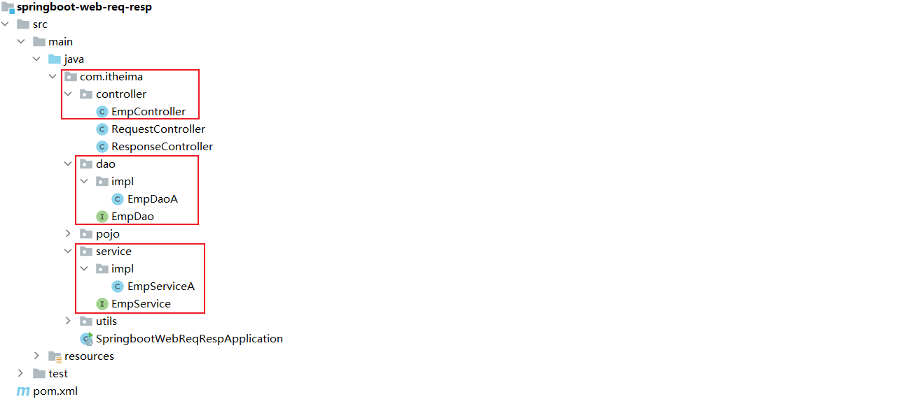

# SpringBootWeb

​		学习SpringBoot之前，先了解一下什么是Spring。进入Spring的官网(https://spring.io)，可以看到Spring官方提供了很多开源项目，按照流行程度排序为：


​		现在关于Spring提供的用于完成特定功能的若干子项目，我们称之为**spring全家桶**。在一般的项目开发中，一般会偏向于选择这一套spring家族的技术，来解决对应领域的问题。而Spring家族旗下这么多的技术，**最基础、最核心的是 SpringFramework**。其他的spring家族的技术，都是基于SpringFramework的，SpringFramework中提供很多实用功能，如：**依赖注入、事务管理、web开发支持、数据访问、消息服务**等等。

​		加入我们在项目中，直接基于SpringFramework进行开发，会存在两个问题：配置繁琐、入门难度大。 


​		基于上面问题，spring官方推荐我们从另外一个项目开始学习，那就是目前最火爆的SpringBoot。 通过springboot就可以快速的帮我们构建应用程序，所以springboot呢，最大的特点有两个 ：

- 简化配置
- 快速开发

**Spring Boot 可以帮助我们非常快速的构建应用程序、简化开发、提高效率 。**

### 1.SpringBootWeb简单入门

​		现在有一个简单需求，基于SpringBoot的方式开发一个web应用，浏览器发起   ”/hello“   请求  后，给浏览器返回字符串 “Hello World ~”，开发步骤如下：

第1步：创建SpringBoot工程项目。

第2步：定义HelloController类，添加方法hello，并添加注解。

第3步：测试运行。

##### 1.1创建SpringBoot工程

​		完善项目基础信息。


​		勾选web开发相关依赖。


​		点击Finish后耐心等待联网创建SpringBoot工程，创建完成后的结构如下：


##### 1.2定义请求处理类

​		然后在工程下的src/Java下创建包名，创建一个启动类，再创建一个子包controller，子包里是/hello页面，写上需求再运行启动类。

​		Hello Controller页面代码为：

```java
package com.itheima.controller;
import org.springframework.web.bind.annotation.*;

@RestController
public class HelloController {

    @RequestMapping("/hello")
    public String hello(){
        System.out.println("Hello World ~");
        return "Hello World ~";
    }
}    
```

##### 1.3运行测试


​		OK，简单入门已完成。

##### 1.4过程分析

​		我们将上面的简单案例剖析一下，先来分析浏览器，浏览器可以看作是一个客户端，通过**IP地址**找到服务器，再根据**端口号**找到计算机上的程序，最后根据**后面的请求位置**访问到服务器上的数据。

​		用  http://192.168.100.11:8080/hello  这个网址来举例。” http://192.168.100.11 “是IP地址；”  8080  “是端口号；”  /hello “是请求资源位置。

​		再来分析服务器，（可以理解为ServerSocket），它负责的功能如下：

- 接收到浏览器发送的信息（如：/hello）
- 在服务器上找到/hello的资源
- 把资源发送给浏览器

浏览器和服务器两端通过http协议进行数据交互。

### 2.HTTP协议

​		什么是HTTP协议？它的全称是Hyper Text Transfer Protocol(超文本传输协议)，规定了浏览器与服务器之间数据传输的规则。下面主要介绍HTTP协议的特点、如何请求和具体的请求格式。

##### 2.1HTTP-特点

​		特点主要有三点：

+ **基于TCP协议: ** 面向连接，安全。

+ **基于请求-响应模型:** 一次请求对应一次响应（先请求后响应）。

+ **HTTP协议是无状态协议:**对于数据没有记忆能力，每次请求-响应都是独立的。

##### 2.2HTTP-请求协议

​		浏览器和服务器是按照HTTP协议进行数据通信的。HTTP协议又分为：请求协议和响应协议：

- 请求协议：浏览器将数据以请求格式发送到服务器
  - 包括：**请求行**、**请求头** 、**请求体** 
- 响应协议：服务器将数据以响应格式返回给浏览器
  - 包括：**响应行** 、**响应头** 、**响应体** 

​		在HTTP1.1版本中，浏览器访问服务器的几种方式： 

| 请求方式 | 请求说明                                                     |
| :------: | :----------------------------------------------------------- |
| **GET**  | 获取资源。<br/>向特定的资源发出请求。例：http://www.baidu.com/s?wd=itheima |
| **POST** | 传输实体主体。<br/>向指定资源提交数据进行处理请求（例：上传文件），数据被包含在请求体中。 |
| OPTIONS  | 返回服务器针对特定资源所支持的HTTP请求方式。<br/>因为并不是所有的服务器都支持规定的方法，为了安全有些服务器可能会禁止掉一些方法，例如：DELETE、PUT等。那么OPTIONS就是用来询问服务器支持的方法。 |
|   HEAD   | 获得报文首部。<br/>HEAD方法类似GET方法，但是不同的是HEAD方法不要求返回数据。通常用于确认URI的有效性及资源更新时间等。 |
|   PUT    | 传输文件。<br/>PUT方法用来传输文件。类似FTP协议，文件内容包含在请求报文的实体中，然后请求保存到URL指定的服务器位置。 |
|  DELETE  | 删除文件。<br/>请求服务器删除Request-URI所标识的资源         |
|  TRACE   | 追踪路径。<br/>回显服务器收到的请求，主要用于测试或诊断      |
| CONNECT  | 要求用隧道协议连接代理。<br/>HTTP/1.1协议中预留给能够将连接改为管道方式的代理服务器 |

​		在实际应用中常用的也就是 ：GET和POST两种请求方式。


**GET方式的请求协议：**

 

* 请求行 ：HTTP请求中的第一行数据。由：`请求方式`、`资源路径`、`协议/版本`组成（之间使用空格分隔）

  * 请求方式：GET  
  * 资源路径：/brand/findAll?name=OPPO&status=1
    * 请求路径：/brand/findAll
    * 请求参数：name=OPPO&status=1
      * 请求参数是以key=value形式出现
      * 多个请求参数之间使用`&`连接
    * 请求路径和请求参数之间使用`?`连接 			 
  * 协议/版本：HTTP/1.1  

* 请求头 ：第二行开始，上图黄色部分内容就是请求头。格式为key: value形式 

  - http是个无状态的协议，所以在请求头设置浏览器的一些自身信息和想要响应的形式。这样服务器在收到信息后，就可以知道是谁，想干什么了

  常见的HTTP请求头有:

  ~~~
  Host: 表示请求的主机名
  
  User-Agent: 浏览器版本。 例如：Chrome浏览器的标识类似Mozilla/5.0 ...Chrome/79 ，IE浏览器的标识类似Mozilla/5.0 (Windows NT ...)like Gecko
  
  Accept：表示浏览器能接收的资源类型，如text/*，image/*或者*/*表示所有；
  
  Accept-Language：表示浏览器偏好的语言，服务器可以据此返回不同语言的网页；
  
  Accept-Encoding：表示浏览器可以支持的压缩类型，例如gzip, deflate等。
  
  Content-Type：请求主体的数据类型
  
  Content-Length：数据主体的大小（单位：字节）
  ~~~

注意：GET请求的请求参数在请求行中，故不需要设置请求体

**POST方式的请求协议：**	


- 请求行(以上图中红色部分)：包含请求方式、资源路径、协议/版本
  - 请求方式：POST
  - 资源路径：/brand
  - 协议/版本：HTTP/1.1
- 请求头(以上图中黄色部分)   
- 请求体(以上图中绿色部分) ：存储请求参数 
  - 请求体和请求头之间是有一个空行隔开（作用：用于标记请求头结束）


GET请求和POST请求的区别：

| 区别方式     | GET请求                                                      | POST请求             |
| ------------ | ------------------------------------------------------------ | -------------------- |
| 请求参数     | 请求参数在请求行中。<br/>例：/brand/findAll?name=OPPO&status=1 | 请求参数在请求体中   |
| 请求参数长度 | 请求参数长度有限制(浏览器不同限制也不同)                     | 请求参数长度没有限制 |
| 安全性       | 安全性低。原因：请求参数暴露在浏览器地址栏中。               | 安全性相对高         |

##### 2.3 HTTP-响应协议

​		同样的，有请求就有响应，HTTP响应的数据也分为3个部分：**响应行**、**响应头** 、**响应体** 

* 响应行(以上图中红色部分)：响应数据的第一行。响应行由`协议及版本`、`响应状态码`、`状态码描述`组成

  * 协议/版本：HTTP/1.1
  * 响应状态码：200
  * 状态码描述：OK

* 响应头(以上图中黄色部分)：响应数据的第二行开始。格式为key：value形式

  * http是个无状态的协议，所以可以在请求头和响应头中设置一些信息和想要执行的动作，这样，对方在收到信息后，就可以知道你是谁，你想干什么

  常见的HTTP响应头有:

  ~~~
  Content-Type：表示该响应内容的类型，例如text/html，image/jpeg ；
  
  Content-Length：表示该响应内容的长度（字节数）；
  
  Content-Encoding：表示该响应压缩算法，例如gzip ；
  
  Cache-Control：指示客户端应如何缓存，例如max-age=300表示可以最多缓存300秒 ;
  
  Set-Cookie: 告诉浏览器为当前页面所在的域设置cookie ;
  ~~~

- 响应体(以上图中绿色部分)： 响应数据的最后一部分。存储响应的数据
  - 响应体和响应头之间有一个空行隔开（作用：用于标记响应头结束）

​		下面是响应状态码的分类，常见的如200（响应成功）、404（请求资源不存在）、500（服务器发生错误）等等。

| 状态码分类 | 说明                                                         |
| ---------- | ------------------------------------------------------------ |
| 1xx        | **响应中** --- 临时状态码。表示请求已经接受，告诉客户端应该继续请求或者如果已经完成则忽略 |
| 2xx        | **成功** --- 表示请求已经被成功接收，处理已完成              |
| 3xx        | **重定向** --- 重定向到其它地方，让客户端再发起一个请求以完成整个处理 |
| 4xx        | **客户端错误** --- 处理发生错误，责任在客户端，如：客户端的请求一个不存在的资源，客户端未被授权，禁止访问等 |
| 5xx        | **服务器端错误** --- 处理发生错误，责任在服务端，如：服务端抛出异常，路由出错，HTTP版本不支持等 |

### 3.Tomcat

​		什么是Tomcat？它是一个Web服务器，和普通的电脑不太一样，它体积比较大，是多用于提供计算服务的设备。服务器的构成包括处理器、硬盘、内存、系统总线等，和通用的计算机架构类似，但是由于需要提供高可靠的服务，因此在处理能力、稳定性、可靠性、安全性、可扩展性、可管理性等方面要求较高。服务器只是一台设备，必须安装服务器软件才能提供相应的服务。

**服务器软件**

服务器软件：基于ServerSocket编写的程序

- 服务器软件本质是一个运行在服务器设备上的应用程序
- 能够接收客户端请求，并根据请求给客户端响应数据


​		那么是Web服务器呢？Web服务器是一个应用程序(软件)，对HTTP协议的操作进行封装，使得程序员不必直接对协议进行操作(不用程序员自己写代码去解析http协议规则)，让Web开发更加便捷。主要功能是"提供网上信息浏览服务"。


​		Web服务器是安装在服务器端的一款软件，将来我们把自己写的Web项目部署到Tomcat服务器软件中，当Web服务器软件启动后，部署在Web服务器软件中的页面就可以直接通过浏览器来访问了。

​		Tomcat服务器软件是一个免费的开源的web应用服务器。是Apache软件基金会的一个核心项目。由Apache，Sun和其他一些公司及个人共同开发而成。

由于Tomcat只支持Servlet/JSP少量JavaEE规范，所以是一个开源免费的轻量级Web服务器。

> JavaEE规范：   JavaEE => Java Enterprise Edition(Java企业版)
>
> avaEE规范就是指Java企业级开发的技术规范总和。包含13项技术规范：JDBC、JNDI、EJB、RMI、JSP、Servlet、XML、JMS、Java IDL、JTS、JTA、JavaMail、JAF

因为Tomcat支持Servlet/JSP规范，所以Tomcat也被称为Web容器、Servlet容器。JavaWeb程序需要依赖Tomcat才能运行。

##### 3.1Tomcat下载

​		直接从官方网站下载：https://tomcat.apache.org/download-90.cgi，**安装:** Tomcat是绿色版，直接解压即安装。Tomcat在解压缩的时候，解压所在的目录可以任意，但最好**解压到一个不包含中文和空格**的目录，因为后期在部署项目的时候，如果路径有中文或者空格可能会导致程序部署失败。

​		假如想要卸载的话，直接删掉目录就好了。

##### 3.2启动和关闭

​		**启动Tomcat** 

- 双击tomcat解压目录/bin/**startup.bat**文件即可启动tomcat。


​		tomcat服务器启动后,黑窗口不会关闭,只要黑窗口不关闭,就证明tomcat服务器正在运行。



​		Tomcat的默认端口为8080，所以在浏览器的地址栏输入：`http://127.0.0.1:8080` 即可访问tomcat服务器。能看到Apache Tomcat的内容就说明Tomcat已经启动成功。

Tomcat启动的过程中，遇到控制台有中文乱码时，可以通常修改conf/logging.prooperties文件解决

 

​		**关闭Tomcat:**  关闭有三种方式 

1、强制关闭：直接x掉Tomcat窗口（不建议）。

2、正常关闭：bin\shutdown.bat。


3、正常关闭：在Tomcat启动窗口中按下 Ctrl+C。

- 说明：如果按下Ctrl+C没有反映，可以多按几次。

**如果出现了端口号冲突，要想修改Tomcat启动的端口号，则需要修改 conf/server.xml文件。**

##### 3.3pom.xml文件配置

​		上面入门案例中的项目是Spring官方提供的，Spring官方骨架，可以看作是Spring官方为程序员提供的一个搭建项目的模板，怎样才能得到骨架项目，具体流程如下：


我们可以通过访问：https://start.spring.io/ ，进入到官方骨架页面


Spring官方生成的SpringBoot项目，怎么使用呢？

- 解压缩后，就会得到一个SpringBoot项目工程


打开pom.xml文件，我们可以看到springboot项目中引入了web依赖和test依赖


> **结论：不论使用IDEA创建SpringBoot项目，还是直接在官方网站利用骨架生成SpringBoot项目，项目的结构和pom.xml文件中内容是相似的。**

+ **起步依赖**

​		spring-boot-starter-web和spring-boot-starter-test，在SpringBoot中又称为：**起步依赖**。而在SpringBoot的项目中，有很多的起步依赖，它们有一个共同的特征：就是以`spring-boot-starter-`作为开头。

​		**spring-boot-starter-web**内部把关于Web开发所有的依赖都已经导入并且指定了版本，只需引入 `spring-boot-starter-web` 依赖就可以实现Web开发的需要的功能。

> ****

​		Spring的官方提供了很多现成的starter(起步依赖)，我们在开发相关应用时，只需要引入对应的starter即可。官方地址：https://docs.spring.io/spring-boot/docs/2.7.2/reference/htmlsingle/#using.build-systems.starters

##### 3.4SpringBoot父工程

​		在之前开发的SpringBoot入门案例中，配置文件中引入了maven依赖，但是没有指定具体的依赖版本号的。


​		为什么没有指定<version>版本号，可以正常使用呢？

- 因为每一个SpringBoot工程，都有一个父工程。依赖的版本号，在父工程中统一管理。


​		还有一个问题：为什么在之前的SpringBoot入门程序中，并没有把程序部署到Tomcat的webapps目录下，也可以运行呢？是因为在我们的SpringBoot中，引入了web运行环境(也就是引入spring-boot-starter-web起步依赖)，其内部已经集成了内置的Tomcat服务器。就是说当前工程下引入的依赖。其中已经将Tomcat的相关依赖传递下来了，所以在SpringBoot中可以直接使用Tomcat服务器。

### 4.SpringBootWeb请求

​		在上面的入门案例中，服务器接收到了浏览器的/hello请求，并返回给了浏览器一串 “Hello World ~”。

​		其实当浏览器发起请求时，请求的是后端web服务器(也就是内置的Tomcat)。而在开发web程序时我们定义的控制器类Controller是接收不到请求的，请求会被部署在Tomcat中的Controller接收，然后Controller再给浏览器一个响应，响应一个字符串 “Hello World”。 而在请求响应的过程中是遵循HTTP协议的。

​		但是Tomcat这类Web服务器中，是不识别程序自己定义的Controller的。因为Tomcat是一个Servlet容器，是支持Serlvet规范的，所以tomcat只能识别 Servlet程序。 那我们所编写的XxxController 是如何处理请求的，又与Servlet之间有什么联系呢？

​		其实在SpringBoot进行web程序开发时，它内置了一个核心的Servlet程序 DispatcherServlet，称之为核心控制器。由 DispatcherServlet 负责接收页面发送的请求，然后根据执行的规则，将请求转发给后面的请求处理器Controller，请求处理器处理完请求之后，最终再由DispatcherServlet给浏览器响应数据。


​		浏览器发送请求，会携带请求数据，包括：请求行、请求头；请求到达tomcat之后，tomcat会负责解析这些请求数据，并将解析后的请求数据传递给Servlet程序的HttpServletRequest对象，那也就意味着 HttpServletRequest对象就可以获取到请求数据。而Tomcat会给Servlet程序传递一个参数HttpServletResponse，通过这个对象，我们就可以给浏览器设置响应数据 。

##### 4.1发送请求

​		那么如何方便快捷地发送请求呢？可以借助Postman工具来快速发送请求，用于调试我们地后台服务器程序。Postman的优点：不用在浏览器中发送请求，更加方便地满足更多的发送请求方式。Postman原是Chrome浏览器的插件，可以模拟浏览器向后端服务器发起任何形式(如:get、post)的HTTP请求。

创建请求：


接收请求：

​		在后端程序中，如何接收传递过来的普通参数数据呢？有两种方式：原始方式、SpringBoot方式

**原始方式：**

​		原始的Web程序中，我们需要通过Servlet中提供地API（HttpServletRequest）请求对象，来获取请求地相关信息，当Tomcat接收到http请求时：把请求的相关信息封装到HttpServletRequest对象中，在Controller中，我们要想获取Request对象，可以直接在方法的形参中声明 HttpServletRequest 对象。代码如下：

```java
@RestController
public class RequestController {
    //原始方式
    @RequestMapping("/simpleParam")
    public String simpleParam(HttpServletRequest request){
        // http://localhost:8080/simpleParam?name=Tom&age=10
        // 请求参数： name=Tom&age=10   （有2个请求参数）
        // 第1个请求参数： name=Tom   参数名:name，参数值:Tom
        // 第2个请求参数： age=10     参数名:age , 参数值:10

        String name = request.getParameter("name");//name就是请求参数名
        String ageStr = request.getParameter("age");//age就是请求参数名

        int age = Integer.parseInt(ageStr);//需要手动进行类型转换
        System.out.println(name+"  :  "+age);
        return "OK";
    }
}
```

**SpringBoot方式：**

​		在Springboot的环境中，对原始的API进行了封装，接收参数的形式更加简单。 如果是简单参数，参数名与形参变量名相同，定义同名的形参即可接收参数。

```java
@RestController
public class RequestController {
    // http://localhost:8080/simpleParam?name=Tom&age=10
    // 第1个请求参数： name=Tom   参数名:name，参数值:Tom
    // 第2个请求参数： age=10     参数名:age , 参数值:10
    
    //springboot方式
    @RequestMapping("/simpleParam")
    public String simpleParam(String name , Integer age ){//形参名和请求参数名保持一致
        System.out.println(name+"  :  "+age);
        return "OK";
    }
}
```

问题：如果方法形参名称与请求参数名称不一致，controller方法中的形参还能接收到请求参数值吗？

```java
@RestController
public class RequestController {
    // http://localhost:8080/simpleParam?name=Tom&age=20
    // 请求参数名：name

    //springboot方式
    @RequestMapping("/simpleParam")
    public String simpleParam(String username , Integer age ){//请求参数名(name)和形参名(username)不相同
        System.out.println(username+"  :  "+age);
        return "OK";
    }
}
```

​		结果：运行并没有报错，controller方法中的username值为：null，age值为20。

那么该如何解决呢？可以使用Spring提供的@RequestParam注解完成映射。在方法形参前面加上 @RequestParam 然后通过value属性执行请求参数名，从而完成映射。**注意：添加@RequestParam注解后，@RequestParam中的required属性默认为true（默认值是true）。所以必须传递参数，否则会报错。**代码如下：

```java
@RestController
public class RequestController {
    // http://localhost:8080/simpleParam?name=Tom&age=20
    // 请求参数名：name

    //springboot方式
    @RequestMapping("/simpleParam")
    public String simpleParam(@RequestParam("name") String username , Integer age ){
        System.out.println(username+"  :  "+age);
        return "OK";
    }
}
```

​		如果该参数不是必要的，也可以设置required为false。

```java
@RequestMapping("/simpleParam")
public String simpleParam(@RequestParam(name = "name", required = false) String username, Integer age){
System.out.println(username+ ":" + age);
return "OK";
}
```

##### 4.2复杂实体对象

​		假如要传递复杂的实体对象，该如何接收到这个对象呢？

复杂实体对象指的是，在实体类中有一个或多个属性，也是实体对象类型的。如下：

- User类中有一个Address类型的属性（Address是一个实体类）


复杂实体对象的封装，需要遵守如下规则：

- **请求参数名与形参对象属性名相同，按照对象层次结构关系即可接收嵌套实体类属性参数。**

假如要传递一个用户对象，用户有名字、年龄和地址属性，而地址也是一个实体类，有省份和城市属性。此时Controller方法如下：

```java
@RestController
public class RequestController {
    //实体参数：复杂实体对象
    @RequestMapping("/complexPojo")
    public String complexPojo(User user){
        System.out.println(user);
        return "OK";
    }
}
```


##### 4.3数组、集合参数

​		加入我们请求地参数有多个值，那么该如何发送请求呢？


​		此时可以通过数组或者集合方式发送请求，数组方式如下：

Controller方法：

```java
@RestController
public class RequestController {
    //数组集合参数
    @RequestMapping("/arrayParam")
    public String arrayParam(String[] hobby){
        System.out.println(Arrays.toString(hobby));
        return "OK";
    }
}
```

​		集合方式如下：

**请求参数名与形参集合对象名相同且请求参数为多个，@RequestParam 绑定参数关系**。(默认情况下，请求中参数名相同的多个值，是封装到数组。如果要封装到集合，要使用@RequestParam绑定参数关系。

Controller方法：

```java
@RestController
public class RequestController {
    //数组集合参数
    @RequestMapping("/listParam")
    public String listParam(@RequestParam List<String> hobby){
        System.out.println(hobby);
        return "OK";
    }
}
```

##### 4.4日期参数

​		在一些特殊的需求中，浏览器发送的请求可能包含日期类型数据，这时服务器会指定发送的日期格式，而浏览器必须按照指定的格式传递日期参数。

- @DateTimeFormat注解的pattern属性中指定了哪种日期格式，前端的日期参数就必须按照指定的格式传递。
- 后端controller方法中，需要使用Date类型或LocalDateTime类型，来封装传递的参数。

Controller方法：

```java
@RestController
public class RequestController {
    //日期时间参数
   @RequestMapping("/dateParam")
    public String dateParam(@DateTimeFormat(pattern = "yyyy-MM-dd HH:mm:ss") LocalDateTime updateTime){
        System.out.println(updateTime);
        return "OK";
    }
}
```

##### 4.5JSON参数

​		在实际应用中，前后端交互可能会有很复杂地数据，这时候可以传递JSON参数。 （JSON是开发中最常用的前后端数据交互方式）需要注意两个点：

+ 如何传递json格式地请求参数
+ 如何在服务端的控制类中接收到json参数

Postman发送JSON格式数据：


服务端Controller方法接收JSON格式数据：

- 传递json格式的参数，在Controller中会使用实体类进行封装。 
- 封装规则：**JSON数据键名与形参对象属性名相同，定义POJO类型形参即可接收参数。需要使用 @RequestBody标识。**


- @RequestBody注解：将JSON数据映射到形参的实体类对象中（JSON中的key和实体类中的属性名保持一致）

实体类：Address

```java
public class Address {
    private String province;
    private String city;
    
	//省略GET , SET 方法
}
```

实体类：User

```java
public class User {
    private String name;
    private Integer age;
    private Address address;
    
    //省略GET , SET 方法
}    
```

Controller方法：

```java
@RestController
public class RequestController {
    //JSON参数
    @RequestMapping("/jsonParam")
    public String jsonParam(@RequestBody User user){
        System.out.println(user);
        return "OK";
    }
}
```

##### 4.6路径参数

​		现在的开发中也会在请求的url后传递参数，像下面这种传递参数的方式叫做路径参数：

```
http://localhost:8080/user/1		
http://localhost:880/user/1/0
```

​		既然前端传递的是url，在请求地址里包含了参数，所以我们需要在后端的Controller方法里拿到参数，那么该怎么拿到呢？参照下图：


Controller方法：

```java
@RestController
public class RequestController {
    //路径参数
    @RequestMapping("/path/{id}")
    public String pathParam(@PathVariable Integer id){
        System.out.println(id);
        return "OK";
    }
}
```

**假如要传递多个路径参数呢？**

Controller方法：

~~~java
@RestController
public class RequestController {
    //路径参数
    @RequestMapping("/path/{id}/{name}")
    public String pathParam2(@PathVariable Integer id, @PathVariable String name){
        System.out.println(id+ " : " +name);
        return "OK";
    }
}
~~~

### 5.SpringBootWeb响应

##### 5.1响应

​		前面知道了前后端交互是通过HTTP协议进行的，既然可以接收请求，那么就可以响应请求。观察下图中的return是怎么把结果返回到浏览器的？


答案：是通过@ResponseBody注解。那么什么是@ResponseBody注解呢？

**@ResponseBody注解：**

- 类型：方法注解、类注解
- 位置：书写在Controller方法上或类上
- 作用：将方法返回值直接响应给浏览器
  - 如果返回值类型是实体对象/集合，将会转换为JSON格式后在响应给浏览器

​		但是通过观察可以发现，在控制类上的注解一般是@RestController而不是@ResponseBody，这是为什么呢？其实我们在控制类上方添加的注解RestController可以等效于两个注解，分别是**@ResponseBody和@Controller。**

​		下面是@RestController的源码：

```java
@Target({ElementType.TYPE})   //元注解（修饰注解的注解）
@Retention(RetentionPolicy.RUNTIME)  //元注解
@Documented    //元注解
@Controller   
@ResponseBody 
public @interface RestController {
    @AliasFor(
        annotation = Controller.class
    )
    String value() default "";
}
```

​		所以在类上添加了@RestController或者是ResponseBody注解时，就会**将当前类下的所有方法的返回值作为响应数据，返回给浏览器。如果返回值时一个POJO对象或者集合，则会以JSON格式返回。**

##### 5.2统一响应结果

​		我们在类上添加@RestController注解，所以这个类中的方法里的所有返回值都可以响应到浏览器上。但是返回值多种多样，且没有规范。所以为了更好的维护项目，我们应该定义一个统一的返回结果。

​		如下图所示，我们可以定义一个类统一格式来响应浏览器，一般返回格式都需要包含三个部分：**响应状态码、状态码信息、返回的数据。**下面定义一个响应对象：

```java
public class Result {
    private Integer code;//响应码，1 代表成功; 0 代表失败
    private String msg;  //响应码 描述字符串
    private Object data; //返回的数据

    public Result() { }
    public Result(Integer code, String msg, Object data) {
        this.code = code;
        this.msg = msg;
        this.data = data;
    }

    public Integer getCode() {
        return code;
    }

    public void setCode(Integer code) {
        this.code = code;
    }

    public String getMsg() {
        return msg;
    }

    public void setMsg(String msg) {
        this.msg = msg;
    }

    public Object getData() {
        return data;
    }

    public void setData(Object data) {
        this.data = data;
    }

    //增删改 成功响应(不需要给前端返回数据)
    public static Result success(){
        return new Result(1,"success",null);
    }
    //查询 成功响应(把查询结果做为返回数据响应给前端)
    public static Result success(Object data){
        return new Result(1,"success",data);
    }
    //失败响应
    public static Result error(String msg){
        return new Result(0,msg,null);
    }
}
```

Controller代码：

```java
@RestController
public class ResponseController { 
    //响应统一格式的结果
    @RequestMapping("/hello")
    public Result hello(){
        System.out.println("Hello World ~");
        //return new Result(1,"success","Hello World ~");
        return Result.success("Hello World ~");
    }

    //响应统一格式的结果
    @RequestMapping("/getAddr")
    public Result getAddr(){
        Address addr = new Address();
        addr.setProvince("广东");
        addr.setCity("深圳");
        return Result.success(addr);
    }

    //响应统一格式的结果
    @RequestMapping("/listAddr")
    public Result listAddr(){
        List<Address> list = new ArrayList<>();

        Address addr = new Address();
        addr.setProvince("广东");
        addr.setCity("深圳");

        Address addr2 = new Address();
        addr2.setProvince("陕西");
        addr2.setCity("西安");

        list.add(addr);
        list.add(addr2);
        return Result.success(list);
    }
}
```

##### 5.3案例

​		下面通过一个案例来学习一下，需求是解析xml文件中的数据，统一格式并响应到浏览器中。

案例准备：

1. XML文件
   - 已经准备好(emp.xml)，直接导入进来，放在 src/main/resources目录下
2. 工具类
   - 已经准备好解析XML文件的工具类，无需自己实现
   - 直接在创建一个包 com.itheima.utils ，然后将工具类拷贝进来

3. 前端页面资源
   - 已经准备好，直接拷贝进来，放在src/main/resources下的static目录下

Springboot项目的静态资源(html，css，js等前端资源)默认存放目录为：classpath:/static 、 classpath:/public、 classpath:/resources

> 在SpringBoot项目中，静态资源默认可以存放的目录：
>
> - classpath:/static/
> - classpath:/public/
> - classpath:/resources/
> - classpath:/META-INF/resources/
>
> classpath：
>
> - 代表的是类路径，在maven的项目中，其实指的就是 src/main/resources 或者 src/main/java，但是java目录是存放java代码的，所以相关的配置文件及静态资源文档，就放在 src/main/resources下。

​		在pom.xml文件中引入dom4j的依赖，用于解析XML文件

```xml
<dependency>
    <groupId>org.dom4j</groupId>
    <artifactId>dom4j</artifactId>
    <version>2.1.3</version>
</dependency>
```

​		将上面的静态页面和资源引入对应的resources下的static目录下，创建EmpController类，编写Controller程序，处理请求，响应数据。

 

Result类：

```java
public class Result {
    private Integer code ;//1 成功 , 0 失败
    private String msg; //提示信息
    private Object data; //数据 date

    public Result() {
    }
    public Result(Integer code, String msg, Object data) {
        this.code = code;
        this.msg = msg;
        this.data = data;
    }
    public Integer getCode() {
        return code;
    }
    public void setCode(Integer code) {
        this.code = code;
    }
    public String getMsg() {
        return msg;
    }
    public void setMsg(String msg) {
        this.msg = msg;
    }
    public Object getData() {
        return data;
    }
    public void setData(Object data) {
        this.data = data;
    }
    public static Result success(Object data){
        return new Result(1, "success", data);
    }
    public static Result success(){
        return new Result(1, "success", null);
    }
    public static Result error(String msg){
        return new Result(0, msg, null);
    }
}
```

Contriller代码：

```java
@RestController
public class EmpController {
    @RequestMapping("/listEmp")
    public Result list(){
        //1. 加载并解析emp.xml
        String file = this.getClass().getClassLoader().getResource("emp.xml").getFile();
        //System.out.println(file);
        List<Emp> empList = XmlParserUtils.parse(file, Emp.class);

        //2. 对数据进行转换处理 - gender, job
        empList.stream().forEach(emp -> {
            //处理 gender 1: 男, 2: 女
            String gender = emp.getGender();
            if("1".equals(gender)){
                emp.setGender("男");
            }else if("2".equals(gender)){
                emp.setGender("女");
            }

            //处理job - 1: 讲师, 2: 班主任 , 3: 就业指导
            String job = emp.getJob();
            if("1".equals(job)){
                emp.setJob("讲师");
            }else if("2".equals(job)){
                emp.setJob("班主任");
            }else if("3".equals(job)){
                emp.setJob("就业指导");
            }
        });
        //3. 响应数据
        return Result.success(empList);
    }
}
```

思考：虽然需求已经实现，但是会发现案例中：解析XML数据，获取数据的代码，处理数据的逻辑的代码，给页面响应的代码全部都堆积在一起了，全部都写在controller方法中了。


​		可以发现上面控制层、业务层和持久层代码都在一个控制类下，这还是比较简单的需求，要是需求比较复杂的话，代码就会显得十分复杂。

### 6.分层解耦

##### 6.1三层架构

​		什么叫分层解耦？我们一般在设计程序的时候，会遵循一个原则一一单一职责原则：一个类或一个方法，就只做一件事情，只管一块功能。

其实上述案例的处理逻辑，从组成上看可以分为三个部分：

- 数据访问：负责业务数据的维护操作，包括增、删、改、查等操作。
- 逻辑处理：负责业务逻辑处理的代码。
- 请求处理、响应数据：负责，接收页面的请求，给页面响应数据。

基于三层架构的程序执行流程：


- 前端发起的请求，由Controller层接收（Controller响应数据给前端）
- Controller层调用Service层来进行逻辑处理（Service层处理完后，把处理结果返回给Controller层）
- Serivce层调用Dao层（逻辑处理过程中需要用到的一些数据要从Dao层获取）
- Dao层操作文件中的数据（Dao拿到的数据会返回给Service层）


**重点：代码拆分**

使用三层架构思想，来改造下之前的程序：

- 控制层包名：xxxx.controller
- 业务逻辑层包名：xxxx.service
- 数据访问层包名：xxxx.dao



**控制层：**接收前端发送的请求，对请求进行处理，并响应数据

```java
@RestController
public class EmpController {
    //业务层对象
    private EmpService empService = new EmpServiceA();

    @RequestMapping("/listEmp")
    public Result list(){
        //1. 调用service层, 获取数据
        List<Emp> empList = empService.listEmp();

        //3. 响应数据
        return Result.success(empList);
    }
}
```

**业务逻辑层：**处理具体的业务逻辑

- 业务接口

~~~java
//业务逻辑接口（制定业务标准）
public interface EmpService {
    //获取员工列表
    public List<Emp> listEmp();
}
~~~

- 业务实现类

```java
//业务逻辑实现类（按照业务标准实现）
public class EmpServiceA implements EmpService {
    //dao层对象
    private EmpDao empDao = new EmpDaoA();

    @Override
    public List<Emp> listEmp() {
        //1. 调用dao, 获取数据
        List<Emp> empList = empDao.listEmp();

        //2. 对数据进行转换处理 - gender, job
        empList.stream().forEach(emp -> {
            //处理 gender 1: 男, 2: 女
            String gender = emp.getGender();
            if("1".equals(gender)){
                emp.setGender("男");
            }else if("2".equals(gender)){
                emp.setGender("女");
            }

            //处理job - 1: 讲师, 2: 班主任 , 3: 就业指导
            String job = emp.getJob();
            if("1".equals(job)){
                emp.setJob("讲师");
            }else if("2".equals(job)){
                emp.setJob("班主任");
            }else if("3".equals(job)){
                emp.setJob("就业指导");
            }
        });
        return empList;
    }
}
```

**数据访问层：**负责数据的访问操作，包含数据的增、删、改、查

- 数据访问接口

~~~java
//数据访问层接口（制定标准）
public interface EmpDao {
    //获取员工列表数据
    public List<Emp> listEmp();
}
~~~

- 数据访问实现类

```java
//数据访问实现类
public class EmpDaoA implements EmpDao {
    @Override
    public List<Emp> listEmp() {
        //1. 加载并解析emp.xml
        String file = this.getClass().getClassLoader().getResource("emp.xml").getFile();
        System.out.println(file);
        List<Emp> empList = XmlParserUtils.parse(file, Emp.class);
        return empList;
    }
}
```


三层架构的好处：

1. 复用性强
2. 便于维护
3. 利用扩展

##### 6.2分层解耦

​		什么是分层解耦呢？首先需要了解软件开发涉及到的两个概念：**内聚和耦合。内聚：**软件中各个功能模块内部的功能联系。**耦合：**衡量软件中各个层/模块之间的依赖、关联的程度。软件设计的原则是：高内聚低耦合。

​		例如上面的案例中，EmpServiceA类只是编写了处理数据的一种方式，


​		如果要修改处理数据的方式，将controller层中改为EmpServiceB。

 那应该怎么解耦呢？

- 首先不能在EmpController中使用new对象。代码如下：


- 此时，就存在另一个问题了，不能new，就意味着没有业务层对象（程序运行就报错），怎么办呢？
  - 我们的解决思路是：
    - 提供一个容器，容器中存储一些对象(例：EmpService对象)
    - controller程序从容器中获取EmpService类型的对象

我们想要实现上述解耦操作，就涉及到Spring中的两个核心概念：

- **控制反转：** Inversion Of Control，简称IOC。对象的创建控制权由程序自身转移到外部（容器），这种思想称为控制反转。

  > 对象的创建权由程序员主动创建转移到容器(由容器创建、管理对象)。这个容器称为：IOC容器或Spring容器

- **依赖注入：** Dependency Injection，简称DI。容器为应用程序提供运行时，所依赖的资源，称之为依赖注入。

  > 程序运行时需要某个资源，此时容器就为其提供这个资源。
  >
  > 例：EmpController程序运行时需要EmpService对象，Spring容器就为其提供并注入EmpService对象

IOC容器中创建、管理的对象，称之为：bean对象

##### 6.3 IOC&DI

上面引出了Spring中IOC和DI的基本概念，下面就来具体学习下IOC和DI的代码实现。

任务：完成Controller层、Service层、Dao层的代码解耦

- 思路：
  1. 删除Controller层、Service层中new对象的代码
  2. Service层及Dao层的实现类，交给IOC容器管理
  3. 为Controller及Service注入运行时依赖的对象
     - Controller程序中注入依赖的Service层对象
     - Service程序中注入依赖的Dao层对象

第1步：删除Controller层、Service层中new对象的代码


第2步：Service层及Dao层的实现类，交给IOC容器管理

- 使用Spring提供的注解：@Component ，就可以实现类交给IOC容器管理


第3步：为Controller及Service注入运行时依赖的对象

- 使用Spring提供的注解：@Autowired ，就可以实现程序运行时IOC容器自动注入需要的依赖对象


完整的三层代码：

- **Controller层：**

~~~java
@RestController
public class EmpController {

    @Autowired //运行时,从IOC容器中获取该类型对象,赋值给该变量
    private EmpService empService ;

    @RequestMapping("/listEmp")
    public Result list(){
        //1. 调用service, 获取数据
        List<Emp> empList = empService.listEmp();

        //3. 响应数据
        return Result.success(empList);
    }
}
~~~

- **Service层：**

~~~java
@Component //将当前对象交给IOC容器管理,成为IOC容器的bean
public class EmpServiceA implements EmpService {

    @Autowired //运行时,从IOC容器中获取该类型对象,赋值给该变量
    private EmpDao empDao ;

    @Override
    public List<Emp> listEmp() {
        //1. 调用dao, 获取数据
        List<Emp> empList = empDao.listEmp();

        //2. 对数据进行转换处理 - gender, job
        empList.stream().forEach(emp -> {
            //处理 gender 1: 男, 2: 女
            String gender = emp.getGender();
            if("1".equals(gender)){
                emp.setGender("男");
            }else if("2".equals(gender)){
                emp.setGender("女");
            }

            //处理job - 1: 讲师, 2: 班主任 , 3: 就业指导
            String job = emp.getJob();
            if("1".equals(job)){
                emp.setJob("讲师");
            }else if("2".equals(job)){
                emp.setJob("班主任");
            }else if("3".equals(job)){
                emp.setJob("就业指导");
            }
        });
        return empList;
    }
}
~~~

**Dao层：**

~~~java
@Component //将当前对象交给IOC容器管理,成为IOC容器的bean
public class EmpDaoA implements EmpDao {
    @Override
    public List<Emp> listEmp() {
        //1. 加载并解析emp.xml
        String file = this.getClass().getClassLoader().getResource("emp.xml").getFile();
        System.out.println(file);
        List<Emp> empList = XmlParserUtils.parse(file, Emp.class);
        return empList;
    }
}
~~~

##### 6.4 IOC详解

通过IOC和DI的入门程序呢，可以基本了解了IOC和DI的基础操作。接下来呢，我们学习下IOC控制反转和DI依赖注入的细节。

**bean的声明**

前面我们提到IOC控制反转，就是将对象的控制权交给Spring的IOC容器，由IOC容器创建及管理对象。IOC容器创建的对象称为bean对象。

在之前的入门案例中，要把某个对象交给IOC容器管理，需要在类上添加一个注解：@Component 

而Spring框架为了更好的标识web应用程序开发当中，bean对象到底归属于哪一层，又提供了@Component的衍生注解：

- @Controller    （标注在控制层类上）
- @Service          （标注在业务层类上）
- @Repository    （标注在数据访问层类上）

修改入门案例代码：

- **Controller层：**

~~~java
@RestController  //@RestController = @Controller + @ResponseBody
public class EmpController {

    @Autowired //运行时,从IOC容器中获取该类型对象,赋值给该变量
    private EmpService empService ;

    @RequestMapping("/listEmp")
    public Result list(){
        //1. 调用service, 获取数据
        List<Emp> empList = empService.listEmp();

        //3. 响应数据
        return Result.success(empList);
    }
}
~~~

- **Service层：**

~~~java
@Service
public class EmpServiceA implements EmpService {

    @Autowired //运行时,从IOC容器中获取该类型对象,赋值给该变量
    private EmpDao empDao ;

    @Override
    public List<Emp> listEmp() {
        //1. 调用dao, 获取数据
        List<Emp> empList = empDao.listEmp();

        //2. 对数据进行转换处理 - gender, job
        empList.stream().forEach(emp -> {
            //处理 gender 1: 男, 2: 女
            String gender = emp.getGender();
            if("1".equals(gender)){
                emp.setGender("男");
            }else if("2".equals(gender)){
                emp.setGender("女");
            }

            //处理job - 1: 讲师, 2: 班主任 , 3: 就业指导
            String job = emp.getJob();
            if("1".equals(job)){
                emp.setJob("讲师");
            }else if("2".equals(job)){
                emp.setJob("班主任");
            }else if("3".equals(job)){
                emp.setJob("就业指导");
            }
        });
        return empList;
    }
}
~~~

**Dao层：**

~~~java
@Repository
public class EmpDaoA implements EmpDao {
    @Override
    public List<Emp> listEmp() {
        //1. 加载并解析emp.xml
        String file = this.getClass().getClassLoader().getResource("emp.xml").getFile();
        System.out.println(file);
        List<Emp> empList = XmlParserUtils.parse(file, Emp.class);
        return empList;
    }
}
~~~


要把某个对象交给IOC容器管理，需要在对应的类上加上如下注解之一，才能完成控制反转：

| 注解        | 说明                 | 位置                                            |
| :---------- | -------------------- | ----------------------------------------------- |
| @Controller | @Component的衍生注解 | 标注在控制器类上                                |
| @Service    | @Component的衍生注解 | 标注在业务类上                                  |
| @Repository | @Component的衍生注解 | 标注在数据访问类上（由于与mybatis整合，用的少） |
| @Component  | 声明bean的基础注解   | 不属于以上三类时，用此注解                      |

> 查看源码：

在IOC容器中，每一个Bean都有一个属于自己的名字，可以通过注解的value属性指定bean的名字。如果没有指定，默认为类名首字母小写。


> 注意事项: 
>
> - 声明bean的时候，可以通过value属性指定bean的名字，如果没有指定，默认为类名首字母小写。
> - 使用以上四个注解都可以声明bean，但是在springboot集成web开发中，声明控制器bean只能用@Controller。


##### 组件扫描

问题：使用前面学习的四个注解声明的bean，一定会生效吗？

答案：不一定。（原因：bean想要生效，还需要被组件扫描）


 下面尝试通过修改项目工程的目录结构，来测试bean对象是否生效：


运行程序后，报错：


为什么没有找到bean对象呢？

- 使用四大注解声明的bean，要想生效，还需要被组件扫描注解@ComponentScan扫描

> @ComponentScan注解虽然没有显式配置，但是实际上已经包含在了引导类声明注解 @SpringBootApplication 中，==**默认扫描的范围是SpringBoot启动类所在包及其子包**==。
>
>  

- 解决方案：手动添加@ComponentScan注解，指定要扫描的包   （==仅做了解，不推荐==）


推荐做法（如下图）：

- 将我们定义的controller，service，dao这些包呢，都放在引导类所在包com.itheima的子包下，这样我们定义的bean就会被自动的扫描到


##### 6.5 DI详解

上一小节我们讲解了控制反转IOC的细节，接下来呢，我们学习依赖注解DI的细节。

依赖注入，是指IOC容器要为应用程序去提供运行时所依赖的资源，而资源指的就是对象。

在入门程序案例中，我们使用了@Autowired这个注解，完成了依赖注入的操作，而这个Autowired翻译过来叫：自动装配。

@Autowired注解，默认是按照**类型**进行自动装配的（去IOC容器中找某个类型的对象，然后完成注入操作）

> 入门程序举例：在EmpController运行的时候，就要到IOC容器当中去查找EmpService这个类型的对象，而我们的IOC容器中刚好有一个EmpService这个类型的对象，所以就找到了这个类型的对象完成注入操作。


那如果在IOC容器中，存在多个相同类型的bean对象，会出现什么情况呢？


- 程序运行会报错


如何解决上述问题呢？Spring提供了以下几种解决方案：

- @Primary

- @Qualifier

- @Resource


使用@Primary注解：当存在多个相同类型的Bean注入时，加上@Primary注解，来确定默认的实现。

 


使用@Qualifier注解：指定当前要注入的bean对象。 在@Qualifier的value属性中，指定注入的bean的名称。

- @Qualifier注解不能单独使用，必须配合@Autowired使用


使用@Resource注解：是按照bean的名称进行注入。通过name属性指定要注入的bean的名称。


> 面试题 ： @Autowird 与 @Resource的区别
>
> - @Autowired 是spring框架提供的注解，而@Resource是JDK提供的注解
> - @Autowired 默认是按照类型注入，而@Resource是按照名称注入