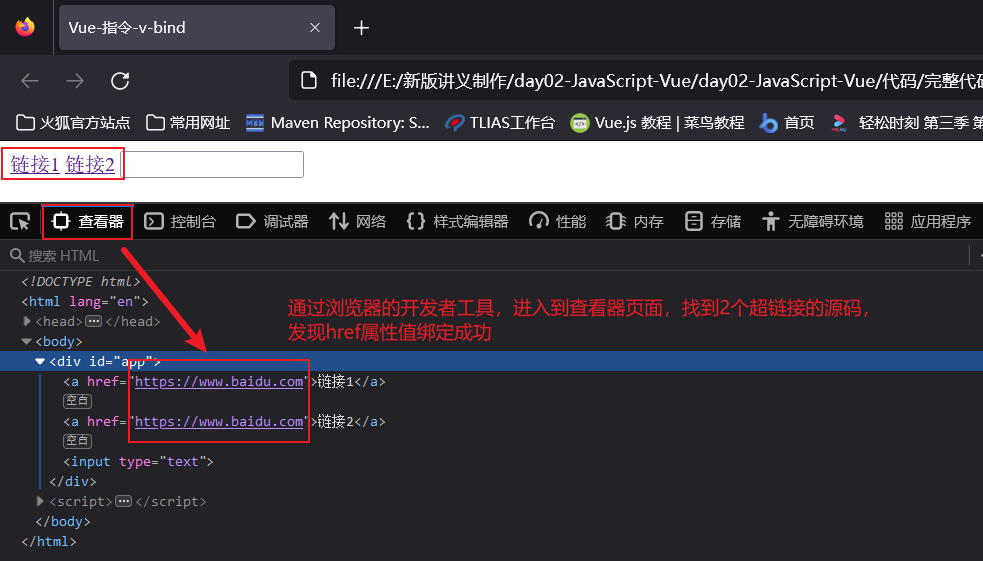
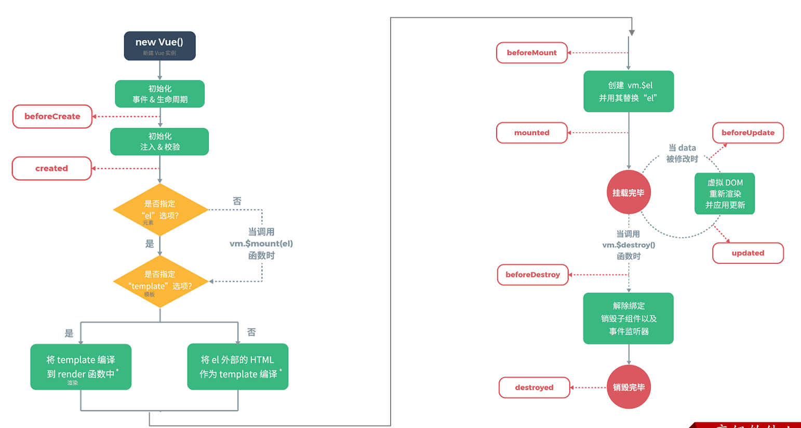
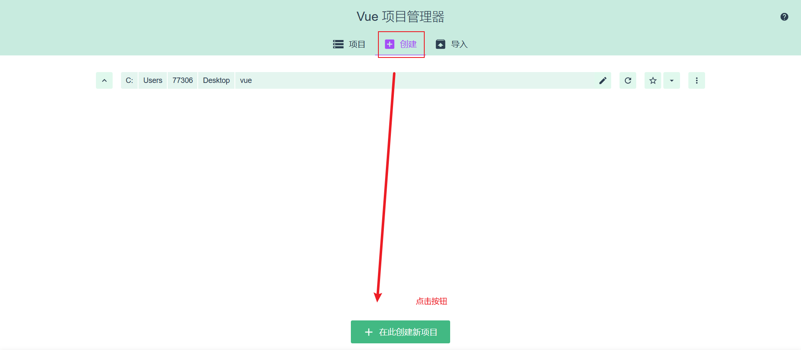
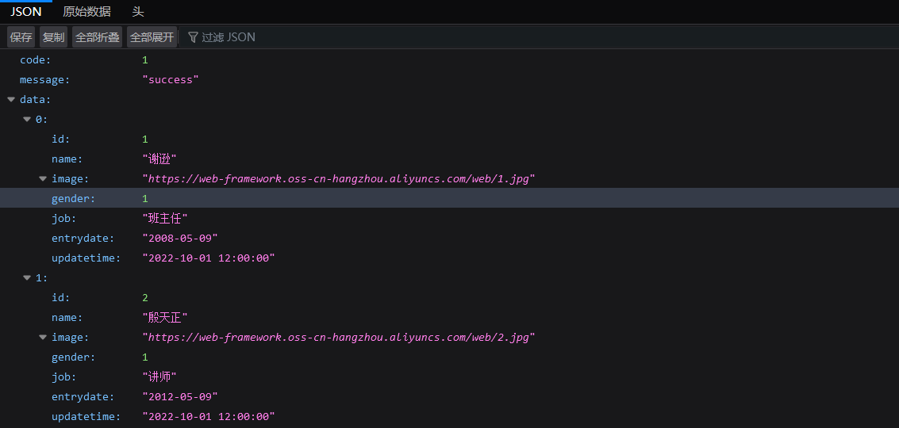

# Web

​		Web开发相较于C/S不同，Web开发是B/S架构，开发B/S架构我们不需要开发客户端，就是开发网站，可以先了解一下网站的工作流程：

### 1.Web开发

##### 1.1网站的工作流程

+ 首先我们需要**在浏览器输入栏中输入域名**，域名会通过运营商的dns服务器**解析成IP地址**，然后浏览器**通过这个IP地址访问到前端服务器中的前端程序**，这时候前端程序会将前端代码返回给浏览器，如下图所示：

​		

+ 浏览器得到了前端代码，浏览器会将前端代码进行解析，然后展示到浏览器的窗口中，这时用户就可以看到网站的初步页面，但此时的页面中是没有数据的。

+ 下一步需要去拿到数据并在页面上显示，在这之前，浏览器需要依据**前端代码中指定的后台服务器的地址**向后台服务器发起请求，**后台服务器会从数据库中获取数据**，然后返回给浏览器。
+ 
+ 浏览器拿到后台返回的数据后，会将数据展示在网页上，这样用户就能看到一个完整的网页了。

简单来说就是：

1.浏览器先向前端服务器请求**前端资源**，也就是我们所说的**网页**。

2.浏览器再向**后台服务器**发起请求，获取**数据。**

3.浏览器将得到的后台**数据**填充到**网页**上，然后展示给用户去看。

##### 1.2网站开发模式和开发技术

​		什么是网站开发模式？一般来说网站开发模式分为两种。一种是前后端分离项目，一种是混合开发。目前企业开发的主流是前后端分离项目。


​		网站开发所需要使用的基本技术有哪些呢？

前端web开发：

| 技术       | 描述                                          |
| ---------- | --------------------------------------------- |
| HTML       | 用于构建网站的基础结构的                      |
| css        | 用于美化页面的，作用和化妆或者整容作用一样    |
| JavaScript | 实现网页和用户的交互                          |
| Vue        | 主要用于将数据填充到html页面上的              |
| Element    | 主要提供了一些非常美观的组件                  |
| Nginx      | 一款web服务器软件，可以用于部署我们的前端工程 |

后端web开发：

| 技术       | 描述                                           |
| ---------- | :--------------------------------------------- |
| Maven      | 一款java中用于管理项目的软件                   |
| Mysql      | 最常用的一款数据库软件之一                     |
| SpringBoot | spring家族的产品，当前最为主流的项目开发技术。 |
| Mybatis    | 用于操作数据库的框架                           |

### 2.网页开发三剑客

​		什么是网页前端开发三剑客？它们分别是HTML（负责网页结构）、CSS（负责网页表现）、JavaScript（负责网页行为）。

##### 2.1HTML

​		什么是HTML呢？HTML（HyperText Markup Language）是：超文本标记语言。它超越了文本的限制，比普通文本更加强大，还可以定义图片、音频、视频等内容。同时它是由标签构成的。HTML代码直接在浏览器中运行，HTML标签由浏览器解析。

​		它的特点如下：

1.由htm或者html为扩展名。

2.HTML标签不区分大小写。

3.标签的属性值使用单双引号都可以（建议用双引号）。

4.语法松散。

​		下面是一些常见标签：


"<div>"：定义HTML文档中的一个区域部分，经常与CSS一起使用，用来布局页面。

“<span>”:用来组合行内元素。

​		下面学习一些简单的表单标签：


##### 2.2 CSS

​		什么是CSS？CSS（Cascading Style Sheet）是：层叠样式表。用于控制页面的样式。如何引用CSS呢？一般由三种引入方法：**内联样式、内部样式和外部样式。**它们的区别如下：

+ 内联样式：在标签内部，使用style属性，属性值就是css属性键值对。

+ 内部样式：定义<style>标签，在标签内部定义css样式。

+ 外部样式：定义<link>标签，引入外部的css文件。


​		那么什么又是CSS选择器呢？这是选取需设置样式的元素。选择器也有三种，它们分别是元素选择器，id选择器和类选择器。其实这三种选择器的优先级是：**元素选择器>类选择器>id选择器**，它们的格式如下：


##### 2.3 JavaScript

​		什么是JavaScript? JS（简称）是一门跨平台、面向对象的脚本语言。它是用来控制网页行为的，它可以使网页进行交互。需要注意的是，**JavaScript 和 Java 是完全不同的语言，不论是概念还是设计。但是基础语法类似。**

​		JS的引入方式有两种，分别是内部脚本和外部脚本，特点如下：

+ 内部脚本将JS定义在HTML页面中，JavaScript代码必须位于<script></script>标签内，在HTML文档中，可以在任意位置放置任意数量的<script>标签，一般会将脚本置于<body>元素的底部，可改善网页显示速度。

+ 外部脚本就是将JS代码定义在外部JS文件中，然后引入HTML页面中。外部JS文件中，只包含JS代码，不包含<script>标签，**并且<script>标签不能自闭合。**

​		JavaScript与Java的书写语法基本相同，不同的地方在于JS代码每行结尾的分号可有可无（但建议加上）。JS有三种输出的方式可以用作在网页中输出语句。


​		JS中的变量，JavaScript是一门**弱类型语言**，**所以变量可以存放不同类型的值**，JS用**var**关键字来声明变量。

```html
var a = 20;
a = "张三";
```

变量名要遵守一下规则：

1.组成字符可以是任何字母、数字、下划线（_）或美元符号（$）。

2.数字不能开头。

3.建议使用驼峰命名。

​		**注意：**lECMAScript 6新增了let关键字来定义变量。它的用法类似于 var，但是所声明的变量，只在let关键字所在的代码块内有效，且不允许重复声明。lECMAScript 6新增了 const 关键字，用来声明一个只读的常量。一旦声明，常量的值就不能改变。

JavaScript中分为：**原始类型**和**引用类型。**


可以使用typeof运算符来获取数据类型：

```html
var a = 20;
alert(typeof  a);
```

JavaScript中的运算符和Java基本相同，不同的是多了一个”===“运算符，注意===运算符不会进行类型转换，而==运算符会进行类型转换。


### 3. JavaScript基本对象（二）

##### 3.1 JS函数

​		什么是JavaScript函数？JS中的函数被设计为可以执行特定任务的代码块，通过关键字function来定义，有两种定义函数的语法：

+ **第一种定义格式**

```js
function 函数名(参数1,参数2..){
    要执行的代码
}
```

**注意：**因为JS是弱数据类型的语言，所以它的函数中的形参，可以不需要声明数据类型；还有返回值也不需要声明类型，直接return就行。上述的只是定义函数，函数需要被调用才能执行，示例如下：

```js
		//第一种构造函数方法
        function add(a, b) {
            return a + b;
        }
		//调用函数
        var result = add(50, 30);
        alert(result);//浏览器弹框内容为80
```

+ **第二种定义格式**

```js
var functionName = function (参数1,参数2..){   
	//要执行的代码
}
```

```js
 		//第二种构造函数方法
        var add2 = function(a, b) {
            return a + b;
        }
        //调用函数
        const result2 = add2(55, 185);
        alert(result2);//弹框内容为240
```

​		如果我们在调用函数时，在参数后面再添加两个数，会发生什么呢？

```js
var result = add(10,20,30,40);//会发生什么？
```

​		用浏览器打开，发现没有错误，并且依然弹出30，这是为什么呢？因为在JavaScript中，**函数的调用只需要名称正确即可，不会管参数列表。**如上述案例，10传递给了变量a，20传递给了变量b,**30和40没有变量接受，但是不影响函数的正常调用。**

##### 3.2 JS对象

​		如果在学习使用JS时，有不懂的地方，可以打开[W3school在线学习文档](https://w0ww.w3school.com.cn/)，在里面学习。那么JS对象有哪些呢？JS对象在分类上可以分为3大类：基本对象、BOM对象（浏览器对象模型）、DOM（标签元素对象模型）三类。

基本对象包括：


BOM对象,主要是和浏览器相关的几个对象：


DOM对象，JavaScript中将html的每一个标签都封装成一个对象：


+ **基本对象–Array**

​		Array对象能用来定义数组，数组的定义有两种格式：

```js
//第一种
var 变量名 = new Array(元素列表); // var arr = new Array(1,2,3,4,);

//第二种
var 变量名 = [ 元素列表 ]; // var arr = [1,2,3,4];
```

JS和Java一样通过数组索引来获取数组中的元素，但和Java不同的是，JS中的数组是（**伪数组**），它相当于java中的集合，**数组中可以存储任意数据类型的值**，如下代码在浏览器中控制台输出的结果：

```js
var arr = [1, 2, 3, 4, 5];
arr[8] = true;
arr[12] = "你好";
console.log(arr)
```


​		Array作为一个对象，那么对象肯定是有属性和方法的，下面介绍一下Array的一些属性和方法，只需要留意一些常用的属性和方法：

属性：

| 属性   | 描述                         |
| :----- | :--------------------------- |
| length | 设置或返回数组中元素的数量。 |

方法：

| 方法方法  | 描述                                             |
| :-------- | :----------------------------------------------- |
| forEach() | 遍历数组中的每个有值得元素，并调用一次传入的函数 |
| push()    | 将新元素添加到数组的末尾，并返回新的长度         |
| splice()  | 从数组中删除元素                                 |

​		forEach()函数是用来遍历的，且forEach遍历时指挥遍历有值的元素，没有值的元素是不会输出的。使用这个方法需要传递一个函数，函数的形参就是遍历数组时的值，下面是修改前的遍历代码：

```js
//e是形参，接受的是数组遍历时的值
arr.forEach(function(e){
     console.log(e);
})
//ES6之后，引入了箭头函数的写法，类似Java中的lambda表达式
arr.forEach((e) => {
     console.log(e);
}) 
```

​		push（）函数用于向数组的末尾添加元素，并且返回添加后数组的长度。

​		splice()函数用来删除数组中的元素，函数中填入2个参数。splice（参数1：表示从哪个索引位置删除，参数2：表示删除元素的个数。

+ **基本对象–String对象**

​		String对象的创建方式有两种：

```js
//方式一  
var 变量名 = new String("…") ; // var str = new String("你好");
 //方式二
var 变量名 = "…" ; //var str = "你好";
```

​		当然String对象也提供了一些常用的属性和方法，如下表格式所示：

属性：

| 属性   | 描述               |
| ------ | ------------------ |
| length | 返回字符串的长度。 |

方法：

| 方法        | 描述                                     |
| ----------- | ---------------------------------------- |
| charAt()    | 返回在指定位置的字符。                   |
| indexOf()   | 检索字符串。                             |
| trim()      | 去除字符串两边的空格                     |
| substring() | 提取字符串中两个指定的索引号之间的字符。 |

​		解释上表方法的具体作用，length用于返回字符串的长度、charAt用于返回指定索引位置的字符，参数就是指定的索引、indexOf用于检索指定内容在字符串中的位置，参数就是指定的字符串、trim用于去除字符串两边的空格、substring用于截取字符串，它有两个参数，substring（参数1：表示从那个索引位置（包含）开始截取，参数2：表示到那个索引位置（不包含）结束）

+ **基本对象–JSON对象**

  在JavaScript中自定义对象特别简单，它的语法格式如下：

```js
var 对象名 = {
    属性名1: 属性值1, 
    属性名2: 属性值2,
    属性名3: 属性值3,
    函数名称: function(形参列表){}
};
```

​		我们可以通过“对象名.属性名”来调用属性；或者通过“对象名.函数名”调用函数。下面我们在JavaScript中自定义一个对象并且在控制台输出它的属性和函数：

```js
<script>
    //自定义对象
    var user = {
        name: "Tom",
        age: 10,
        gender: "male",
        eat: function(){
             console.log("用膳~");
         }
    }

    console.log(user.name);
    user.eat();
<script>
```


​		那什么是JSON对象？JSON对象：**J**ava**S**cript **O**bject **N**otation，JavaScript对象标记法。是通过JavaScript标记法书写的文本。格式需要注意**key必须使用引号并且是双引号标记，value可以是任意数据类型。**其格式如下：

```js
{	//注意key必须要用双引号包裹，用单引号则会解析错误
    "key":value,
    "key":value,
    "key":value
}
```

​		那么用JSON这种数据格式存储数据有什么用呢？**它经常用来作为前后台交互的数据载体**，那为什么不用XML格式来进行传输数据呢？因为**XML格式传输数据有一些缺点**：1、标签需要编写双份，占用带宽，浪费资源2、解析繁琐。

​		现在新建一个html文件，再新建一个js脚本文件，将其引入到html中，在js中用JSON格式创建一个对象，输出这个对象的名字，看一下会发生什么。

```js
var JSONstr = '{ "name": "张三", "age": 22, "address": "深圳", "weight": "62" }';
alert(JSONstr.name);
```


​		为什么会显示名字未定义？**因为上述是一个json字符串，不是json对象，所以需要借助下面函数来进行json字符串和json对象的转换。**

```js
var Object = JSON.parse(JSONstr);
alert(Object.name);
```


​		同样我们可以通过stringify（）函数将json对象再次转换成字符串，代码如下：

```js
alert(JSON.stringify(Object));
```


+ **BOM对象**

​		什么是BOM对象？BOM的全称是**B**rowser **O**bject **M**odel,翻译过来是浏览器对象模型。也就是JavaScript将浏览器的各个组成部分封装成了对象。方便我们操作浏览器的部分功能，可以通过操作BOM对象的相关属性或者函数来完成。例如：现在需要将浏览器的地址改为`http://www.baidu.com`,就可以通过BOM中提供的location对象的href属性来完成，代码如下：`location.href='http://www.baidu.com'`

BOM中提供了五个对象：

| 对象名称  | 描述           |
| :-------- | :------------- |
| Window    | 浏览器窗口对象 |
| Navigator | 浏览器对象     |
| Screen    | 屏幕对象       |
| History   | 历史记录对象   |
| Location  | 地址栏对象     |

​		上面这五个对象对应的关系如下图所示：


* BOM–Window对象

​		window对象指的是浏览器窗口对象，是JavaScript的全部对象，所以对于window对象，我们可以直接使用，并且对于window对象的方法和属性，是可以省略window.例如：我们之前学习的alert()函数其实是属于window对象的,其完整的代码如下：

```js
window.alert('hello');//window.可以省略，如下
alert("hello");
```

​		所以对于window对象的属性和方法，一般都是采用简写的方式。window提供了很多属性和方法，下表列出了常用属性和方法.

window对象提供了获取其他BOM对象的属性：

| 属性      | 描述                  |
| --------- | --------------------- |
| history   | 用于获取history对象   |
| location  | 用于获取location对象  |
| Navigator | 用于获取Navigator对象 |
| Screen    | 用于获取Screen对象    |

​		也就是说我们要使用location对象，只需要通过代码`window.location`或者简写`location`即可使用

window也提供了一些常用的函数，如下表格所示：

| 函数          | 描述                                               |
| ------------- | -------------------------------------------------- |
| alert()       | 显示带有一段消息和一个确认按钮的警告框。           |
| comfirm()     | 显示带有一段消息以及确认按钮和取消按钮的对话框。   |
| setInterval() | 按照指定的周期（以毫秒计）来调用函数或计算表达式。 |
| setTimeout()  | 在指定的毫秒数后调用函数或计算表达式。             |

​		comfirm（）相较于alert（），它多了一个确认按钮和取消按钮，并且当用户点击确认时，会返回true；当用户点击取消时会返回false，利用返回值可以决定页面的后续操作。

​		**setInterval(fn,毫秒值)**：定时器，用于周期性的执行某个功能，并且是**循环执行**。该函数需要传递2个参数：

1、fn:函数，需要周期性执行的功能代码。

2、毫秒值：间隔时间。

代码如下：

~~~js
//定时器 - setInterval -- 周期性的执行某一个函数
var i = 0;
setInterval(function(){
     i++;
     console.log("定时器执行了"+i+"次");
},2000);
~~~

​		刷新页面，浏览器每个一段时间都会在控制台输出，结果如下：

 

​		**setTimeout(fn,毫秒值)** ：定时器，只会在一段时间后**执行一次功能**。参数和上述setInterval一致。代码如下：

~~~js
//定时器 - setTimeout -- 延迟指定时间执行一次 
setTimeout(function(){
	alert("JS");
},3000);
~~~

浏览器打开，3s后弹框，关闭弹框，就再也不会弹框了。

* BOM–Navigator对象
* BOM–Screen对象
* BOM–History对象
* BOM–Location对象

​		location是指代浏览器的地址栏对象，这个对象一般常用的是href属性，用于获取或者设置浏览器的地址信息，添加如下代码：

~~~js
//获取浏览器地址栏信息
alert(location.href);
//设置浏览器地址栏信息
location.href = "https://www.baidu.com";
~~~

浏览器效果如下：首先弹框展示浏览器地址栏信息，关闭弹框后会跳转到百度首页。

+ **DOM对象**

​		什么是DOM对象？DOM对象全称是**D**ocument **O**bject **M**odel 文档对象模型。也就是 JavaScript 将 HTML 文档的各个组成部分封装为对象。DOM和XML类似的点在于读取时需要解析，XML文档中的标签需要自己写代码解析，而HTML文档由浏览器解析，封装的对象如下：

- Document：整个文档对象
- Element：元素对象
- Attribute：属性对象
- Text：文本对象
- Comment：注释对象

如下图，左边是 HTML 文档内容，右边是 DOM 树，学习DOM技术有什么用呢？主要作用有1.改变 HTML 元素的内容。2.改变 HTML 元素的样式（CSS）。3.对 HTML DOM 事件作出反应。4.添加和删除 HTML 元素。


​		上面了解到了DOM的作用时通过修改HTML元素的内容和样式来实现页面的动态效果，那么操作DOM对象的前提是要获取到元素对象，再进行操作。那么我们应该如何拿到标签对象呢？又应该如何去操作标签对象的属性呢？

​		**HTML中的Element对象可以通过Document对象获取，而Document对象是通过window对象获取的。**document对象提供的用于获取Element元素对象的api如下表所示：

| 函数                              | 描述                                     |
| --------------------------------- | ---------------------------------------- |
| document.getElementById()         | 根据id属性值获取，返回单个Element对象    |
| document.getElementsByTagName()   | 根据标签名称获取，返回Element对象数组    |
| document.getElementsByName()      | 根据name属性值获取，返回Element对象数组  |
| document.getElementsByClassName() | 根据class属性值获取，返回Element对象数组 |

​		OK，现在我们拿到了对象或者对象数组，应该如何操作呢？通过查询文档资料，可以得知需要用到div标签对象的innerHTML属性来修改标签的内容。如果有多个div标签的话，则通过索引确定对应的标签，以修改内容，举个例子：

```js
var divs = document.getElementsByClassName('cls');
var div1 = divs[0];

div1.innerHTML = "ojbk";
```

##### 3.3DOM案例

​		现在有一些需求，要求利用DOM来实现：

1.点亮灯泡（获取图片标签，切换图片）

2.将所有的div标签的标签体内容后面加上：（红色）very good  （获取div标签，在后面加上新内容）

3.使所有的复选框呈现被选中的状态（获取复选框对象，设置checked为true）

```html
<!DOCTYPE html>
<html lang="en">
<head>
    <meta charset="UTF-8">
    <meta http-equiv="X-UA-Compatible" content="IE=edge">
    <meta name="viewport" content="width=device-width, initial-scale=1.0">
    <title>JS-对象-DOM-案例</title>
</head>

<body>
      <br><br>

    <div class="cls">传智教育</div>   <br>
    <div class="cls">黑马程序员</div>  <br>

    <input type="checkbox" name="hobby"> 电影
    <input type="checkbox" name="hobby"> 旅游
    <input type="checkbox" name="hobby"> 游戏
</body>

<script>
    //1. 点亮灯泡 : src 属性值
    var img = document.getElementById('h1');
    img.src = "img/on.gif";


    //2. 将所有div标签的内容后面加上: very good (红色字体) -- <font color='red'></font>
    var divs = document.getElementsByTagName('div');
    for (let i = 0; i < divs.length; i++) {
        const div = divs[i];
        div.innerHTML += "<font color='red'>very good</font>"; 
    }


    // //3. 使所有的复选框呈现选中状态
    var ins = document.getElementsByName('hobby');
    for (let i = 0; i < ins.length; i++) {
        const check = ins[i];
        check.checked = true;//选中
    }

</script>
</html>
```

##### 3.4 JavaScript事件

​		如下图所示的百度注册页面，当用户输入完内容，百度可以自动提示用户名已经存在还是可以使用。那么百度是怎么知道用户名输入完了呢？这就需要用到JavaScript中的事件了。

 

​		什么是事件呢？HTML事件是发生在HTML元素上的 “事情”，例如：

- 按钮被点击
- 鼠标移到元素上
- 输入框失去焦点
- ........

​		而我们可以给这些事件绑定函数，当事件触发时，可以自动的完成对应的功能。这就是**事件监听**。例如：对于百度注册页面，我们给用户名输入框的失去焦点事件绑定函数，当我们用户输入完内容，在标签外点击了鼠标，对于用户名输入框来说，失去焦点，然后执行绑定的函数，函数进行用户名内容的校验等操作。JavaScript事件是js非常重要的一部分，接下来我们进行事件的学习。那么我们对于JavaScript事件需要学习哪些内容呢？我们得知道有哪些常用事件，然后我们得学会如何给事件绑定函数。所以主要围绕两点来学习：

- 事件绑定
- 常用事件

​		在JS中，对于事件的绑定，有两种方式：

1.通过html标签中的事件属性进行绑定

- 例如一个按钮，我们对于按钮可以绑定单机事件，可以借助标签的onclick属性，属性值指向一个函数。

  示例如下：

  ~~~html
  <input type="button" id="btn1" value="事件绑定1" onclick="on()">
  ~~~

  onclick绑定了on函数，但还没有on函数，所以需要创建该函数，代码如下：

  ~~~html
  <script>
      function on(){
          alert("按钮1被点击了...");
      }
  </script>
  ~~~

  浏览器打开，然后点击按钮，弹框如下：

   

  

- 方式2：通过DOM中Element元素的事件属性进行绑定

  html中的标签被加载成element对象，所以也可以通过element对象的属性来操作标签的属性。此时我们再次添加一个按钮，代码如下：

  ~~~html
  <input type="button" id="btn2" value="事件绑定2">
  ~~~

  可以先通过id属性获取按钮对象，然后操作对象的onclick属性来绑定事件，代码如下：

  ~~~js
  document.getElementById('btn2').onclick = function(){
      alert("按钮2被点击了...");
  }
  ~~~

  浏览器刷新页面，点击第二个按钮，弹框如下：

   

**需要注意的是：事件绑定的函数，只有在事件被触发时，函数才会被调用。**

​		在JS中有许多事件，上面的onclick只是最常见的事件之一，哪还有哪些常用的事件呢？如下：

| 事件属性名  | 说明                     |
| ----------- | ------------------------ |
| onclick     | 鼠标单击事件             |
| onblur      | 元素失去焦点             |
| onfocus     | 元素获得焦点             |
| onload      | 某个页面或图像被完成加载 |
| onsubmit    | 当表单提交时触发该事件   |
| onmouseover | 鼠标被移到某元素之上     |
| onmouseout  | 鼠标从某元素移开         |

##### 3.5DOM案例增强

现在需求如下：

1. 点击 “点亮”按钮 点亮灯泡，点击“熄灭”按钮 熄灭灯泡。
2. 输入框鼠标聚焦后，展示小写；鼠标离焦后，展示大写。
3. 点击 “全选”按钮使所有的复选框呈现被选中的状态，点击 “反选”按钮使所有的复选框呈现取消勾选的状态。

代码如下：

```html
<!DOCTYPE html>
<html lang="en">
<head>
    <meta charset="UTF-8">
    <meta http-equiv="X-UA-Compatible" content="IE=edge">
    <meta name="viewport" content="width=device-width, initial-scale=1.0">
    <title>JS-事件-案例</title>
</head>
<body>

     <br>

    <input type="button" value="点亮" onclick="on()"> 
    <input type="button"  value="熄灭" onclick="off()">
    
    <br> <br>
    <input type="text" id="name" value="ITCAST" onfocus="lower()" onblur="upper()">
    <br> <br>

    <input type="checkbox" name="hobby"> 电影
    <input type="checkbox" name="hobby"> 旅游
    <input type="checkbox" name="hobby"> 游戏
    <br>
    <input type="button" value="全选" onclick="checkAll()"> 
    <input type="button" value="反选" onclick="reverse()">
</body>
<script>
    //1. 点击 "点亮" 按钮, 点亮灯泡; 点击 "熄灭" 按钮, 熄灭灯泡; -- onclick
    function on(){
        //a. 获取img元素对象
        var img = document.getElementById("light");

        //b. 设置src属性
        img.src = "img/on.gif";
    }

    function off(){
        //a. 获取img元素对象
        var img = document.getElementById("light");

        //b. 设置src属性
        img.src = "img/off.gif";
    }

    //2. 输入框聚焦后, 展示小写; 输入框离焦后, 展示大写; -- onfocus , onblur
    function lower(){//小写
        //a. 获取输入框元素对象
        var input = document.getElementById("name");

        //b. 将值转为小写
        input.value = input.value.toLowerCase();
    }

    function upper(){//大写
        //a. 获取输入框元素对象
        var input = document.getElementById("name");

        //b. 将值转为大写
        input.value = input.value.toUpperCase();
    }

    //3. 点击 "全选" 按钮使所有的复选框呈现选中状态 ; 点击 "反选" 按钮使所有的复选框呈现取消勾选的状态 ; -- onclick
    function checkAll(){
        //a. 获取所有复选框元素对象
        var hobbys = document.getElementsByName("hobby");

        //b. 设置选中状态
        for (let i = 0; i < hobbys.length; i++) {
            const element = hobbys[i];
            element.checked = true;
        }
    }
    
    function reverse(){
        //a. 获取所有复选框元素对象
        var hobbys = document.getElementsByName("hobby");

        //b. 设置未选中状态
        for (let i = 0; i < hobbys.length; i++) {
            const element = hobbys[i];
            element.checked = false;
        }
    }

</script>
</html>
```

### 4.Vue

​		什么是Vue？在了解Vue之前，需要引入一种叫做MVVM的前端开发思想，这种思想可以让开发者更加关注数据，而非数据绑定到视图这种机械化的操作。那么什么是MVVM思想呢？

**MVVM:其实是Model-View-ViewModel的缩写**，有3个单词，具体释义如下：

- Model: 数据模型，特指前端中通过请求从后台获取的数据
- View: 视图，用于展示数据的页面，可以理解成我们的html+css搭建的页面，但是没有数据
- ViewModel: 数据绑定到视图，负责将数据（Model）通过JavaScript的DOM技术，将数据展示到视图（View）上

如图所示就是MVVM开发思想的含义：

 

​		基于上述的MVVM思想，其中的Model我们可以通过Ajax来发起请求从后台获取;对于View部分，我们将来会学习一款ElementUI框架来替代HTML+CSS来更加方便的搭建View;而今天我们要学习的就是侧重于ViewModel部分开发的vue前端框架，用来替代JavaScript的DOM操作，让数据展示到视图的代码开发变得更加的简单。可以简单到什么程度呢？可以参考下图对比：


​		OK，现在再来介绍一下Vue。

Vue.js（读音 /vjuː/, 类似于 **view**） 是一套构建用户界面的 **渐进式框架**。与其他重量级框架不同的是，Vue 采用自底向上增量开发的设计。Vue 的核心库只关注视图层，并且非常容易学习，非常容易与其它库或已有项目整合。Vue.js 的目标是通过尽可能简单的 API 实现**响应的数据绑定**和**组合的视图组件**。

##### 4.1 Vue入门

接下来通过一个vue的快速入门案例，来体验一下Vue。

第一步：在VS Code中创建名为12. Vue-快速入门.html的文件，并且在html文件同级创建js目录，将**/vue.js文件**目录下得vue.js拷贝到js目录，如下图所示：

 

第二步：然后编写&lt;script&gt;标签来引入vue.js文件，代码如下：

~~~html
<script src="js/vue.js"></script>
~~~

第三步：在js代码区域定义vue对象,代码如下：

~~~html
<script>
    //定义Vue对象
    new Vue({
        el: "#app", //vue接管区域
        data:{
            message: "Hello Vue"
        }
    })
</script>
~~~

在创建vue对象时，有几个常用的属性：

- **el:**  用来指定哪儿些标签受 Vue 管理。 该属性取值 `#app` 中的 `app` 需要是受管理的标签的id属性值
- **data:** 用来定义数据模型。
- **methods:** 用来定义函数。

第四步：在html区域编写视图，其中{{}}是插值表达式，用来将vue对象中定义的model展示到页面上的

~~~html
<body>
    <div id="app">
        <input type="text" v-model="message">
        {{message}}
    </div>
</body>
~~~

浏览器打开效果如图所示：

 

整体代码如下：

~~~html
<!DOCTYPE html>
<html lang="en">

<head>
    <meta charset="UTF-8">
    <meta http-equiv="X-UA-Compatible" content="IE=edge">
    <meta name="viewport" content="width=device-width, initial-scale=1.0">
    <title>测试</title>
    <script src="../js/vue.js"></script>
</head>

<body>

    <div id="app">
        <input type="text" v-model="message"> <br> {{message}}
    </div>

    <script>
        new Vue({
            el: "#app",
            data: {
                message: "你好嘻嘻"
            },

        })
    </script>
</body>

</html>
~~~

##### 4.2 Vue指令

在上述案例中，发现了html中输入了一个没有学过的属性`v-model`，这个就是vue的**指令**。

**指令：**HTML 标签上带有 v- 前缀的特殊属性，不同指令具有不同含义。例如：v-if，v-for…

在vue中，通过大量的指令来实现数据绑定到视图的，所以接下来我们需要学习vue的常用指令，如下表所示：

| **指令**  | **作用**                                            |
| --------- | --------------------------------------------------- |
| v-bind    | 为HTML标签绑定属性值，如设置  href , css样式等      |
| v-model   | 在表单元素上创建双向数据绑定                        |
| v-on      | 为HTML标签绑定事件                                  |
| v-if      | 条件性的渲染某元素，判定为true时渲染,否则不渲染     |
| v-else    |                                                     |
| v-else-if |                                                     |
| v-show    | 根据条件展示某元素，区别在于切换的是display属性的值 |
| v-for     | 列表渲染，遍历容器的元素或者对象的属性              |

######  **v-bind和v-model**

​		下面学习一下v-bind指令和v-model指令：

| **指令** | **作用**                                       |
| -------- | ---------------------------------------------- |
| v-bind   | 为HTML标签绑定属性值，如设置  href , css样式等 |
| v-model  | 在表单元素上创建双向数据绑定                   |

+ v-bind:  为HTML标签绑定属性值，如设置  href , css样式等。当vue对象中的数据模型发生变化时，标签的属性值会随之发生变化。

准备以下代码，用这两个指令绑定网址数据：

```html
<!DOCTYPE html>
<html lang="en">
<head>
    <meta charset="UTF-8">
    <meta http-equiv="X-UA-Compatible" content="IE=edge">
    <meta name="viewport" content="width=device-width, initial-scale=1.0">
    <title>Vue-指令-v-bind</title>
    <script src="js/vue.js"></script>
</head>
<body>
    <div id="app">

        <a >链接1</a>
        <a >链接2</a>

        <input type="text" >

    </div>
</body>
<script>
    //定义Vue对象
    new Vue({
        el: "#app", //vue接管区域
        data:{
           url: "https://www.baidu.com"
        }
    })
</script>
</html>
```

- 在上述的代码中，我们需要给&lt;a&gt;标签的href属性赋值，并且值应该来自于vue对象的数据模型中的url变量。所以编写如下代码：

  ~~~html
  <a v-bind:href="url">链接1</a>
  ~~~

  在上述的代码中，v-bind指令是可以省略的，但是:不能省略，所以第二个超链接的代码编写如下：

  ~~~html
  <a :href="url">链接2</a>
  ~~~

  浏览器打开，2个超链接都可以点击，然后跳转到百度去！效果如图所示：

   

  

  **注意：html属性前面有:表示采用的vue的属性绑定！**

- v-model： 在表单元素上创建双向数据绑定。什么是双向？

  -  vue对象的data属性中的数据变化，视图展示会一起变化
  -  视图数据发生变化，vue对象的data属性中的数据也会随着变化。

  data属性中数据变化，我们知道可以通过赋值来改变，但是视图数据为什么会发生变化呢？**只有表单项标签！所以双向绑定一定是使用在表单项标签上的**。编写如下代码：

  ~~~html
  <input type="text" v-model="url">
  ~~~

  打开浏览器，我们修改表单项标签，发现vue对象data中的数据也发生了变化，如下图所示：

   

  通过上图可以发现，只是改变了表单数据，那么我们之前超链接的绑定的数据值也发生了变化，为什么？

  就是因为v-model是双向绑定，在视图发生变化时，同时vue的data中的数据模型也会随着变化。那么这个在企业开发的应用场景是什么？

  **双向绑定的作用：可以获取表单的数据的值，然后提交给服务器**。

  

###### v-on

v-on: 用来给html标签绑定事件的。**需要注意的是如下2点**：

- v-on语法给标签的事件绑定的函数，必须是vue对象种声明的函数

- v-on语法绑定事件时，事件名相比较js中的事件名，没有on

  例如：在js中，事件绑定demo函数

  ~~~html
  <input onclick="demo()">
  ~~~

  vue中，事件绑定demo函数

  ~~~html
  <input v-on:click="demo()">
  ~~~

需要在vue对象的methods属性中定义事件绑定时需要的handle()函数，代码如下：

~~~js
 methods: {
        handle: function(){
           alert("你点我了一下...");
        }
}
~~~

然后给第一个按钮，通过v-on指令绑定单击事件，代码如下：

~~~html
 <input type="button" value="点我一下" v-on:click="handle()">
~~~

同样，v-on也存在简写方式，即v-on: 可以替换成@，所以第二个按钮绑定单击事件的代码如下：

~~~html
<input type="button" value="点我一下" @click="handle()">
~~~

完整代码如下：

~~~html
<!DOCTYPE html>
<html lang="en">
<head>
    <meta charset="UTF-8">
    <meta http-equiv="X-UA-Compatible" content="IE=edge">
    <meta name="viewport" content="width=device-width, initial-scale=1.0">
    <title>Vue-指令-v-on</title>
    <script src="js/vue.js"></script>
</head>
<body>
    <div id="app">

        <input type="button" value="点我一下" v-on:click="handle()">

        <input type="button" value="点我一下" @click="handle()">

    </div>
</body>
<script>
    //定义Vue对象
    new Vue({
        el: "#app", //vue接管区域
        data:{
           
        },
        methods: {
            handle: function(){
                alert("你点我了一下...");
            }
        }
    })
</script>
</html>
~~~

###### v-if和v-show

| 指令      | 描述                                                |
| --------- | --------------------------------------------------- |
| v-if      | 条件性的渲染某元素，判定为true时渲染,否则不渲染     |
| v-if-else |                                                     |
| v-else    |                                                     |
| v-show    | 根据条件展示某元素，区别在于切换的是display属性的值 |

​		下面直接通过代码来演示效果。在VS Code中创建名为15. Vue-指令-v-if和v-show.html的文件，提前准备好如下代码：

~~~html
<!DOCTYPE html>
<html lang="en">
<head>
    <meta charset="UTF-8">
    <meta http-equiv="X-UA-Compatible" content="IE=edge">
    <meta name="viewport" content="width=device-width, initial-scale=1.0">
    <title>Vue-指令-v-if与v-show</title>
    <script src="js/vue.js"></script>
</head>
<body>
    <div id="app">
        
        年龄<input type="text" v-model="age">经判定,为:
        <span>年轻人(35及以下)</span>
        <span>中年人(35-60)</span>
        <span>老年人(60及以上)</span>

        <br><br>
    </div>
</body>
<script>
    //定义Vue对象
    new Vue({
        el: "#app", //vue接管区域
        data:{
           age: 20
        },
        methods: {
            
        }
    })
</script>
</html>
~~~

​		其中采用了双向绑定到age属性，意味着我们可以通过表单输入框来改变age的值。

​		需求是当我们改变年龄时，需要动态判断年龄的值，呈现对应的年龄的文字描述。年轻人，我们需要使用条件判断`age<=35`,中年人我们需要使用条件判断`age>35 && age<60`,其他情况是老年人。所以通过v-if指令编写如下代码：

~~~html
年龄<input type="text" v-model="age">经判定,为:
<span v-if="age <= 35">年轻人(35及以下)</span>
<span v-else-if="age > 35 && age < 60">中年人(35-60)</span>
<span v-else>老年人(60及以上)</span>
~~~

​		浏览器打开测试效果如下图：

 

​		v-show和v-if的作用效果是一样的，只是原理不一样。复制上述html代码，修改v-if指令为v-show指令，代码如下：

~~~html
年龄<input type="text" v-model="age">经判定,为:
<span v-show="age <= 35">年轻人(35及以下)</span>
<span v-show="age > 35 && age < 60">中年人(35-60)</span>
<span v-show="age >= 60">老年人(60及以上)</span>
~~~

​		打开浏览器，展示效果如下所示：

 

​		可以发现，浏览器呈现的效果是一样的，但是浏览器中html源码不一样。v-if指令，不满足条件的标签代码直接没了，而v-show指令中，不满足条件的代码依然存在，只是添加了css样式来控制标签不去显示。

完整代码如下：

~~~html
<!DOCTYPE html>
<html lang="en">
<head>
    <meta charset="UTF-8">
    <meta http-equiv="X-UA-Compatible" content="IE=edge">
    <meta name="viewport" content="width=device-width, initial-scale=1.0">
    <title>Vue-指令-v-if与v-show</title>
    <script src="js/vue.js"></script>
</head>
<body>
    <div id="app">
        
        年龄<input type="text" v-model="age">经判定,为:
        <span v-if="age <= 35">年轻人(35及以下)</span>
        <span v-else-if="age > 35 && age < 60">中年人(35-60)</span>
        <span v-else>老年人(60及以上)</span>

        <br><br>

        年龄<input type="text" v-model="age">经判定,为:
        <span v-show="age <= 35">年轻人(35及以下)</span>
        <span v-show="age > 35 && age < 60">中年人(35-60)</span>
        <span v-show="age >= 60">老年人(60及以上)</span>

    </div>
</body>
<script>
    //定义Vue对象
    new Vue({
        el: "#app", //vue接管区域
        data:{
           age: 20
        },
        methods: {         
        }
    })
</script>
</html>
~~~

###### v-for

​		v-for: 从名字就能看出，这个指令是用来遍历的。其语法格式如下：

~~~html
<标签 v-for="变量名 in 集合模型数据">
    {{变量名}}
</标签>
~~~

​		需要注意的是：**需要循环那个标签，v-for 指令就写在那个标签上。**

​		有时我们遍历时需要使用索引，那么v-for指令遍历的语法格式如下：

~~~html
<标签 v-for="(变量名,索引变量) in 集合模型数据">
    <!--索引变量是从0开始，所以要表示序号的话，需要手动的加1-->
   {{索引变量 + 1}} {{变量名}}
</标签>
~~~

然后分别编写2种遍历语法，来遍历数组，展示数据，代码如下：

~~~html
<!DOCTYPE html>
<html lang="en">
<head>
    <meta charset="UTF-8">
    <meta http-equiv="X-UA-Compatible" content="IE=edge">
    <meta name="viewport" content="width=device-width, initial-scale=1.0">
    <title>Vue-指令-v-for</title>
    <script src="js/vue.js"></script>
</head>
<body>
    
    <div id="app">
     <div v-for="addr in addrs">{{addr}}</div>
     <hr>
     <div v-for="(addr,index) in addrs">{{index + 1}} : {{addr}}</div>
</div>
    
</body>
<script>
    //定义Vue对象
    new Vue({
        el: "#app", //vue接管区域
        data:{
           addrs:["北京", "上海", "西安", "成都", "深圳"]
        },
        methods: {  
        }
    })
</script>
</html>
~~~

浏览器打开，呈现如下效果：

 

##### 4.3 Vue使用案例

+ 需求：

 

​		如上图所示，我们提供好了数据模型，users是数组集合，提供了多个用户信息。然后我们需要将数据以表格的形式，展示到页面上，其中，性别需要转换成中文男女，等级需要将分数数值转换成对应的等级。

+ 分析：

​		首先肯定需要遍历数组的，所以需要使用v-for标签；然后每一条数据对应一行，所以v-for需要添加在tr标签上；其次我们需要将编号，所以需要使用索引的遍历语法；然后我们要将数据展示到表格的单元格中，所以我们需要使用{{}}插值表达式；最后，我们需要转换内容，所以我们需要使用v-if指令，进行条件判断和内容的转换。

步骤：

1.使用v-for的带索引方式添加到表格的&lt;tr&gt;标签上。

2.使用{{}}插值表达式展示内容到单元格。

3.使用索引+1来作为编号。

4.使用v-if来判断，改变性别和等级这2列的值。

+ 代码实现：

首先创建名为17. Vue-指令-案例.html的文件，提前准备如下代码：

~~~html
<!DOCTYPE html>
<html lang="en">
<head>
    <meta charset="UTF-8">
    <meta http-equiv="X-UA-Compatible" content="IE=edge">
    <meta name="viewport" content="width=device-width, initial-scale=1.0">
    <title>Vue-指令-案例</title>
    <script src="js/vue.js"></script>
</head>
<body>
    
    <div id="app">
        
        <table border="1" cellspacing="0" width="60%">
            <tr>
                <th>编号</th>
                <th>姓名</th>
                <th>年龄</th>
                <th>性别</th>
                <th>成绩</th>
                <th>等级</th>
            </tr>
        </table>

    </div>

</body>

<script>
    new Vue({
        el: "#app",
        data: {
            users: [{
                name: "Tom",
                age: 20,
                gender: 1,
                score: 78
            },{
                name: "Rose",
                age: 18,
                gender: 2,
                score: 86
            },{
                name: "Jerry",
                age: 26,
                gender: 1,
                score: 90
            },{
                name: "Tony",
                age: 30,
                gender: 1,
                score: 52
            }]
        },
        methods: {
            
        },
    })
</script>
</html>
~~~

然后在&lt;tr&gt;上添加v-for进行遍历，以及通过插值表达式{{}}和v-if指令来填充内容和改变内容，其代码如下：

~~~html
 <tr align="center" v-for="(user,index) in users">
     <td>{{index + 1}}</td>
     <td>{{user.name}}</td>
     <td>{{user.age}}</td>
     <td>
         <span v-if="user.gender == 1">男</span>
         <span v-if="user.gender == 2">女</span>
     </td>
     <td>{{user.score}}</td>
     <td>
         <span v-if="user.score >= 85">优秀</span>
         <span v-else-if="user.score >= 60">及格</span>
         <span style="color: red;" v-else>不及格</span>
     </td>
</tr>
~~~

其完整代码如下：

~~~html
<!DOCTYPE html>
<html lang="en">
<head>
    <meta charset="UTF-8">
    <meta http-equiv="X-UA-Compatible" content="IE=edge">
    <meta name="viewport" content="width=device-width, initial-scale=1.0">
    <title>Vue-指令-案例</title>
    <script src="js/vue.js"></script>
</head>
<body>
    
    <div id="app">
        
        <table border="1" cellspacing="0" width="60%">
            <tr>
                <th>编号</th>
                <th>姓名</th>
                <th>年龄</th>
                <th>性别</th>
                <th>成绩</th>
                <th>等级</th>
            </tr>

            <tr align="center" v-for="(user,index) in users">
                <td>{{index + 1}}</td>
                <td>{{user.name}}</td>
                <td>{{user.age}}</td>
                <td>
                    <span v-if="user.gender == 1">男</span>
                    <span v-if="user.gender == 2">女</span>
                </td>
                <td>{{user.score}}</td>
                <td>
                    <span v-if="user.score >= 85">优秀</span>
                    <span v-else-if="user.score >= 60">及格</span>
                    <span style="color: red;" v-else>不及格</span>
                </td>
            </tr>
        </table>

    </div>

</body>

<script>
    new Vue({
        el: "#app",
        data: {
            users: [{
                name: "Tom",
                age: 20,
                gender: 1,
                score: 78
            },{
                name: "Rose",
                age: 18,
                gender: 2,
                score: 86
            },{
                name: "Jerry",
                age: 26,
                gender: 1,
                score: 90
            },{
                name: "Tony",
                age: 30,
                gender: 1,
                score: 52
            }]
        },
        methods: {
            
        },
    })
</script>
</html>
~~~

##### 4.4 Vue的生命周期

​		什么是Vue的生命周期？这指的是vue对象从创建到销毁的过程。vue的生命周期包含8个阶段：每触发一个生命周期事件，会自动执行一个生命周期方法，这些生命周期方法也被称为钩子方法。其完整的生命周期如下图所示：

| 状态          | 阶段周期 |
| ------------- | -------- |
| beforeCreate  | 创建前   |
| created       | 创建后   |
| beforeMount   | 挂载前   |
| mounted       | 挂载完成 |
| beforeUpdate  | 更新前   |
| updated       | 更新后   |
| beforeDestroy | 销毁前   |
| destroyed     | 销毁后   |

​		下图是 Vue 官网提供的从创建 Vue 到效果 Vue 对象的整个过程及各个阶段对应的钩子函数：



​		其中我们需要重点关注的是**mounted,**其他的我们了解即可。

​		mounted：挂载完成，Vue初始化成功，HTML页面渲染成功。**以后我们一般用于页面初始化自动的ajax请求后台数据**

​		通过以下代码来演示钩子方法的效果，提前准备如下代码：

~~~html
<!DOCTYPE html>
<html lang="en">
<head>
    <meta charset="UTF-8">
    <meta http-equiv="X-UA-Compatible" content="IE=edge">
    <meta name="viewport" content="width=device-width, initial-scale=1.0">
    <title>Vue-指令-v-for</title>
    <script src="js/vue.js"></script>
</head>
<body>
    <div id="app">

    </div>
</body>
<script>
    //定义Vue对象
    new Vue({
        el: "#app", //vue接管区域
        data:{
           
        },
        methods: {
        }
    })
</script>
</html>
~~~

​		然后我们编写mounted声明周期的钩子函数，应该与**data和methods同级**，代码如下：

~~~html
<script>
    //定义Vue对象
    new Vue({
        el: "#app", //vue接管区域
        data:{
           
        },
        methods: {
            
        },
        mounted () {
            alert("vue挂载完成,发送请求到服务端")
        }
    })
</script>
~~~

​		浏览器打开，运行结果如下：我们发现，自动打印了这句话，因为页面加载完成，vue对象创建并且完成了挂在，此时自动触发mounted所绑定的钩子函数，然后自动执行，弹框。

 

##### 4.5前端工程入门

​		前端工程化可以借助vue官方提供的Vue-cli脚手架来完成，它可以快速生成一个Vue的项目模板，Vue-cli脚手架主要提供以下功能：

- 统一的目录结构
- 本地调试
- 热部署
- 单元测试
- 集成打包上线

​		运行Vue-cli，必须需要依赖NodeJS，NodeJS是前端工程化依赖的环境。所以需要先安装NodeJS，然后才能安装Vue-cli。

+ 前端工程化入门

将环境和脚手架安装好后，可以通过vue-cli脚手架快速创建vue项目。

首先，需要在桌面创建vue文件夹，然后双击文件夹，来到地址目录，输入cmd，然后进入vue文件夹的cmd窗口界面，如下图所示：


然后进入如下界面：


然后在当前目录下，直接输入命令`vue ui`进入到vue的图形化界面，如下图所示：

 

然后选择创建按钮，在vue文件夹下创建项目，如下图所示：



然后来到如下界面，进行vue项目的创建


然后预设模板选择手动，如下图所示：

  

然后再功能页面开启路由功能，如下图所示：

 

然后再配置页面选择语言版本和语法检查规范，如下图所示：

 

然后创建项目，进入如下界面：


最后需要等待片刻，即可进入到创建创建成功的界面，如下图所示：

 

 到此，vue项目创建结束。

+ **vue项目目录结构介绍**

vue项目的标准目录结构以及对应的解释如下图所示，前端开发的代码写在**src目录下**：


+ **运行vue项目**

​		在创建好vue项目后，我们该如何运行它呢？

1、通过**设置/用户设置/扩展/MPM**更改NPM默认配置，打开资源管理器下的NPm开关，再到下方开关打开服务器。

2、**通过命令行**开启服务器，在vue目录下，执行输入命令`npm run serve`即可，如果出现端口被占用导致服务器开启失败，可以在vue.js文件中添加新端口号，如下图:


##### 4.6Vue路由

​		什么是Vue路由？在上面制作的页面中，希望可以通过点击侧面的部门管理来显示部门管理的信息，点击员工管理即可显示员工信息。那么需要如何才能做到？这就需要用到Vue的路由了。首先我们需要**先安装vue-router插件**，可以通过如下命令：

~~~
npm install vue-router@3.5.1
~~~

**但是不需要安装，因为上面创建项目时，就勾选了路由功能，已经安装好了。**只需要在**src/router/index.js**文件中定义路由表，根据其提供的模板代码进行修改，最终代码如下：

```html
<template>
  <div id="app">
    <!-- {{message}} -->
    <!-- <element-view></element-view> -->
    <!-- <emp-view></emp-view> -->
    <router-view></router-view>
  </div>
</template>

<script>
// import EmpView from './views/tlias/EmpView.vue'
// import ElementView from './views/Element/ElementView.vue'
export default {
  components: { },
  data(){
    return {
      "message":"hello world"
    }
  }
}
</script>
<style>

</style>
```

##### 4.7部署前端工程

​		前端工程开发好了需要怎样发布呢？通过NPm中提供的build按钮来在工程目录下生成一个dist目录，在这个目录中存放需要发布的前端资源，然后通过nginx来发布。nginx: Nginx是一款轻量级的Web服务器/反向代理服务器及电子邮件（IMAP/POP3）代理服务器。其特点是占有内存少，并发能力强，在各大型互联网公司都有非常广泛的使用。

​		niginx在windows中的安装是比较方便的，直接解压即可。所以将nginx-1.22.0.zip压缩文件拷贝到**无中文的目录下**，直接解压即可，如下图所示就是nginx的解压目录以及目录结构说明：


**很明显，我们如果要发布，直接将资源放入到html目录中。**

​		发布完成后再进行部署就可以访问页面了，将之前打包的前端工程dist目录下得内容拷贝到nginx的html目录下，如下图所示：


​		拷贝完成通过双击nginx下得nginx.exe文件来启动nginx，如下图所示：


​		nginx服务器的端口号是80，所以启动成功之后，浏览器可以直接访问http://localhost:80 即可，其中80端口可以省略，其浏览器展示效果如图所示：


​		到此前端工程发布成功。

PS: 如果80端口被占用，我们需要通过**conf/nginx.conf**配置文件来修改端口号。如下图所示：


## 5.Vue组件库ElementUI

​		什么是Element组件库？Vue是侧重于VM开发的，而Element是侧重于V开发的前端框架。这是饿了么前端开发团队提供的一套基于Vue的网站组件库，可以用于其中的组件开发出精美的网页。

##### 5.1Elment入门

​		首先在VS Code的命令行输入“npm install element-ui@2.15.3 ”安装ElementUI组件库，然后在需要在main.js这个入口js文件中引入ElementUI的组件库，代码如下：

```js
import ElementUI from 'element-ui';
import 'element-ui/lib/theme-chalk/index.css';

Vue.use(ElementUI);
```

​		然后需要按照vue项目的开发规范，在src/views目录下创建一个vue组件文件，这个组件包括三个部分：模板、脚本、样式。如下：

```html
<template>

</template>

<script>
export default {

}
</script>

<style>

</style>
```

​		然后需要去ElementUI官网找到组件库，然后抄写代码。ElementView.vue组件文件整体代码如下：

```
<template>
    <div>
    <!-- Button按钮 -->
        <el-row>
            <el-button>默认按钮</el-button>
            <el-button type="primary">主要按钮</el-button>
            <el-button type="success">成功按钮</el-button>
            <el-button type="info">信息按钮</el-button>
            <el-button type="warning">警告按钮</el-button>
            <el-button type="danger">危险按钮</el-button>
        </el-row>

        <!-- Table表格 -->
        <el-table
        :data="tableData"
        style="width: 100%">
            <el-table-column
                prop="date"
                label="日期"
                width="180">
            </el-table-column>
            <el-table-column
                prop="name"
                label="姓名"
                width="180">
            </el-table-column>
            <el-table-column
                prop="address"
                label="地址">
            </el-table-column>
        </el-table>
    </div>
</template>

<script>
export default {
     data() {
        return {
          tableData: [{
            date: '2016-05-02',
            name: '王小虎',
            address: '上海市普陀区金沙江路 1518 弄'
          }, {
            date: '2016-05-04',
            name: '王小虎',
            address: '上海市普陀区金沙江路 1517 弄'
          }, {
            date: '2016-05-01',
            name: '王小虎',
            address: '上海市普陀区金沙江路 1519 弄'
          }, {
            date: '2016-05-03',
            name: '王小虎',
            address: '上海市普陀区金沙江路 1516 弄'
          }]
        }
      }
}
</script>

<style>

</style>
```

​		浏览器页面展示如下：


##### 5.2案例

​		参考以上所学并利用element组件制作如下页面：


数据Mock地址：http://yapi.smart-xwork.cn/mock/169327/emp/list，浏览器打开，数据格式如下图所示：



整个完整代码如下，不要能全部写出，能够看懂结构和内容即可。

```html
<template>
    <div>
        <!-- 设置最外层容器高度为700px,在加上一个很细的边框 -->
        <el-container style="height: 700px; border: 1px solid #eee">
            <el-header style="font-size:40px;background-color: rgb(238, 241, 246)">tlias 智能学习辅助系统</el-header>
            <el-container>
                <el-aside width="230px"  style="border: 1px solid #eee">
                     <el-menu :default-openeds="['1', '3']">
                        <el-submenu index="1">
                            <template slot="title"><i class="el-icon-message"></i>系统信息管理</template>
                          
                            <el-menu-item index="1-1">部门管理</el-menu-item>
                            <el-menu-item index="1-2">员工管理</el-menu-item>
                                         
                        </el-submenu>
                     </el-menu>
                </el-aside>
                <el-main>
                    <!-- 表单 -->
                    <el-form :inline="true" :model="searchForm" class="demo-form-inline">
                        <el-form-item label="姓名">
                            <el-input v-model="searchForm.name" placeholder="姓名"></el-input>
                        </el-form-item>
                        <el-form-item label="性别">
                            <el-select v-model="searchForm.gender" placeholder="性别">
                            <el-option label="男" value="1"></el-option>
                            <el-option label="女" value="2"></el-option>
                            </el-select>
                        </el-form-item>
                          <el-form-item label="入职日期">
                             <el-date-picker
                                v-model="searchForm.entrydate"
                                type="daterange"
                                range-separator="至"
                                start-placeholder="开始日期"
                                end-placeholder="结束日期">
                            </el-date-picker>
                        </el-form-item>
                        <el-form-item>
                            <el-button type="primary" @click="onSubmit">查询</el-button>
                        </el-form-item>
                    </el-form>
                    <!-- 表格 -->
                    <el-table :data="tableData">
                        <el-table-column prop="name"      label="姓名" width="180"></el-table-column>
                        <el-table-column prop="image"     label="图像" width="180">
                            <template slot-scope="scope">
                                
                            </template>
                        </el-table-column>
                        <el-table-column prop="gender"    label="性别" width="140">
                            <template slot-scope="scope">
                                {{scope.row.gender==1?"男":"女"}}
                            </template>
                        </el-table-column>
                        <el-table-column prop="job"       label="职位" width="140"></el-table-column>
                        <el-table-column prop="entrydate" label="入职日期" width="180"></el-table-column>
                        <el-table-column prop="updatetime" label="最后操作时间" width="230"></el-table-column>
                        <el-table-column label="操作" >
                            <el-button type="primary" size="mini">编辑</el-button>
                            <el-button type="danger" size="mini">删除</el-button>
                        </el-table-column>
                    </el-table>

                    <!-- Pagination分页 -->
                    <el-pagination
                        @size-change="handleSizeChange"
                        @current-change="handleCurrentChange"
                        background
                        layout="sizes,prev, pager, next,jumper,total"
                        :total="1000">
                    </el-pagination>
                </el-main>
            </el-container>
        </el-container>
    </div>
</template>

<script>
import axios from 'axios'
export default {
     data() {
      return {
        tableData: [
           
        ],
        searchForm:{
            name:'',
            gender:'',
            entrydate:[]
        }
      }
    },
    methods:{
        onSubmit:function(){
            console.log(this.searchForm);
        },
        handleSizeChange(val) {
            console.log(`每页 ${val} 条`);
        },
        handleCurrentChange(val) {
            console.log(`当前页: ${val}`);
        }
    },
    mounted(){
        axios.get("http://yapi.smart-xwork.cn/mock/169327/emp/list")
        .then(resp=>{
            this.tableData=resp.data.data;
        });
    }
}
</script>

<style>

</style>
```


### 6.Ajax

​		什么是Ajax技术？在了解Ajax之前先观察下面表格：


​		观察这个表格，可以看到页面中的表格应该来自于前端代码，但表格中的学生信息应该是来自后台，那么我们应该如何将后台数据展示在前端的表格中呢？因为涉及到前端程序和后端程序的交互，所以要用到Ajax技术。

​		**Ajax**: 全称**A**synchronous **J**ava**S**cript **A**nd XML，就是异步的JavaScript和XML。他有两个作用：1.与服务器进行数据交换：通过Ajax可以给服务器发送请求，并获取服务器响应的数据。2.异步交互：可以在**不重新加载整个页面**的情况下，与服务器交换数据并**更新部分网页**的技术，如：搜索联想、用户名是否可用的校验等等。

+ 第一个作用：与服务器进行交互

当前端资源被浏览器解析后，此时页面上是没有数据的，此时前端可以通过Ajax技术向后端服务器发起请求，后端服务器接收到请求后，会从数据库中获取到前端需要的资源，然后响应给前端，前端通过Vue技术将数据展示在前端页面上，此时用户看到的就是完整的页面了。过程类似于JavaSE中的网络编程技术。

+ 第二个作用：异步交互

异步交互就是指可以在**不重新加载整个页面**的情况下，与服务器交换数据并**更新部分页面**的技术。举个例子：在网页搜索信息时关联出来的提示。发送异步请求时浏览器页面可以做出其他操作，而发送同步请求时页面是不能做其他的操作的。

##### 6.1原生Ajax

​		下面通过代码来演示AJax的效果，已经事先准备好了后端服务器的地址：http://yapi.smart-xwork.cn/mock/169327/emp/list  我们只需在客户端中发送请求，请求成功发送至后台服务器，服务器再将数据返回。客户端的AJax代码共有四步。

第一步：首先在VS Code中创建AJAX的文件夹，并且创建名为01. Ajax-原生方式.html的文件，提供如下代码，**需要按钮绑定单击事件，我们希望点击按钮来发送ajax请求。**

第二步：创建XMLHttpRequest对象，用于和服务器交换数据，也是**原生Ajax请求的核心对象**，提供了各种方法。

第三步：**调用对象的open()方法**设置请求的参数信息，例如请求地址，请求方式。然后**调用send()方法向服务器发送请求。**

第四步：我们**通过绑定事件**的方式，来获取服务器响应的数据。完整代码如下：

```html
<!DOCTYPE html>
<html lang="en">
<head>
    <meta charset="UTF-8">
    <meta http-equiv="X-UA-Compatible" content="IE=edge">
    <meta name="viewport" content="width=device-width, initial-scale=1.0">
    <title>Ajax-原生</title>
</head>
<body>
    <input type="button" value="获取数据" onclick="getData()">

    <div id="div1"></div>
</body>
<script>
    function getData(){
        //通过Ajax动态加载数据
        //1.创建XMLHttpRequest对象
        var xhr = new XMLHttpRequest();

        //2.向服务器发送请求
        xhr.open('GET','http://yapi.smart-xwork.cn/mock/169327/emp/list');  //设置请求路径和请求方式
        xhr.send();

        //3.获取响应数据
        xhr.onreadystatechange = function(){
            if(xhr.readyState == 4 && xhr.status == 200) {
                document.getElementById("div1").innerHTML = xhr.responseText;
            }
        }
    }
</script>
</html>
```

##### 6.2 Axios

​		什么是Axios？这是一门更加简单的发送Ajax请求的技术 。Axios是对原生的AJAX进行封装，简化书写。Axios的使用也比较简单，首先在head标签的底部引入Axios文件：

```html
<script src="js/axios-0.18.0.js"></script>
```

然后使用Axios发送请求，它提供的api很多，不限于get、和post方法，代码如下：

```js
//发送get请求
axios({
    method:"get",
    url:"http://localhost:8080/ajax-demo1/aJAXDemo1?username=zhangsan"
}).then(function (resp){
    alert(resp.data);
})

//发送post请求
axios({
    method:"post",
    url:"http://localhost:8080/ajax-demo1/aJAXDemo1",
    data:"username=zhangsan"
}).then(function (resp){
    alert(resp.data);
});
```

##### 6.3Axios案例

需求：现在要基于Vue和Axios技术完成数据的动态加载，如下图所示：


​		其中数据是来自于后台程序的，地址是：http://yapi.smart-xwork.cn/mock/169327/emp/list

思路及代码如下：

1. 首先创建文件，提前准备基础代码，包括表格以及vue.js和axios.js文件的引入。
2. 我们需要在vue的mounted钩子函数中发送ajax请求，获取数据。
3. 拿到数据，数据需要绑定给vue的data属性。
4. 在&lt;tr&gt;标签上通过v-for指令遍历数据，展示数据。

```html
<!DOCTYPE html>
<html lang="en">
<head>
    <meta charset="UTF-8">
    <meta http-equiv="X-UA-Compatible" content="IE=edge">
    <meta name="viewport" content="width=device-width, initial-scale=1.0">
    <title>Ajax-Axios-案例</title>
    <!-- 1.引入axios的js文件 和vue的js -->
    <script src="js/axios-0.18.0.js"></script>
    <script src="js/vue.js"></script>
</head>
<body>
    <div id="app">
        <table border="1" cellspacing="0" width="60%">
            <tr >
                <th>编号</th>
                <th>姓名</th>
                <th>图像</th>
                <th>性别</th>
                <th>职位</th>
                <th>入职日期</th>
                <th>最后操作时间</th>
            </tr>
                                <!--用v-for循环拿到每个Json对象-->
            <tr align="center" v-for="(emp,index) in emps">
                <td>{{index + 1}}</td>
                <td>{{emp.name}}</td>
                <td>
                    
                </td>
                <td>
                    <span v-if="emp.gender == 1">男</span>
                    <span v-else>女</span>
                </td>
                <td>{{emp.job}}</td>
                <td>{{emp.entrydate}}</td>
                <td>{{emp.updatetime}}</td>
            </tr>
        </table>
    </div>
</body>
<script>
    new Vue({
       el: "#app", //接管HTML中div区域
       data: {
            emps: []
       },
       //使用钩子函数，页面加载完成，自动发送请求
       mounted() {
            //使用axios异步发送请求
            axios.get('http://yapi.smart-xwork.cn/mock/169327/emp/list').then((result) => {
                // alert(result.data.data);
                this.emps = result.data.data;
            });
       },
    });
</script>
</html>
```

