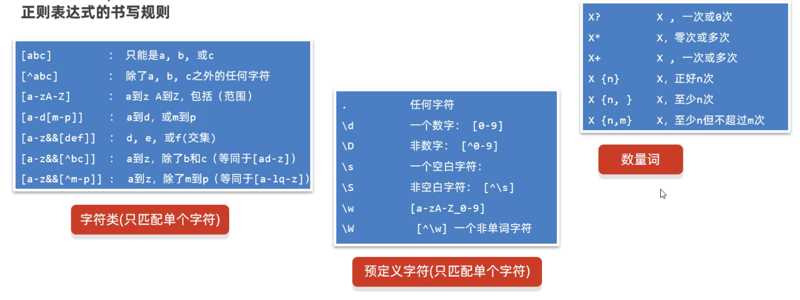

# 基础算法和数据结构

### 1.常见算法

​		什么是算法？算法其实就是解决某个实际问题的过程和方法。那么有哪些常见的算法？例如冒泡排序，选择排序，二分查找等等。

##### 1.1冒泡排序

​		什么叫冒泡排序？每次比较都将相邻的两个元素进行比较，将大的元素放在后面。


```java
public class Teste1 {
    public static void main(String[] args) {
// 1、准备一个数组
        int[] arr = {5, 2, 3, 1};
// 2、定义一个循环控制排几轮
        for (int i = 0; i < arr.length - 1; i++) {
// i = 0 1 2 【5， 2， 3， 1】 次数
// i = 0 第一轮 0 1 2 3
// i = 1 第二轮 0 1 2
// i = 2 第三轮 0 1
// 3、定义一个循环控制每轮比较几次。
            for (int j = 0; j < arr.length - i - 1; j++) {
// 判断当前位置的元素值，是否大于后一个位置处的元素值，如果大则交换。
                if (arr[j] > arr[j + 1]) {
                    int temp = arr[j + 1];
                    arr[j + 1] = arr[j];
                    arr[j] = temp;
                }
            }
        }
        System.out.println(Arrays.toString(arr));
    }
}
```

##### 1.2选择排序

​		什么是选择排序？选择排序的核心思路是，每一轮选定一个固定的元素，和其他的每一个元素 进行比较；经过几轮比较之后，每一个元素都能比较到了。


```java
public class Test {
    public static void main(String[] args) {
// 1、准备好一个数组
        int[] arr = {5, 1, 3, 2};
// 0 1 2 3
// 2、控制选择几轮
        for (int i = 0; i < arr.length - 1; i++) {
// i = 0 第一轮 j = 1 2 3
// i = 1 第二轮 j = 2 3
// i = 2 第三轮 j = 3
// 3、控制每轮选择几次。
            for (int j = i + 1; j < arr.length; j++) {
// 判断当前位置是否大于后面位置处的元素值，若大于则交换。
                if (arr[i] > arr[j]) {
                    int temp = arr[i];
                    arr[i] = arr[j];
                    arr[j] = temp;
                }
            }
        }
        System.out.println(Arrays.toString(arr));
    }
}
```


##### 1.3二分查找

​		什么是二分查找？在了解二分查找前需要先说一下基本查找，基本查找是从索引0的位置开始一个一个往后找，所以查找的元素比较靠后的话，性能就比较差。然后什么是二分查找呢？**二分查找要求比较苛 刻，它要求元素必须是有序的，否则不能进行二分查找。**核心思路如下：

```java
第1步：先定义两个变量，分别记录开始索引(left)和结束索引(right)
第2步：计算中间位置的索引，mid = (left+right)/2;
第3步：每次查找中间mid位置的元素，和目标元素key进行比较
		如果中间位置元素比目标元素小，那就说明mid前面的元素都比目标元素小
			此时：left = mid+1
    	如果中间位置元素比目标元素大，那说明mid后面的元素都比目标元素大
    		此时：right = mid-1
		如果中间位置元素和目标元素相等，那说明mid就是我们要找的位置
			此时：把mid返回		
注意：一般查找一次肯定是不够的，所以需要把第1步和第2步循环来做，只到left>end就结束，如果最后还没有找到目标元素，就返回-1.
```

##### 1.4 递归

​		什么是递归？递归是一种算法，从形式上来说，方法调用自己的形式称之为递归。递归的形式：有直接递归、间接递归。掌握递归的思维很重要。

​		我们通过下面的代码简单认识一下递归：

```java
/**
 * 目标：认识一下递归的形式。
 */
public class RecursionTest1 {
    public static void main(String[] args) {
        test1();
    }

    // 直接方法递归
    public static void test1(){
        System.out.println("----test1---");
        test1(); // 直接方法递归
    }

    // 间接方法递归
    public static void test2(){
        System.out.println("---test2---");
        test3();
    }

    public static void test3(){
        test2(); // 间接递归
    }
}
```

​		直接执行上面的代码，代码会进入死循环，会报栈内存溢出错误。


**重点：递归算法的执行流程**

```java
假设f(n)表示n的阶乘，那么我们可以推导出下面的式子
	 f(5) = 1+2+3+4+5
    f(5) = f(4)+5
    f(4) = f(3)+4
    f(3) = f(2)+3
    f(2) = f(1)+2
    f(1) = 1
总结规律：
	除了f(1) = 1; 出口
	其他的f(n) = f(n-1)+n
```

​		可以把f(n)当做一个方法，那么方法的写法如下：

```java
/**
 * 目标：掌握递归的应用，执行流程和算法思想。
 */
public class RecursionTest2 {
    public static void main(String[] args) {
        System.out.println("5的阶乘是：" + f(5));
    }

    //求n个数的阶乘
    public static int f(int n){
        // 终结点
        if(n == 1){
            return 1;
        }else {
            return f(n - 1) * n;
        }
    }
}
```

**应用场景：递归文件搜索**

​		熟悉完递归算法执行流程后，再思考一下，如何使用递归来遍历文件夹。

案例需求：在`D:\\`判断下搜索QQ.exe这个文件，然后直接输出。

```java
1.先调用文件夹的listFiles方法，获取文件夹的一级内容，得到一个数组
2.然后再遍历数组，获取数组中的File对象
3.因为File对象可能是文件也可能是文件夹，所以接下来就需要判断
	判断File对象如果是文件，就获取文件名，如果文件名是`QQ.exe`则打印，否则不打印
	判断File对象如果是文件夹，就递归执行1,2,3步骤
所以：把1，2,3步骤写成方法，递归调用即可。
```

代码如下：

```java
/**
 * 目标：掌握文件搜索的实现。
 */
public class RecursionTest3 {
    public static void main(String[] args) throws Exception {
          searchFile(new File("D:/") , "QQ.exe");
    }

    /**
     * 去目录下搜索某个文件
     * @param dir  目录
     * @param fileName 要搜索的文件名称
     */
    public static void searchFile(File dir, String fileName) throws Exception {
        // 1、把非法的情况都拦截住
        if(dir == null || !dir.exists() || dir.isFile()){
            return; // 代表无法搜索
        }

        // 2、dir不是null,存在，一定是目录对象。
        // 获取当前目录下的全部一级文件对象。
        File[] files = dir.listFiles();

        // 3、判断当前目录下是否存在一级文件对象，以及是否可以拿到一级文件对象。
        if(files != null && files.length > 0){
            // 4、遍历全部一级文件对象。
            for (File f : files) {
                // 5、判断文件是否是文件,还是文件夹
                if(f.isFile()){
                    // 是文件，判断这个文件名是否是我们要找的
                    if(f.getName().contains(fileName)){
                        System.out.println("找到了：" + f.getAbsolutePath());
                        Runtime runtime = Runtime.getRuntime();
                        runtime.exec(f.getAbsolutePath());
                    }
                }else {
                    // 是文件夹，继续重复这个过程（递归）
                    searchFile(f, fileName);
                }
            }
        }
    }
}
```

### 2.正则表达式

​		什么是正则表达式？正则表达式其实是由一些特殊的符号组成的，它代表的是某种规则。

+ 正则表达式的作用1：用来校验字符串数据是否合法
+ 正则表达式的作用2：可以从一段文本中查找满足要求的内容

下面举个例子，用正则表达式判断qq是否合法：

```java
public static boolean checkQQ1(String qq){
    return qq != null && qq.matches("[1-9]\\d{5,19}");
}
```

相较于传统的用if和for循环判断qq号，用正则表达式来校验qq号可以使代码十分简洁。正则表达式书写规则如下：



##### 2.1正则表达式简单应用

```java
/**
 * 目标：校验用户输入的电话、邮箱、时间是否合法。
 */
public class Test {
    public static void main(String[] args) {
        //校验电话号码
        System.out.println("checkPhone(\"18600001111\") = " + checkPhone("18600001111"));
        //校验邮箱
        System.out.println("checkEmail(\"dlei@163.com\") = " + checkEmail("dlei@163.com"));
    }

    public static boolean checkPhone(String phone) {
        String regex1 = "1[3-9]\\d{9}";
        String regex2 = "0\\d{2}-?\\d{6,8}";
        //上述两种规则,必须完全满足其中1种,即满足第1中规则或第2种规则,每种规则又必须是一个整理。
        //String regex=(第一种规则)或(第二种规则)
        String regex="(1[3-9]\\d{9})|(0\\d{2}-?\\d{6,8})";
        return phone.matches(regex);
    }

    public static boolean checkEmail(String email){
        //.域名.域名...  点和域名要么都出现要么都不出现 且最少1次,最多2次
        String regex="\\w{2,}@\\w{2,20}(\\.\\w{2,}){1,2}";
        return email.matches(regex);
    }
}
```

##### 2.2正则表达式信息爬取

​		正则表达式的第二个作用：可以在一段文本中获取到满足要求的内容。


```java
/**
 * 目标：掌握使用正则表达式查找内容。
 */
public class Test {
    public static void main(String[] args) {
        String data = "来黑马程序员学习Java，\n" +
                "电话：18512516758，18512508907\n" +
                "或者联系邮箱： boniu@itcast.cn\n" +
                "座机电话：01036517895，010-98951256\n" +
                "邮箱：bozai@itcast.cn，\n" +
                "邮箱2：dlei0009@163.com，\n" +
                "热线电话：400-618-9090 ，400-618-4000，\n" +
                "4006184000，4006189090\n";

        //定义匹配规则
        //String regex="(规则A)|(规则B)...";
        String regexEmail = "\\w{2,}@\\w{2,10}(\\.\\w{2,10}){1,2}";
        String regexPhone = "(1[3-9]\\d{9})|(0\\d{2,5}-?\\d{5,15})|400-?\\d{3,8}-?\\d{3,8}";
        String regex = "(" + regexPhone + ")|(" + regexEmail + ")";
        //String regex = "(1[3-9]\\d{9})|(0\\d{2,7}-?[1-9]\\d{4,19})|(\\w{2,}@\\w{2,20}(\\.\\w{2,10}){1,2})"
        //        + "|(400-?\\d{3,7}-?\\d{3,7})";
        //获取匹配对象
        Pattern pattern = Pattern.compile(regex);
        //将符合匹配规则的数据,封装到结果集中
        Matcher matcher = pattern.matcher(data);
        while (matcher.find()) {
            System.out.println("matcher.group() = " + matcher.group());

        }
    }
}
```

4.3正则表达式搜索和替换


```java
/**
 * 目标：掌握使用正则表达式做搜索替换，内容分割。
 */
public class RegexTest5 {
    public static void main(String[] args) {
        // 1、public String replaceAll(String regex , String newStr)：按照正则表达式匹配的内容进行替换
        // 需求1：请把下面字符串中的不是汉字的部分替换为 “-”
        String s1 = "古力娜扎ai8888迪丽热巴999aa5566马尔扎哈fbbfsfs42425卡尔扎巴";
        System.out.println(s1.replaceAll("\\w+", "-"));
        
        // 需求2(拓展)：某语音系统，收到一个口吃的人说的“我我我喜欢编编编编编编编编编编编编程程程！”，需要优化成“我喜欢编程！”。
        String s2 = "我我我喜欢编编编编编编编编编编编编程程程";
        System.out.println(s2.replaceAll("(.)\\1+", "$1"));
       //(.)\1+中  \\1表示组,整句含义表示,组1中的字符出现1次或多次,即同一个字符出现多次。
        //如果写成(.)+表示任意字符1次或多次,则会将整个字符串识别为一个整体,进行替换
        //$记录组  $1-->表示替换为当前规则中,正则规则里面的第1组的内容

        // 2、public String[] split(String regex)：按照正则表达式匹配的内容进行分割字符串，反回一个字符串数组。
        // 需求1：请把下面字符串中的人名取出来，使用切割来做
        String s3 = "古力娜扎ai8888迪丽热巴999aa5566马尔扎哈fbbfsfs42425卡尔扎巴";
        String[] names = s3.split("\\w+");
        System.out.println(Arrays.toString(names));
    }
}
```

