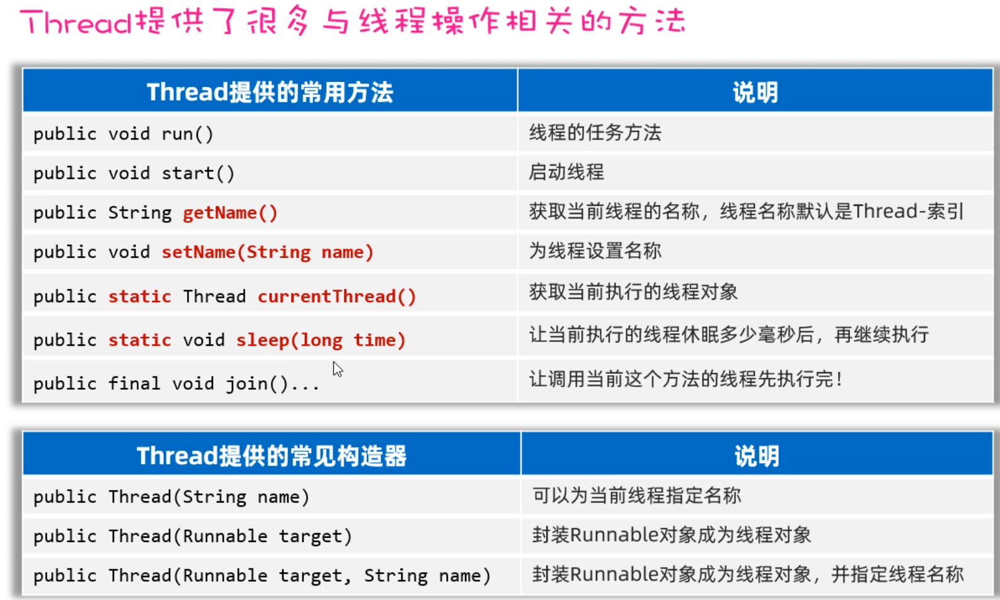
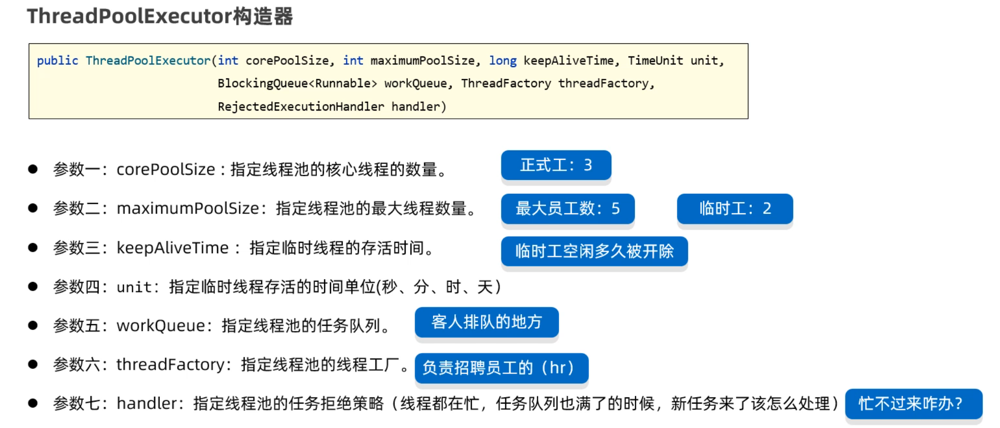
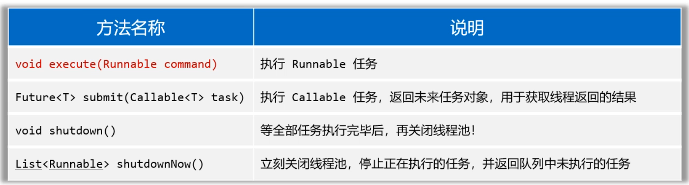
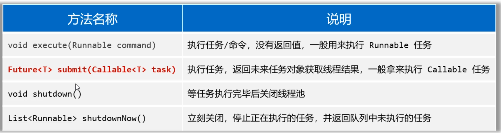
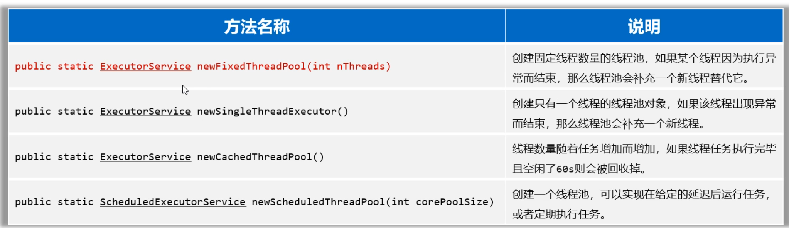
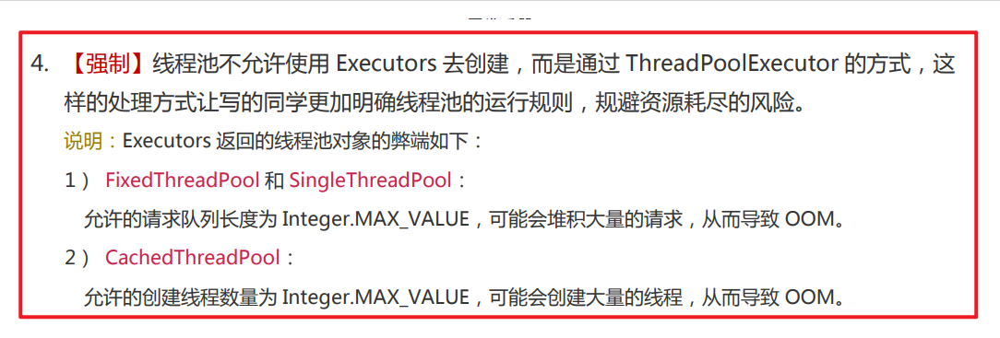
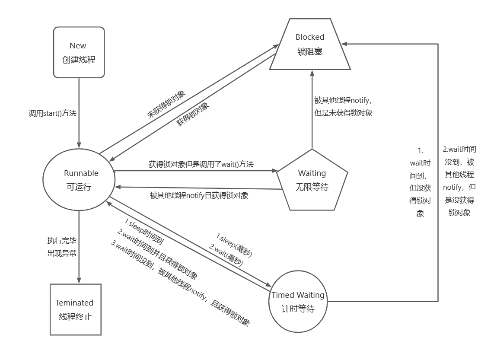

# 多线程

​		什么是线程？线程其实是程序中的一条执行路径。

​		那什么才是多线程程序呢？打个比方，12306网站就是支持多线程的，因为同时可以有很多人一起进入网站购票，而且每一个人互不影响。再例如百度网盘，可以同时下载或者上传多个文件。这些程序中其实就有多条执行路径，每一条执行执行路径就是一条线程，所以这样的程序就是多线程程序。

### 1.创建线程

##### 1.1 线程创建方式（一）

​		第一种创建线程的方式如下：

```txt
1.定义一个子类继承Thread类，并重写run方法
2.创建Thread的子类对象
3.调用start方法启动线程（启动线程后，会自动执行run方法中的代码）
```

​		代码如下：

```java
public class MyThread extends Thread{
    // 2、必须重写Thread类的run方法
    @Override
    public void run() {
        // 描述线程的执行任务。
        for (int i = 1; i <= 5; i++) {
            System.out.println("子线程MyThread输出：" + i);
        }
    }
}
```

​		再定义一个测试类，在测试类中创建MyThread线程对象，并启动线程。

```java
public class ThreadTest1 {
    // main方法是由一条默认的主线程负责执行。
    public static void main(String[] args) {
        // 3、创建MyThread线程类的对象代表一个线程
        Thread t = new MyThread();
        // 4、启动线程（自动执行run方法的）
        t.start(); 

        for (int i = 1; i <= 5; i++) {
            System.out.println("主线程main输出：" + i);
        }
    }
}
```

​		打印结果如下图所示，可以发现MyThread和main线程在相互抢夺CPU的执行权（**注意：哪一个线程先执行，哪一个线程后执行，目前是无法控制的，所以每次输出结果都会不一样**）

**注意：**启动Mythread线程不能直接去调用run方法，如果直接调用run方法就不认为是一条线程启动了，而是把Thread当做一个普通对象，此时run方法中的执行的代码会成为主线程的一部分。此时执行结果是这样的。

##### 1.2 线程创建方式（二）

​		线程的第二种创建方式，需要用到Runable接口，该接口中只有一个run方法，意思就是通过Runnable接口的实现类对象专门来表示线程要执行的任务。具体步骤如下：

```txt
1.先写一个Runnable接口的实现类，重写run方法(这里面就是线程要执行的代码)
2.再创建一个Runnable实现类的对象
3.创建一个Thread对象，把Runnable实现类的对象传递给Thread
4.调用Thread对象的start()方法启动线程（启动后会自动执行Runnable里面的run方法）
```

代码如下：先准备一个Runnable接口的实现类。

```java
/**
 * 1、定义一个任务类，实现Runnable接口
 */
public class MyRunnable implements Runnable{
    // 2、重写runnable的run方法
    @Override
    public void run() {
        // 线程要执行的任务。
        for (int i = 1; i <= 5; i++) {
            System.out.println("子线程输出 ===》" + i);
        }
    }
}
```

再写一个测试类，在测试类中创建线程对象，并调用start执行线程。

```java
public class ThreadTest2 {
    public static void main(String[] args) {
        // 3、创建任务对象。
        Runnable target = new MyRunnable();
        // 4、把任务对象交给一个线程对象处理。
        //  public Thread(Runnable target)
        new Thread(target).start();

        for (int i = 1; i <= 5; i++) {
            System.out.println("主线程main输出 ===》" + i);
        }
    }
}
```

##### 1.3 线程创建方式（二+）

​		这种种创建方式其实就是在第二种创建方式的基础上，用匿名内部类改写一下，所以和第二种方式会有稍稍不同。

​		**比如我现在不想写Runnable实现类，于是可以直接创建Runnable接口的匿名内部类对象，传递给Thread对象。**

```java
public class ThreadTest2_2 {
    public static void main(String[] args) {
        // 1、直接创建Runnable接口的匿名内部类形式（任务对象）
        Runnable target = new Runnable() {
            @Override
            public void run() {
                for (int i = 1; i <= 5; i++) {
                    System.out.println("子线程1输出：" + i);
                }
            }
        };
        new Thread(target).start();

        // 简化形式1：
        new Thread(new Runnable() {
            @Override
            public void run() {
                for (int i = 1; i <= 5; i++) {
                    System.out.println("子线程2输出：" + i);
                }
            }
        }).start();

        // 简化形式2：
        new Thread(() -> {
                for (int i = 1; i <= 5; i++) {
                    System.out.println("子线程3输出：" + i);
                }
        }).start();

        for (int i = 1; i <= 5; i++) {
            System.out.println("主线程main输出：" + i);
        }
    }
}
```

##### 1.4 线程创建方式（三）

​		第三种方式相较于前面几种，有一个优点，它重写的run方法可以返回结果。在JDK5就提供了Callable接口和FutureTask类来创建线程，它最大的优点就是有返回值。在Callable接口中有一个call方法，重写call方法就是线程要执行的代码，它是有返回值的。

​		第三种创建线程的方式如下:

```txt
1.先定义一个Callable接口的实现类，重写call方法。
2.创建Callable实现类的对象。
3.创建FutureTask类的对象，将Callable对象传递给FutureTask。
4.创建Thread对象，将Future对象传递给Thread。
5.调用Thread的start()方法启动线程(启动后会自动执行call方法),等call()方法执行完之后，会自动将返回值结果封装到FutrueTask对象中。
6.调用FutrueTask对的get()方法获取返回结果。
```

​		代码如下：先准备一个Callable接口的实现类：

```java
public class MyCallable implements Callable<String> {
    int n;

    public MyCallable(int n) {
        this.n = n;
    }

    @Override
    public String call() throws Exception {
        int sum = 0;
        for (int i = 1; i <= n; i++) {
            sum += i;
        }
        return "线程求出了1-" + n + "的和是:" + sum;
    }
}

```

​		再定义一个测试类，在测试类中创建线程并启动线程，还要获取返回结果：

```java
public class ThreadTest3 {
    public static void main(String[] args) throws Exception {
        // 3、创建一个Callable的对象
        Callable<String> call = new MyCallable(100);
        // 4、把Callable的对象封装成一个FutureTask对象（任务对象）
        // 未来任务对象的作用？
        // 1、是一个任务对象，实现了Runnable对象.
        // 2、可以在线程执行完毕之后，用未来任务对象调用get方法获取线程执行完毕后的结果。
        FutureTask<String> f1  = new FutureTask<>(call);
        // 5、把任务对象交给一个Thread对象
        new Thread(f1).start();


        Callable<String> call2 = new MyCallable(200);
        FutureTask<String> f2  = new FutureTask<>(call2);
        new Thread(f2).start();


        // 6、获取线程执行完毕后返回的结果。
        // 注意：如果执行到这儿，假如上面的线程还没有执行完毕
        // 这里的代码会暂停，等待上面线程执行完毕后才会获取结果。
        String rs = f1.get();
        System.out.println(rs);

        String rs2 = f2.get();
        System.out.println(rs2);
    }
}
```

##### 1.5多线程常用方法

​		下面是Thread提供的一些常用方法：



​		getName()方法用于获取到线程的名字，setName(String name)用于设置线程的名字，

currentThread()获取当前执行的线程对象，sleep(long time)让线程休息多少毫秒再继续执行。

### 2.线程安全问题

​		什么是线程安全问题？线程安全问题指的是，多个线程同时操作同一个共享资源的时候，可能会出现业务安全问题。现在有以下场景：小明和小红是一对夫妻，他们有一个共享账户，余额是10万元，小红和小明同时来取钱，并且2人各自都在取钱10万元，可能出现什么问题呢？

​		小明和小红假设都是一个线程，本类每个线程都应该执行完三步操作，才算是完成的取钱的操作。但是真实执行过程可能是下面这样子的

​	① 小红线程只执行了判断余额是否足够（条件为true），然后CPU的执行权就被小明线程抢走了。

​	② 小明线程也执行了判断了余额是否足够（条件也是true）, 然后CPU执行权又被小明线程抢走了。

​	③ 小明线程由于刚才已经判断余额是否足够了，直接执行第2步，吐出了10万元钱，此时共享账户月为0。然后CPU执行权又被小红线程抢走。 

​	④ 小红线程由于刚刚也已经判断余额是否足够了，直接执行第2步，吐出了10万元钱，此时共享账户月为-10万。

##### 2.1解决线程安全示例

Account类如下：

```java
public class Account {
    private double money;

    public Account(double money) {
        this.money = money;
    }

    public void getMoney(String name, double money) {
        synchronized (Account.class) {
            if (this.money >= money) {
                System.out.println(name + "账户已被取走了" + money + "元");
                this.money -= money;
            } else {
                System.out.println("账户没钱了");
            }
        }
    }
}

```

MoneyThread类如下：

```java
public class MoneyThread extends Thread {
    private Account acc;

    public MoneyThread(Account acc) {
        this.acc = acc;
    }

    @Override
    public void run() {
            acc.getMoney(getName(),100000);
        }

}
```

Test类如下：

```java
public class Test {
    public static void main(String[] args) {
        Account acc = new Account(100000);

        new MoneyThread(acc).start();
        new MoneyThread(acc).start();
    }
}

//Thread-0账户已被取走了100000.0元
//账户没钱了
```

### 3.线程同步方案

​		什么是线程同步？怎样做到线程同步呢？线程同步就是每次只允许一个线程加锁，加锁后才能进入访问，访问完毕后自动释放锁，然后其他线程才能再加锁进来。

​		线程同步可以用到三种方法：同步代码块、同步方法、Lock锁。

##### 3.1同步代码块

​		同步代码块就是把访问共享数据的代码用synchronized锁起来：

```java
//锁对象：必须是一个唯一的对象（同一个地址）
synchronized(锁对象){
    //...访问共享数据的代码...
}
```

​		例如上面的取钱问题用同步代码块实现：

```java
public void drawMoney(double money) {
    // 先搞清楚是谁来取钱？
    String name = Thread.currentThread().getName();
    // 1、判断余额是否足够
    // this正好代表共享资源！同一时刻只允许一条线程进来
    synchronized (this) {
        if(this.money >= money){
            System.out.println(name + "来取钱" + money + "成功！");
            this.money -= money;
            System.out.println(name + "来取钱后，余额剩余：" + this.money);
        }else {
            System.out.println(name + "来取钱：余额不足~");
        }
    }
}
```

​		**那么锁对象该如何选择呢？**

```txt
1.建议把共享资源作为锁对象, 不要将随便无关的对象当做锁对象
2.对于实例方法，建议使用this作为锁对象
3.对于静态方法，建议把类的字节码(类名.class)当做锁对象
```

##### 3.2同步方法

​		**同步方法就是把整个方法给锁住，一个线程调用这个方法，另一个线程调用的时候就执行不了，只有等上一个线程调用结束，下一个线程调用才能继续执行。**还是上面的取钱案例，用同步方法实现：

```java
// 同步方法
public synchronized void drawMoney(double money) {
    // 先搞清楚是谁来取钱？
    String name = Thread.currentThread().getName();
    // 1、判断余额是否足够
    if(this.money >= money){
        System.out.println(name + "来取钱" + money + "成功！");
        this.money -= money;
        System.out.println(name + "来取钱后，余额剩余：" + this.money);
    }else {
        System.out.println(name + "来取钱：余额不足~");
    }
}
```

​		思考一下同步方法有没有锁对象？锁对象是谁？

```txt
同步方法也是有锁对象，只不过这个锁对象没有显示的写出来而已。
	1.对于实例方法，锁对象其实是this（也就是方法的调用者）
	2.对于静态方法，锁对象时类的字节码对象（类名.class）
```

##### 3.3Lock锁

​		什么是Lock锁？Lock锁是JDK5版本专门提供的一种锁对象，通过这个锁对象的方法来达到加锁，和释放锁的目的，使用起来更加灵活。格式如下：

```java
1.首先在成员变量位子，需要创建一个Lock接口的实现类对象（这个对象就是锁对象）
	private final Lock lk = new ReentrantLock();
2.在需要上锁的地方加入下面的代码
	 lk.lock(); // 加锁
	 //...中间是被锁住的代码...
	 lk.unlock(); // 解锁
```

​		用Lock锁改写前面的取钱问题：

```java
// 创建了一个锁对象
private final Lock lk = new ReentrantLock();

public void drawMoney(double money) {
        // 先搞清楚是谁来取钱？
        String name = Thread.currentThread().getName();
        try {
            lk.lock(); // 加锁
            // 1、判断余额是否足够
            if(this.money >= money){
                System.out.println(name + "来取钱" + money + "成功！");
                this.money -= money;
                System.out.println(name + "来取钱后，余额剩余：" + this.money);
            }else {
                System.out.println(name + "来取钱：余额不足~");
            }
        } catch (Exception e) {
            e.printStackTrace();
        } finally {
            lk.unlock(); // 解锁
        }
    }
}
```

### 4.线程通信

​		**什么是线程通信？**

+ 当多个线程共同操作共享资源时，线程间通过某种方式互相告知自己的状态，以相互协调，避免无效的资源挣抢。
+ **线程通信的常见模式：是生产者与消费者模型**
  - 生产者线程负责生成数据。
  - 消费者线程负责消费生产者生成的数据。
  - 注意：生产者生产完数据后应该让自己等待，通知其他消费者消费；消费者消费完数据之后应该让自己等待，同时通知生产者生成。

##### 4.1包子案例

一个简单的案例，生产者和消费者案例  (生产包子和吃包子)代码如下：

BaoZi类：

```java
public class BaoZi {
    private String name;//包子名
    private boolean flag;//定义旗帜变量判断包子是否存在

    public BaoZi() {
    }

    public BaoZi(String name, boolean flag) {
        this.name = name;
        this.flag = flag;
    }

    public String getName() {
        return name;
    }

    public void setName(String name) {
        this.name = name;
    }

    public boolean isFlag() {
        return flag;
    }

    public void setFlag(boolean flag) {
        this.flag = flag;
    }

    @Override
    public String toString() {
        return "BaoZi{" +
                "name='" + name + '\'' +
                ", flag=" + flag +
                '}';
    }
}
```

BaoZiPu类：

```java
public class BaoZiPu extends Thread {
    BaoZi baoZi;

    public BaoZiPu(BaoZi baoZi) {
        this.baoZi = baoZi;
    }

    @Override
    public void run() {
        while (true) {
            synchronized (baoZi) {
                if (baoZi.isFlag()) {
                    try {
                        baoZi.wait();
                    } catch (InterruptedException e) {
                        e.printStackTrace();
                    }
                }
                if (baoZi.isFlag() == false) {
                    System.out.println("正在做" + baoZi.getName() + "包子。。。");
                    try {
                        baoZi.wait(5000);
                    } catch (InterruptedException e) {
                        e.printStackTrace();
                    }
                    baoZi.setFlag(true);
                    System.out.println(baoZi.getName() + "包子做好了，吃货们快来吃。。。");
                    baoZi.notify();
                }
            }
        }
    }
}
```

ChiHuo类：

```java
public class ChiHuo extends Thread {
    BaoZi baozi;

    public ChiHuo(BaoZi baozi) {
        this.baozi = baozi;
    }

    @Override
    public void run() {
        while (true) {
            synchronized (baozi) {
                if (baozi.isFlag()) {
                    System.out.println("吃" + baozi.getName() + "包子中...");
                    try {
                        baozi.wait(5000);
                    } catch (InterruptedException e) {
                        e.printStackTrace();
                    }
                    System.out.println(baozi.getName() + "包子已经吃完了，包子铺快做包子");
                    baozi.setFlag(false);
                    baozi.notify();
                }
                if (baozi.isFlag() == false) {
                    try {
                        baozi.wait();
                    } catch (InterruptedException e) {
                        e.printStackTrace();
                    }

                }
            }
        }
    }
}
```

测试类：

```java
public class Test {
    public static void main(String[] args) {
        BaoZi baoZi = new BaoZi("韭菜猪肉馅",false);
        BaoZiPu bzp = new BaoZiPu(baoZi);
        ChiHuo ch = new ChiHuo(baoZi);
        bzp.start();
        ch.start();
    }
}
```

​		**分析等待唤醒机制的运行：**

- 1.不管是否使用等待唤醒机制,**线程的调度都是抢占式。**
- 2.线程进入无限等待,线程就会释放锁,cpu,也不会再去争夺。
- 3.唤醒其他线程,当前唤醒线程是不会释放锁,cpu的。
- 4.无限等待线程被唤醒,拿到锁对象后,会从进入无限等待的位置继续往下执行。

### 5.线程池

​		什么是线程池？线程池就是一个可以复用线程的技术。那么为什么要用到线程池呢？假设：用户每次发起一个请求给后台，后台就创建一个新的线程来处理，下次新的任务过来肯定也会创建新的线程，如果用户量非常大，创建的线程也讲越来越多。然而，创建线程是开销很大的，并且请求过多时，会严重影响系统性能。所以有一个线程池就可以复用线程了。

##### 5.1创建线程池

​		在JDK5版本中提供了代表线程池的接口ExecutorService，而这个接口下有一个实现类叫ThreadPoolExecutor类，使用ThreadPoolExecutor类就可以用来创建线程池对象。但它的构造器参数比较多：



​		用它的七个参数创建线程池，如下：

```java
ExecutorService pool = new ThreadPoolExecutor(
    3,	//核心线程数有3个
    5,  //最大线程数有5个。   临时线程数=最大线程数-核心线程数=5-3=2
    8,	//临时线程存活的时间8秒。 意思是临时线程8秒没有任务执行，就会被销毁掉。
    TimeUnit.SECONDS,//时间单位（秒）
    new ArrayBlockingQueue<>(4), //任务阻塞队列，没有来得及执行的任务在，任务队列中等待
    Executors.defaultThreadFactory(), //用于创建线程的工厂对象
    new ThreadPoolExecutor.CallerRunsPolicy() //拒绝策略
);
```

+ **临时线程什么时候创建？**

​		新任务提交时，发现核心线程都在忙、任务队列满了、并且还可以创建临时线程，此时会创建临时线程。

+ **什么时候开始拒绝新的任务？**

​		核心线程和临时线程都在忙、任务队列也满了、新任务过来时才会开始拒绝任务。

##### 5.2线程池执行Runnable任务

​		创建好线程池之后，接下来我们就可以使用线程池执行任务了。线程池执行的任务可以有两种，一种是Runnable任务；一种是callable任务。下面的execute方法可以用来执行Runnable任务。



​		**执行流程为：**

1、创建一个线程池。

2、创建一个有Runnable接口的线程任务。

3、测试类new一个线程任务，线程池调用自己的execute方法，参数为new出来的线程任务。

4、这时线程池会自动创建一个新线程，自动处理这个任务，自动按照设置的线程池要求执行线程。

##### 5.3线程池执行Callable任务

​		什么时Callable任务？allable任务相对于Runnable任务来说，就是多了一个返回值。执行Callable任务需要用到下面的submit方法：



​		下面是创建一个可以执行多个计算1-n的和线程的线程池代码：

GetSum类：

```java
public class GetSum implements Callable<String> {
    private int num;//计算1-num的和

    public GetSum(int num) {
        this.num = num;
    }

    @Override
    public String call() {//重写call方法，将当前线程名和计算结果返回到Future对象中
        int sum = 0;
        for (int i = 1; i <= num; i++) {
            sum += i;
        }
        return Thread.currentThread().getName() + "计算的1到" + num + "返回值是" + sum;
    }
}
```

Test类：

```java
public class Test {
    public static void main(String[] args) {
        ExecutorService es = new ThreadPoolExecutor(
                4, 5, 1000, TimeUnit.MINUTES,
                new ArrayBlockingQueue<>(3),
                Executors.defaultThreadFactory(),
                new ThreadPoolExecutor.CallerRunsPolicy()
        );//添加四条线程，并返回结果到Future对象中，打印输出
        Future<String> f1 = es.submit(new GetSum(50));
        Future<String> f2 = es.submit(new GetSum(100));
        Future<String> f3 = es.submit(new GetSum(200));
        Future<String> f4 = es.submit(new GetSum(500));
        try {
            System.out.println(f1.get());
            System.out.println(f2.get());
            System.out.println(f3.get());
            System.out.println(f4.get());
        } catch (InterruptedException e) {
            e.printStackTrace();
        } catch (ExecutionException e) {
            e.printStackTrace();
        }
        System.exit(0);
    }
}
```

##### 5.4线程池工具类Executors

​		这个线程池工具类包含了一些不同特点的线程池，但使用频率不高，可以了解一下。



​		但一般线程池也不推荐使用Executors创建，它存在一些弊端：



### 6.扩展

##### 6.1并发和并行

​		在了解并发和并行之前，先了解一下什么是进程和线程？

- 正常运行的程序（软件）就是一个独立的进程。
- 线程是属于进程，一个进程中包含多个线程。
- 进程中的线程其实并发和并行同时存在。

**那么什么是并发呢？**

​		进程中的线程由CPU负责调度执行，但是CPU同时处理线程的数量是优先的，为了保证全部线程都能执行到，CPU采用轮询机制为系统的每个线程服务，由于CPU切换的速度很快，给我们的感觉这些线程在同时执行，这就是并发。（简单记：并发就是多条线程交替执行）

**那什么是并行呢？**

​		并行指的是，多个线程同时被CPU调度执行。多个CPU在执行多条线程。

**注意：其实电脑上存在多个线程同时运行，并发和并行是同时存在的。**

##### 6.2线程的生命周期

​		线程的生命周期有六种状态，可以参考下图：



​		线程的6种状态：

```txt
NEW: 新建状态，线程还没有启动
RUNNABLE: 可以运行状态，线程调用了start()方法后处于这个状态
BLOCKED: 锁阻塞状态，没有获取到锁处于这个状态
WAITING: 无限等待状态，线程执行时被调用了wait方法处于这个状态
TIMED_WAITING: 计时等待状态，线程执行时被调用了sleep(毫秒)或者wait(毫秒)方法处于这个状态
TERMINATED: 终止状态, 线程执行完毕或者遇到异常时，处于这个状态。
```

