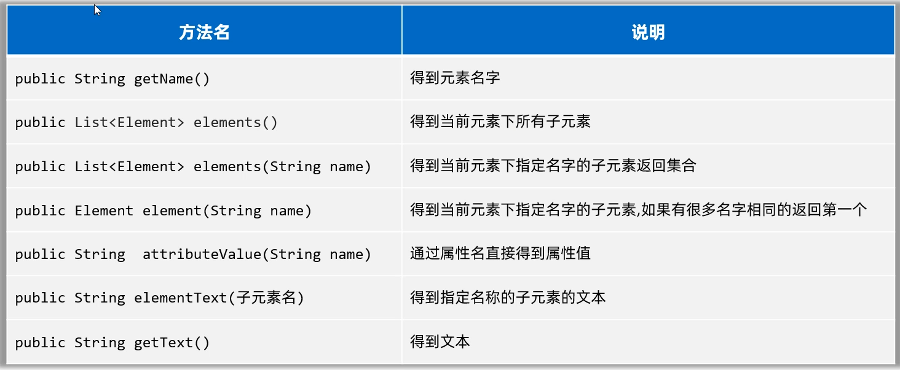

# 特殊文件、日志技术、多线程

### 特殊文件

​		什么是特殊文件？特殊文件就是具有一定格式要求，用于存储一些数据类型、数据结构或者满足其他要求的文件。相较于普通的txt文本文件没有任何格式规范，这些文件是有一定的格式要求，方面程序对文件中的数据进行处理。

### 1. Properties属性文件

​		什么是Properties属性文件？后缀为.properties的文件，称之为属性文件，它可以很方便的存储一些类似于键值对的数据。经常当做软件的配置文件使用。注意Properties属性文件的格式要求：

1. 属性文件后缀以`.properties`结尾
2. 属性文件里面的每一行都是一个键值对，键和值中间用=隔开。比如: `admin=123456` 
3. `#`表示这样是注释信息，是用来解释这一行配置是什么意思。
4. 每一行末尾不要习惯性加分号，以及空格等字符；不然会把分号，空格会当做值的一部分。
5. 键不能重复，值可以重复

​		深入了解一下，Properties的底层是什么？Properties是Map接口下面的一个实现类，所以Properties也是一种双列集合，用来存储键值对。一般不会把它当做集合来使用。Properties类的对象，用来表示属性文件，可以用来读取属性文件中的键值对。下面是Properties的构造和常用方法：


**用Properties读取属性文件的步骤如下：**

1、创建一个Properties的对象出来（键值对集合，空容器）。

2、调用load(字符输入流/字节输入流)方法，开始加载属性文件中的键值对数据到properties对象中去。

3、调用getProperty(键)方法，根据键取值。

```java
/**
 * 目标：掌握使用Properties类读取属性文件中的键值对信息。
 */
public class PropertiesTest1 {
    public static void main(String[] args) throws Exception {
        // 1、创建一个Properties的对象出来（键值对集合，空容器）
        Properties properties = new Properties();
        System.out.println(properties);

        // 2、开始加载属性文件中的键值对数据到properties对象中去
        properties.load(new FileReader("properties-xml-log-app\\src\\users.properties"));
        System.out.println(properties);

        // 3、根据键取值
        System.out.println(properties.getProperty("赵敏"));
        System.out.println(properties.getProperty("张无忌"));

        // 4、遍历全部的键和值。
        //获取键的集合
        Set<String> keys = properties.stringPropertyNames();
        for (String key : keys) {
            //再根据键获取值
            String value = properties.getProperty(key);
            System.out.println(key + "---->" + value);
        }
		
        properties.forEach((k, v) -> {
            System.out.println(k + "---->" + v);
        });
    }
}
```

​		使用Properties往属性文件中写键值对，需要用到的方法如下：


**往Properties属性文件中写键值对的步骤如下:**

1、先准备一个.properties属性文件，按照格式写几个键值对。
2、创建Properties对象出来。
3、调用setProperty存储一些键值对数据。
4、调用store(字符输出流/字节输出流, 注释)，将Properties集合中的键和值写到文件中
	注意：第二个参数是注释，必须得加。

执行如下：

```java
public class Test {
    public static void main(String[] args) throws IOException {
        Properties p = new Properties();
        p.setProperty("admin","123456");
        p.setProperty("张无忌","minmin");
        p.setProperty("周芷若","wuji");
        p.setProperty("赵敏","wuji");
        p.store(new FileWriter("/NewClass/users.properties"),"这里是注释啊");
    }
}
```


### 2. XML文件

​		什么是XML文件？XML是可扩展的标记语言，意思是它是由一些标签组成	的，而这些标签是自己定义的。本质上一种数据格式，可以用来表示复杂的数据关系。它的特点如下：

- XML中的`<标签名>` 称为一个标签或者一个元素，一般是成对出现的。
- XML中的标签名可以自己定义（可扩展），但是必须要正确的嵌套。
- XML中只能有一个根标签。
- XML标准中可以有属性。
- XML必须第一行有一个文档声明，格式是固定的`<?xml version="1.0" encoding="UTF-8"?>`
- XML文件必须是以.xml为后缀结尾。

​		XML文件中的数据格式是最为常见的，标签有属性、文本、还有合理的嵌套。XML文件中除了写以上的数据格式之外，还有一些特殊的字符不能直接写。像 `<,>,& `等这些符号不能出现在标签的文本中，因为标签格式本身就有<>，会和标签格式冲突。如果标签文本中有这些特殊字符，需要用一些占位符代替。

```txt
&lt;  表示 <
&gt;  表示 >
&amp; 表示 &
&apos; 表示 '
&quot; 表示 "
```

​		如果标签文本中出现大量的特殊字符，不想使用特殊字符，可以用CDATA区，在里面输入特殊字符不会受影响。

```xml
<data1>
    <![CDATA[
   		3 < 2 && 5 > 4
    ]]>
</data1>
```

​		XML文件在实际开发中有什么作用？它一般用来做为系统的配置文件，或者作为一种特殊的数据结构，在网络中进行传输。

##### 2.1XML解析

​		什么是XML解析？使用程序读取XML文件中的数据，称之为XML解析。自己手动写IO流代码去读取xml文件中的数据过于繁琐。其实有很多开源的，好用的XML解析框架，最知名的是DOM4J（第三方开发）

​		DOM4J解析XML文件的思想是：文档对象模型（意思是把整个XML文档、每一个标签、每一个属性都等都当做对象来看待）。Dowument对象表示真个XML文档、Element对象表示标签（元素）、Attribute对象表示属性、标签中的内容就是文本。

​		DOM4J解析XML需要的构造器和方法如下图所示：


​		通过上面构造SAXReader对象，调用getRootElement方法获取根元素，然后就可以用根元素获取到它里面的子元素（包括子标签、表属性等等），需要用到下列方法：



​		将上列方法在下面代码中演示一下:

```java
public class Test {
    public static void main(String[] args) throws Exception {
        // 1、创建一个Dom4J框架提供的解析器对象
        SAXReader saxReader = new SAXReader();

        // 2、使用saxReader对象把需要解析的XML文件读成一个Document对象。
        Document document =
                saxReader.read("properties-xml-log-app\\src\\helloworld.xml");

        // 3、从文档对象中解析XML文件的全部数据了
        Element root = document.getRootElement();
        System.out.println(root.getName());

        // 4、获取根元素下的全部一级子元素。
        // List<Element> elements = root.elements();
        List<Element> elements = root.elements("user");
        for (Element element : elements) {
            System.out.println(element.getName());
        }

        // 5、获取当前元素下的某个子元素。
        Element people = root.element("people");
        System.out.println(people.getText());

        // 如果下面有很多子元素user，默认获取第一个。
        Element user = root.element("user");
        System.out.println(user.elementText("name"));

        // 6、获取元素的属性信息呢？
        System.out.println(user.attributeValue("id"));
        Attribute id = user.attribute("id");
        System.out.println(id.getName());
        System.out.println(id.getValue());

        List<Attribute> attributes = user.attributes();
        for (Attribute attribute : attributes) {
            System.out.println(attribute.getName() + "=" + attribute.getValue());
        }

        // 7、如何获取全部的文本内容:获取当前元素下的子元素文本值
        System.out.println(user.elementText("name"));
        System.out.println(user.elementText("地址"));
        System.out.println(user.elementTextTrim("地址")); // 取出文本去除前后空格
        System.out.println(user.elementText("password"));

        Element data = user.element("data");
        System.out.println(data.getText());
        System.out.println(data.getTextTrim()); // 取出文本去除前后空格
    }
}
```

##### 2.2XML文件写入

​		其实DOM4J中也提供了向XML文件中写标签的方法，但是用起来比较麻烦，所以不太建议使用。可以通过StringBuilder按照标签的格式拼接，然后再使用BufferedWriter将标签写到XML文件中去。

```java
public class Test {
    public static void main(String[] args) {
        // 1、使用一个StringBuilder对象来拼接XML格式的数据。
        StringBuilder sb = new StringBuilder();
        sb.append("<?xml version=\"1.0\" encoding=\"UTF-8\" ?>\r\n");
        sb.append("<book>\r\n");
        sb.append("\t<name>").append("从入门到跑路").append("</name>\r\n");
        sb.append("\t<author>").append("dlei").append("</author>\r\n");
        sb.append("\t<price>").append(999.99).append("</price>\r\n");
        sb.append("</book>");

        try (
                BufferedWriter bw = new BufferedWriter(new FileWriter("properties-xml-log-app/src/book.xml"));
                ){
            bw.write(sb.toString());
        } catch (Exception e) {
            e.printStackTrace();
        }

    }
}
```

##### 2.3XML约束

​		什么是XML约束？XML约束指的是限制XML文件中的标签或者属性，只能按照规定的格式写。假如我在项目中，想约束一个XML文件中的标签只能写<书>、<书名>、<作者>、<售价>这几个标签，如果写其他标签就报错。

​		那么需要怎么做才能约束XML标签格式呢？**有两种约束技术，一种是DTD约束、一种是Schame约束。**

+ DTD约束案例

​		如下图所示book.xml中引入了DTD约束文件，book.xml文件中的标签就受到DTD文件的约束。


DTD文件解释如下：

```txt
<!ELEMENT 书架(书+)>   表示根标签是<书架>，并且书架中有子标签<书>
<!ELEMENT 书(书名、作者、售价)> 表示书是一个标签，且书中有子标签<书名>、<作者>、<售价>
<!ELEMENT 书名(#PCDATA)>	表示<书名>是一个标签，且<书名>里面是普通文本
<!ELEMENT 作者(#PCDATA)>	表示<作者>是一个标签，且<作者>里面是普通文本
<!ELEMENT 售价(#PCDATA)>	表示<售价>是一个标签，且<售价>里面是普通文本
```

+ Schame约束案例

如下图所示，左边的book2.xml文件就受到右边schame文件（.xsd结尾的文件）的约束。


### 3.日志技术

​		什么是日志？在了解什么是日志之前，先思考几个问题：

- 系统系统能记住某些数据被谁操作，比如被谁删除了？
- 想分析用户浏览系统的具体情况，比如挖掘用户的具体喜好？
- 当系统在开发中或者上线后出现了Bug，崩溃了，该通过什么去分析，定位Bug?

为了解决上述问题，可以用到日志来记录程序中发生的一些问题，日志技术有以下好处：

1. 日志可以将系统执行的信息，方便的记录到指定位置，可以是控制台、可以是文件、可以是数据库中。
2. 日志可以随时以开关的形式控制启停，无需侵入到源代码中去修改。

##### 3.1日志的体系

​		日志框架有很多种，比如有JUL（java.util.logging）、Log4j、logback等。但是这些日志框架大部分使用的API方法都不一样，这会让使用者的学习成本变的很高。为了降低程序员的学习成本，行内提供了一套日志接口，规范所有的日志框架都按照日志接口的API来实现就可以了。

​		这样程序员只要会一套日志框架，那么其他的也就可以通过用，甚至可以在多套日志框架之间来回切换。比较常用的日志框架，和日志接口的关系如下图所示：


##### 3.2介绍Logback

​		在网上下载号Logback日志的jar包，创建一个lib文件夹，将jar包和log back配置文件拖到文件夹内，并且`logback.xml`配置文件必须在src目录内。

​		开始记录日志，代码如下：

```java
public class LogBackTest {
    // 创建一个Logger日志对象
    public static final Logger LOGGER = LoggerFactory.getLogger("LogBackTest");

    public static void main(String[] args) {
        //while (true) {
            try {
                LOGGER.info("chu法方法开始执行~~~");
                chu(10, 0);
                LOGGER.info("chu法方法执行成功~~~");
            } catch (Exception e) {
                LOGGER.error("chu法方法执行失败了，出现了bug~~~");
            }
        //}
    }

    public static void chu(int a, int b){
        LOGGER.debug("参数a:" + a);
        LOGGER.debug("参数b:" + b);
        int c = a / b;
        LOGGER.info("结果是：" + c);
    }
}
```


​		同时也会在本地生成日志文件，那么该去哪里找到这个日志文件呢？文件地址在xml文件中的<file>标签内。

##### 3.3Logback日志配置文件

​		Logback提供了一个核心配置文件logback.xml，日志框架在记录日志时会读取配置文件中的配置信息，从而记录日志的形式。具体可以做哪些配置呢？

+ 可以配置日志输出的位置是文件、还是控制台。

+ 可以配置日志输出的格式。

+ 还可以配置日志关闭和开启、以及哪些日志输出哪些日志不输出。

**如下图所示，控制日志往文件中输出，还是往控制台输出**


**如下图所示，控制打开和关闭日志**


**如下图所示，控制日志的输出的格式**


​		**如何配置日志级别？**

什么是日志级别？就是是否在控制台和日志文件中记录信息的优先级，常见的日志级别如下：


​		该去配置文件的哪里配置日志级别呢？


​		Logback只输出大于或者等于核心配置文件配置的日志级别信息。小于配置级别的日志信息，不被记录，如下：

```txt
配置的是trace，则trace、debug、info、warn、error级别的日志都被输出
配置的是debug, 则debug、info、warn、error级别的日志被输出
配置的是info,则info、warn、error级别的日志被输出
...
```

