# 网络编程

​		什么是网路编程？网络编程就是指编写的应用程序可以与网络上的其他设备中的应用程序进行数据交互。网络编程有什么用呢？比如生活中用的微信收发消息、打开浏览器浏览各种网站、观手机上观看直播都需要用到网络编程技术。

​		Java提供的网络编程的解决方案都是在Java.net包下的。网络通信的基本架构主要有两种形式，一种是CS架构（Client 客户端/Server服务端）、一种是BS架构（Brower 浏览器/Server服务端），这两种结构不管是CS、还是BS都是需要用到网络编程的相关技术。

- **CS架构的特点：**CS架构需要用户在自己的电脑或者手机上安装客户端软件，然后由客户端软件通过网络连接服务器程序，由服务器把数据发给客户端，客户端就可以在页面上看到各种数据了。

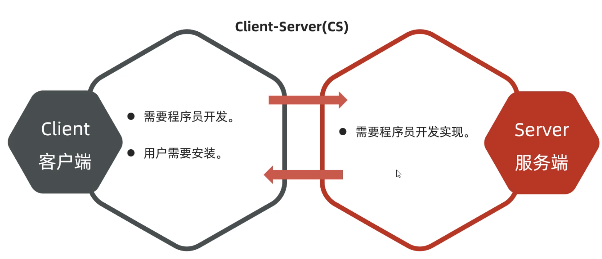

- **BS架构的特点：**BS架构不需要开发客户端软件，用户只需要通过浏览器输入网址就可以直接从服务器获取数据，并由服务器将数据返回给浏览器，用户在页面上就可以看到各种数据了。

  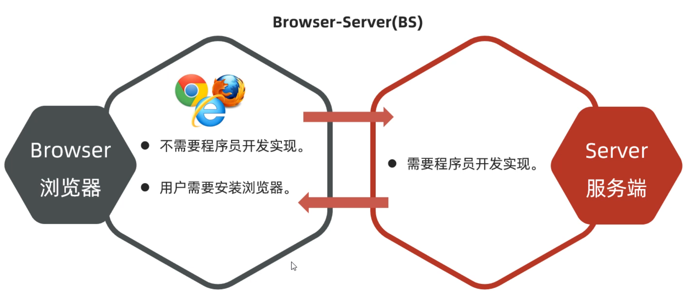

### 1.网络编程三要素

​		什么是网络编程三要素？它们分别是什么，有什么作用？三要素分别是IP地址、端口号和通信协议。

+ IP地址：表示设备在网络中的地址，是网络中设备的唯一标识 。
+ 端口号：应用程序在设备中唯一的标识。
+ 协议：连接和数据在网络中传输的规则。

​		假设我要发一条微信消息到其他电脑的微信上？执行流程如下：

1.先通过ip地址找到对方的电脑。

2.再通过端口号找到对方电脑上的微信客户端。

3.按照双方约定好的规则发送并接受数据。

##### 1.1 IP地址

​		什么是IP地址？**IP（Ineternet Protocol）全称互联网协议地址，是分配给网络设备的唯一表示。**IP地址分为：IPV4地址、IPV6地址。

​		IPV4地址由32个比特位（4个字节）组成，如果下图所示，但是由于采用二进制太不容易阅读了，于是就将每8位看成一组，把每一组用十进制表示（叫做点分十进制表示法）。所以就有了我们经常看到的IP地址形式，如：192.168.1.66、127.0.0.1。

​		因为越来越多的设备需要联网，IPV4地址已经不够用了，所以扩展出来了IPV6地址。IPV6采用128位二进制数据来表示（16个字节），号称可以为地球上的每一粒沙子编一个IP地址，IPV6比较长，为了方便阅读，每16位编成一组，每组采用十六进制数据表示，然后用冒号隔开（称为冒分十六进制表示法），如下图所示：

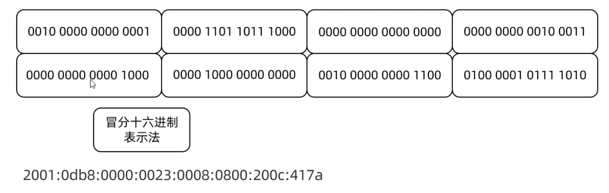

​		还需要注意一个跟IP相关的东西，叫做域名，其实是和IP地址一一对应的，由运营商来管理域名和IP地址的对应关系。我们在浏览器上访问某个网站时，就需要输入该网站的网址，然后由运营商的域名解析器(dns服务器)将域名转换为IP地址返回给计算机，计算机再用这个IP地址去访问对应的网站服务器，并讲数据返回到计算机上的浏览器。

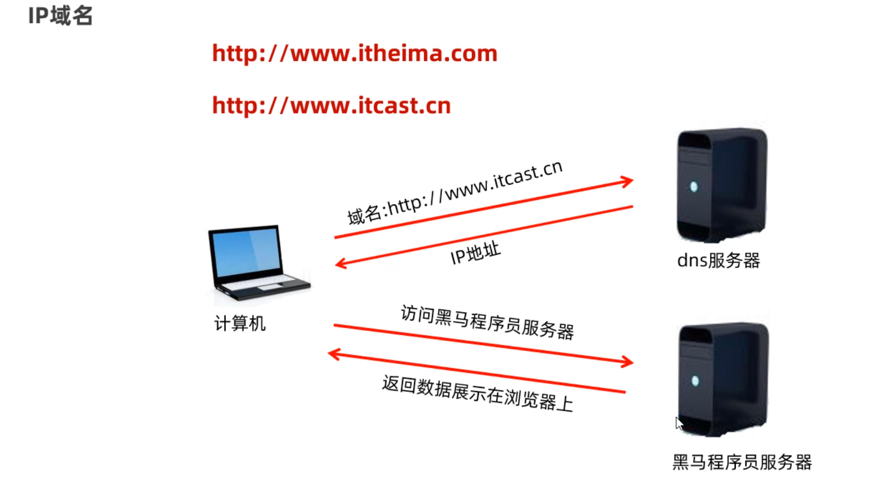

+ **tips**

  

```txt
ipconfig: 查看本机的ip地址
pring 域名/ip  检测当前电脑与指定的ip是否连通
本地回送地址：127.0.0.1
```

##### 1.2InetAddress类

​		Java中也有一个类用来表IP地址，这个类是InetAddress类。我们在开发网络通信程序的时候，可能有时候会获取本机的IP地址，以及测试与其他地址是否连通，这个时候就可以使用InetAddress类来完成。下面是它的几个常用方法。

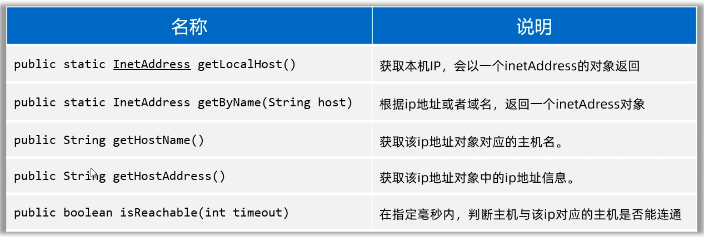

```java
public class InetAddressTest {
    public static void main(String[] args) throws Exception {
        // 1、获取本机IP地址对象的
        InetAddress ip1 = InetAddress.getLocalHost();
        System.out.println(ip1.getHostName());
        System.out.println(ip1.getHostAddress());

        // 2、获取指定IP或者域名的IP地址对象。
        InetAddress ip2 = InetAddress.getByName("www.baidu.com");
        System.out.println(ip2.getHostName());
        System.out.println(ip2.getHostAddress());

        // ping www.baidu.com
        System.out.println(ip2.isReachable(6000));
    }
}
```

##### 1.3端口号

​		什么是端口号？端口号：指的是计算机设备上运行的应用程序的标识，被规定为一个16位的二进制数据，范围（0~65535），端口号分为以下几类，可以了解一下：

- 周知端口：0~1023，被预先定义的知名应用程序占用（如：HTTP占用80，FTP占用21）
- 注册端口：1024~49151，分配给用户经常或者某些应用程序
- 动态端口：49152~65536，之所以称为动态端口，是因为它一般不固定分配给某进程，而是动态分配的。

**注意：**同一台设备中，两个不同的应用软件不能使用同一个端口号

##### 1.4协议

​		什么是协议？只有了IP地址和端口号可不能进行数据通信，它们还需要满足一些规则才能完成数据通信，这个规则就是通信协议，**网络上通信的设备，事先规定的连接规则，以及传输数据的规则被称为网络通信协议。**

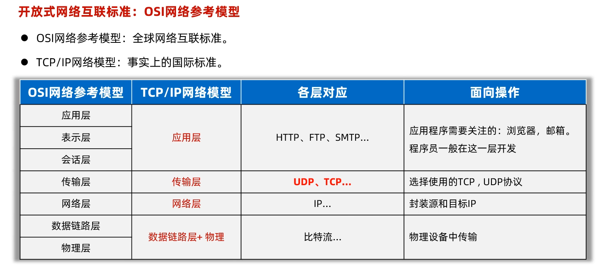

通过TCP协议和UDP协议，我们就可以实现在国际互联网上通信，下面是它们的特点：

+ **UDP协议特点**

特点：无连接，不可靠通信。（优点是通信效率高，可用于语音通话、视频直播）

不事先简历连接，数据按照包发，一包数据通常包括：自己的IP、程序端口、目的地IP、程序端口和数据（限制在64KB内）等。

+ TCP协议特点

特点：面向连接，可靠通信。

TCP最终目的：要保证在不可靠的信道上实现可靠的传输。

TCP有三步实现可靠传输：三次握手建立连接、传输数据进行确认、四次挥手断开连接。

三次握手如下图所示**：目的是确认通信双方，收发消息都是正常没问题的**

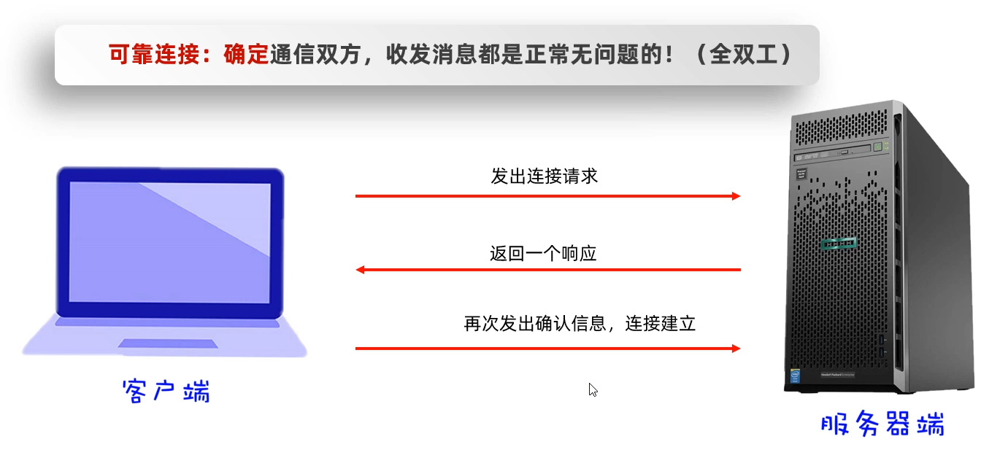

四次挥手如下图所示：**目的是确保双方数据的收发已经完成，没有数据丢失**

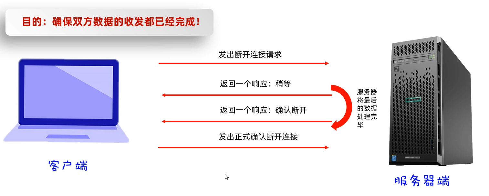

### 2.UDP通信代码

​		UDP是面向无连接的、不需要确认双方是否存在，所以它是不可靠的协议。Java提供了一个类叫DatagramSocket来完成基于UDP协议的收发数据。使用DatagramSocket收发数据时，数据要以数据包的形式体现，一个数据包限制在64KB以内。

具体流程为：假设把DatagramSocket看做是街道两天的人，现在左边的人要扔一盘韭菜到右边，这里的韭菜就是数据，但是数据需要用一个盘子装起来，这里的盘子就是DatagramPacket数据包的意思。通信双方都需要有DatagramSocket(扔、接韭菜人)，还需要DatagramPacket(装韭菜的盘子)。test

##### 2.1 UDP实现一发一收

客户端：

```java
import java.net.*;

public class Client {
    public static void main(String[] args)  {
        System.out.println("准备发送数据~~~");
        try {
            DatagramSocket ds = new DatagramSocket(8888);
            byte[] b = "准备起飞".getBytes();
            DatagramPacket dp = new DatagramPacket(b, b.length, InetAddress.getLocalHost(), 7777);
            ds.send(dp);
            System.out.println("数据发送完毕~~~");
            ds.close();//释放资源

        }  catch (Exception e) {
            e.printStackTrace();
        }
    }
}
```

服务端：

```java
public class Server {
    public static void main(String[] args) {
        try {
            DatagramSocket ds2 = new DatagramSocket(7777);//想象成是接盘子的人

            byte[] b = new byte[1024*64];
            //new一个盘子出来，给出盘子类型和大小
            DatagramPacket dp2 = new DatagramPacket(b, b.length);

            ds2.receive(dp2);
            //接受数据后并打印出来
            int length = dp2.getLength();
            String result = new String(b,0,length);
            System.out.println(result);

          //  System.out.println(dp2.getAddress().getHostAddress());
            System.out.println(dp2.getSocketAddress().toString());
            
            ds2.close();
        } catch (IOException e) {
            e.printStackTrace();
        }
    }
}
```

##### 2.2 UDP实现多发多收

​		多发多收只要在一发一收上修改一下，用while循环发送和接受。

客户端：

```java
public class Client2 {
    public static void main(String[] args) throws Exception {
        Scanner sc = new Scanner(System.in);
        DatagramSocket ds = new DatagramSocket(8888);

        while (true) {
            System.out.println("请您发送信息（输入exit结束）：");
            String msg = sc.nextLine();
            if (msg.equals("exit")) {
                System.out.println("欢迎下次使用");
                ds.close();
                break;
            }
            byte[] buffer = new byte[1024 * 64];
            DatagramPacket dp = new DatagramPacket(buffer, msg.length(), InetAddress.getLocalHost(), 6666);
            ds.send(dp);
        }
    }
}

```

服务端：

```java
public class Server2 {
    public static void main(String[] args) throws Exception {
        DatagramSocket ds2 = new DatagramSocket(6666);

        byte[] buffer = new byte[1024 * 64];
        DatagramPacket dp2 = new DatagramPacket(buffer, buffer.length);
        while (true) {
            System.out.println("开始接受数据～～～");
            ds2.receive(dp2);

            int length = dp2.getLength();
            String result = new String(buffer, 0, length);
            System.out.println(result);

            System.out.println(dp2.getSocketAddress().toString());
        }
    }
}
```

### 3.TCP通信代码

##### 3.1  TCP实现一发一收

​		那么TCP通信的代码该如何编写呢？Java提供了一个java.net.Socket类来完成TCP通信。我们先讲一下Socket完成TCP通信的流程，再讲代码怎么编写就很好理解了。如下图所示：

1. 当创建Socket对象时，就会在客户端和服务端创建一个数据通信的管道，在客户端和服务端两边都会有一个Socket对象来访问这个通信管道。
2. 现在假设客户端要发送一个“在一起”给服务端，客户端这边先需要通过Socket对象获取到一个字节输出流，通过字节输出流写数据到服务端。
3. 然后服务端这边通过Socket对象可以获取字节输入流，通过字节输入流就可以读取客户端写过来的数据，并对数据进行处理。
4. 服务端处理完数据之后，假设需要把“没感觉”发给客户端端，那么服务端这边再通过Socket获取到一个字节输出流，将数据写给客户端。
5. 客户端这边再获取输入流，通过字节输入流来读取服务端写过来的数据。

​		**注意：原始的字节流不太好用，我们可以将原始的OutputStream包装DataOutputStream是比较好用的。**

客户端：

```java
public class Client {
    public static void main(String[] args) throws Exception{
        // 通过TCP通信实现一发一收
        //创建Socket对象，并同时请求与服务器程序的连接
        Socket sk = new Socket(InetAddress.getLocalHost().getHostAddress(),8888);
        //从Socket通信管道种获得字节流对象并包装成数据输出流
        OutputStream os = sk.getOutputStream();
        DataOutputStream dos = new DataOutputStream(os);
        //写入数据出去
        dos.writeUTF("你好你好");
        //关闭资源
        dos.close();
        sk.close();
    }
}
```

服务端：

```java
public class Server {
    public static void main(String[] args) throws Exception {
        //创建ServerSocket对象，并为服务器注册端口，和客户端一致
        ServerSocket ssk = new ServerSocket(8888);
        //使用serverSocket对象，调用一个accept方法，等待客户端的连接请求
        Socket accept = ssk.accept();
        //从Socket通信管道里获取字节输入流并包装成数据输入流
        InputStream is = accept.getInputStream();
        DataInputStream dis = new DataInputStream(is);
        //读取数据并打印
        System.out.println(dis.readUTF());
        //关闭资源
        is.close();
        ssk.close();
    }
}
```

##### 3.2  TCP实现多发多收

​		同样的，我们在一发一收的基础上套用一层循环，可以让Socket一直发，同时让ServerSocket一直收就能实现多发多收了。

客户端：

```java
public class Client2 {
    public static void main(String[] args) throws Exception {
        Scanner sc = new Scanner(System.in);
        Socket sk = new Socket(InetAddress.getLocalHost().getHostAddress(), 8888);
        OutputStream os = sk.getOutputStream();
        DataOutputStream dos = new DataOutputStream(os);

        while (true) {
            System.out.println("请输入要传输的数据（输入exit结束）：");
            String str = sc.nextLine();
            if (str.equals("exit")) {
                os.close();
                dos.close();
                break;
            }
            dos.writeUTF(str);
            dos.flush();
        }
    }
}

```

服务端：

```java
public class Server2 {
    public static void main(String[] args) throws Exception{
        ServerSocket sst = new ServerSocket(8888);
        Socket socket = sst.accept();

        InputStream is = socket.getInputStream();
        DataInputStream dis = new DataInputStream(is);

        while (true) {
            System.out.println("开始接受数据：");
            try {
                /*
                这里不用判断获取的数据是否等于exit，是的话跳出循环。
                因为客户端输入exit后Socket通道就直接关闭了，
                服务器拿不到exit数据，通道连接异常中断就会报错,
                所以直接用try/catch捕获异常再进行操作。
                */
                String result = dis.readUTF();
                System.out.println(result);

            } catch (IOException e) {//10.254.2.165
                System.out.println(socket.getLocalSocketAddress()+"已经离线。。。");
                is.close();
                dis.close();
                break;
            }
        }
    }
}

```

##### 3.3 TCP通信（多线程）

​		上个案例中只支持一个客户端和服务器进行通信，如果有多个客户端连接服务器，此时服务器是不支持的。

​		因此为了让服务器能够和多个客户端进行通信，需要用到多线程技术，实现思路如下：每当有一个客户端连接服务器，服务器就用这个客户端的Socket开启一条线程来执行读取的操作，此时需要创建一个ServerThread类继承线程，这样有多少个客户端，就能创建多少个线程以支持通信。

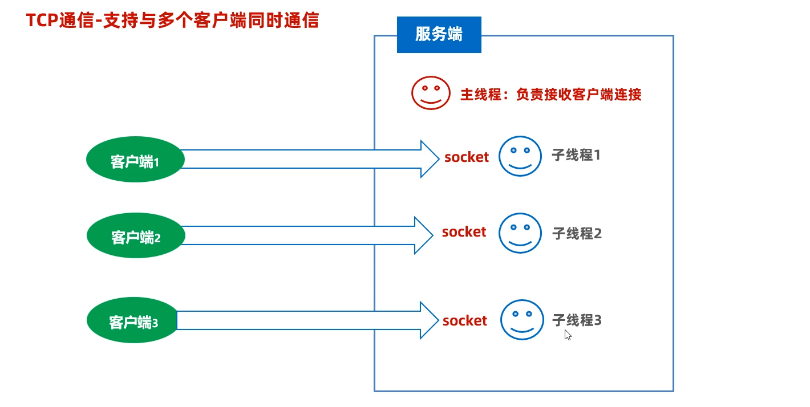

客户端：

```java
public class Client {
    public static void main(String[] args) throws Exception{
        Scanner sc = new Scanner(System.in);
        Socket socket = new Socket(InetAddress.getLocalHost().getHostName(),8888);

        OutputStream os = socket.getOutputStream();
        DataOutputStream dos = new DataOutputStream(os);

        while (true) {
            System.out.println("请输入要传输的数据：");
            String str = sc.nextLine();
            if (str.equals("exit")) {
                System.out.println("欢迎下次使用");
                dos.close();
                break;
            }
            dos.writeUTF(str);
        }
    }
}
```

服务端：

```java
public class Server {
    public static void main(String[] args) throws Exception {
        ServerSocket ss = new ServerSocket(8888);

        while (true) {
            Socket accept = ss.accept();//连接客户端
            new ServerThread(accept).start();
        }
    }
}
```

服务端线程类：

```java
public class ServerThread extends Thread {
    Socket socket;

    public ServerThread(Socket socket) {
        this.socket = socket;
    }

    @Override
    public void run() {
        try {
            InputStream is = socket.getInputStream();
            DataInputStream dis = new DataInputStream(is);
            while (true) {
                System.out.println("服务器读取数据:");
                System.out.println(dis.readUTF());
            }
        } catch (Exception e) {
            System.out.println(socket.getRemoteSocketAddress() + "" + socket.getPort() + "已离线。。。");
        }
    }
}
```

##### 3.4群聊案例

​		上面已经实现了一个服务端可以和多个客户端进行通信，现在来思考如何实现群聊案例？实现群聊不仅需要服务端和多个客户端实现通信，并且客户端发送的消息要同时在其他客户端上显示出来。实现思路如下：

​		可以在服务端创建一个静态变量集合以存储客户端的Socket，当一个客户端发送消息时，就遍历集合通过每个Socket将消息转发给其他客户端。同时还要新建ClientThread线程类，用于循环接收服务端转发的消息。

客户端：

```java
public class Client {
    public static void main(String[] args) throws Exception {
        Scanner sc = new Scanner(System.in);
        Socket socket = new Socket(InetAddress.getLocalHost().getHostName(), 8888);

        new ClientThread(socket).start();

        OutputStream os = socket.getOutputStream();
        DataOutputStream dos = new DataOutputStream(os);

        while (true) {
            System.out.println("请输入要传输的数据：");
            String str = sc.nextLine();
            if (str.equals("exit")) {
                System.out.println("欢迎下次使用");
                dos.close();
                break;
            }
            dos.writeUTF(str);
        }
    }
}
```

客户端线程类：

```java
public class ClientThread extends Thread {
    Socket socket;

    public ClientThread(Socket socket) {
        this.socket = socket;
    }

    @Override
    public void run() {
        try {
            InputStream is = socket.getInputStream();
            DataInputStream dis = new DataInputStream(is);

            while (true) {
                //循环读取由服务端转发的其他客户端发送的消息
                String str = dis.readUTF();
                System.out.println(socket.getInetAddress().getHostAddress() + "" + socket.getPort() + ":用户发送了信息" + str);
            }
        } catch (IOException e) {
            e.printStackTrace();
        }

    }
}
```

服务端：

```java
public class Server {
    //定义成员变量集合来储存所有客户端的Socket
    public static final ArrayList<Socket> onLineSockets = new ArrayList<>();

    public static void main(String[] args) throws Exception {
        ServerSocket ss = new ServerSocket(8888);

        while (true) {
            Socket accept = ss.accept();//连接客户端
            onLineSockets.add(accept);
            new ServerThread(accept).start();

        }
    }
}
```

服务端线程类：

```java
public class ServerThread extends Thread {

    Socket socket;

    public ServerThread(Socket socket) {
        this.socket = socket;
    }

    @Override
    public void run() {
        try {
            InputStream is = socket.getInputStream();
            DataInputStream dis = new DataInputStream(is);

            while (true) {
                //读取客户端发送的消息并输出在服务端
                String str = dis.readUTF();
                System.out.println(str);
                for (Socket on : Server.onLineSockets) {
                    //判断所有不是自己的客户端，将消息转发给其他客户端
                    if (!(on == socket)) {
                        OutputStream outputStream = on.getOutputStream();
                        DataOutputStream dos = new DataOutputStream(outputStream);
                        dos.writeUTF(str);
                        dos.flush();
                    }
                }
            }
        } catch (IOException e) {
            System.out.println(socket.getLocalSocketAddress() + "" + socket.getPort() + "用户退出了");
        }
    }
}
```

### 4. BS架构程序

​		前面的例子都是CS结构的，需要用户下载客户端才能与服务器进行通信。而网络编程还可以编写BS架构的程序。程序运行在浏览器，可以把浏览器当成是客户端，这时只需要开发服务端程序就可以了。

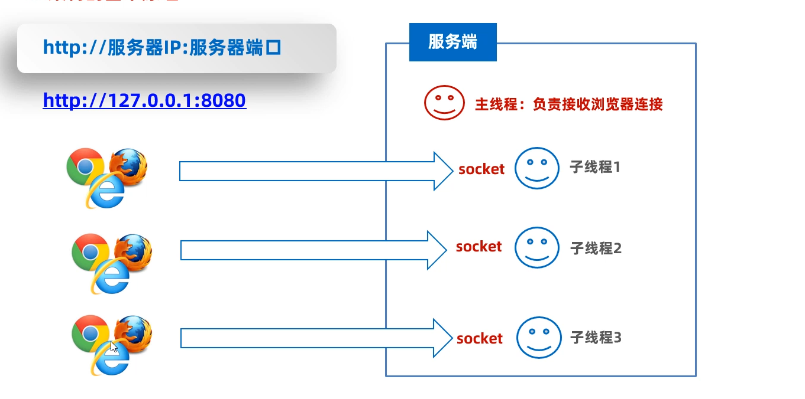

​		在BS结构的程序中，**浏览器和服务器通信是基于HTTP协议来完成的，浏览器给客户端发送数据需要按照HTTP协议规定好的数据格式发给服务端，服务端返回数据时也需要按照HTTP协议规定好的数据给是发给浏览器**，只有这两双方才能完成一次数据交互。服务端给客户端响应数据的数据格式（HTTP协议规定数据格式）如下图所示：左图是数据格式，右图是示例。

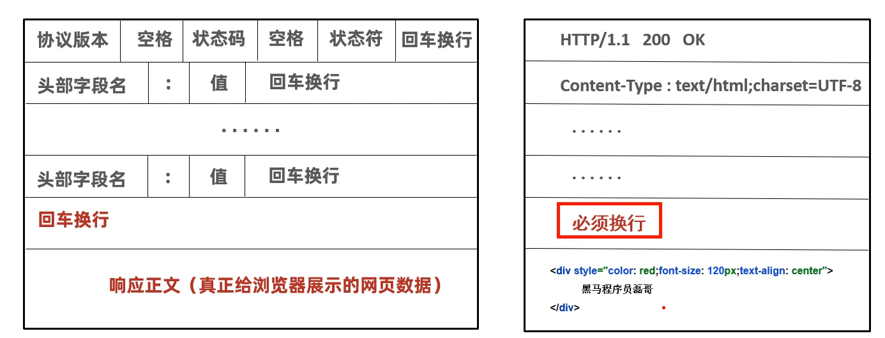

##### 4.1服务端程序

​		下面来编写一个简单的服务端程序，先写一个线程类，用于按照HTTP协议的格式返回数据给浏览器（客户端）。

服务端线程类：

```java
public class ServerReaderThread extends Thread{
    private Socket socket;
    public ServerReaderThread(Socket socket){
        this.socket = socket;
    }
    @Override
    public void run() {
        //  立即响应一个网页内容：“666”给浏览器展示。
        try {
            OutputStream os = socket.getOutputStream();
            PrintStream ps = new PrintStream(os);
            ps.println("HTTP/1.1 200 OK");
            ps.println("Content-Type:text/html;charset=UTF-8");
            ps.println(); // 必须换行
            ps.println("<div style='color:red;font-size:120px;text-align:center'>666<div>");
            ps.close();
            socket.close();
        } catch (Exception e) {
            e.printStackTrace();
        }
    }
}
```

服务端：

```java
/**
 *  目标：完成TCP通信快速入门-服务端开发：要求实现与多个客户端同时通信。
 */
public class Server {
    public static void main(String[] args) throws Exception {
        System.out.println("-----服务端启动成功-------");
        // 1、创建ServerSocket的对象，同时为服务端注册端口。
        ServerSocket serverSocket = new ServerSocket(8080);

        while (true) {
            // 2、使用serverSocket对象，调用一个accept方法，等待客户端的连接请求
            Socket socket = serverSocket.accept();

            System.out.println("有人上线了：" + socket.getRemoteSocketAddress());

            // 3、把这个客户端对应的socket通信管道，交给一个独立的线程负责处理。
            new ServerReaderThread(socket).start();
        }
    }
}
```

##### 4.2 用线程池优化服务端程序

​		为了避免服务端创建太多的线程导致oom，可以把服务端用线程池优化一下，提高服务端的性能。先写一个给浏览器响应数据的线程任务。

服务端线程任务：

```java
public class ServerReaderRunnable implements Runnable{
    private Socket socket;
    public ServerReaderRunnable(Socket socket){
        this.socket = socket;
    }
    @Override
    public void run() {
        //  立即响应一个网页内容：“黑马程序员”给浏览器展示。
        try {
            OutputStream os = socket.getOutputStream();
            PrintStream ps = new PrintStream(os);
            ps.println("HTTP/1.1 200 OK");
            ps.println("Content-Type:text/html;charset=UTF-8");
            ps.println(); // 必须换行
            ps.println("<div style='color:red;font-size:120px;text-align:center'>黑马程序员666<div>");
            ps.close();
            socket.close();
        } catch (Exception e) {
            e.printStackTrace();
        }
    }
}
```

服务端：

```java
public class Server {
    public static void main(String[] args) throws Exception {
        System.out.println("-----服务端启动成功-------");
        // 1、创建ServerSocket的对象，同时为服务端注册端口。
        ServerSocket serverSocket = new ServerSocket(8080);

        // 创建出一个线程池，负责处理通信管道的任务。
        ThreadPoolExecutor pool = new ThreadPoolExecutor(16 * 2, 16 * 2, 0, TimeUnit.SECONDS,
                new ArrayBlockingQueue<>(8) , Executors.defaultThreadFactory(),
                new ThreadPoolExecutor.AbortPolicy());

        while (true) {
            // 2、使用serverSocket对象，调用一个accept方法，等待客户端的连接请求
            Socket socket = serverSocket.accept();

            // 3、把这个客户端对应的socket通信管道，交给一个独立的线程负责处理。
            pool.execute(new ServerReaderRunnable(socket));
        }
    }
}
```

