# 集合进阶

### 1.集合概述

​		什么是集合？集合体系分为两种：**Collection**（单列集合）和**Map**（双列集合）

##### 1.1单列集合

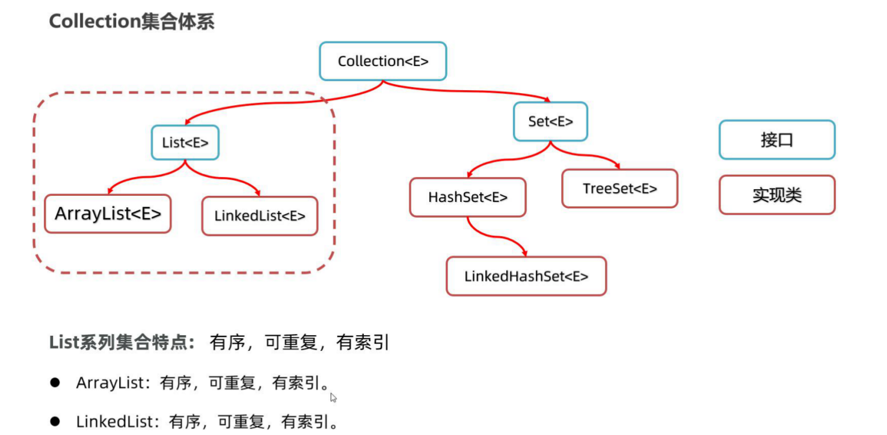

##### 1.2Collection集合的常用方法

​		接下来，我们学习一下Collection集合的一些常用方法，这些方法所有Collection实现类都可以使用。 这里我们以 创建ArrayList为例：

```java
public class Test1 {
    public static void main(String[] args) {
        Collection<String> col = new ArrayList<>();//多态
        //public boolean add(E e):添加元素到集合
        col.add("java0");
        col.add("java1");
        col.add("java1");
        col.add("java2");
        col.add("java3");
        System.out.println(col);//  [java0, java1, java1, java2, java3]

        System.out.println(col.size());//获取集合的大小

        col.contains("java3");//判断集合是否包含某个元素，返回值为布尔

        col.remove("java1");//删除集合的元素，注意：如果有多个元素，只能删除一个
        System.out.println(col);//[java0, java1, java2, java3]

       //col.clear();//清空集合的所有元素

        System.out.println(col.isEmpty());//判断集合是否为空，返回值为布尔

        col.toArray();//把集合转换为数组，返回一个数组

        //如果想把集合转换为指定类型的数组，可以使用下面的代码
        String[] array1 = col.toArray(new String[col.size()]);
        System.out.println(Arrays.toString(array1)); //[java1,java2, java2, java3]

        Collection<String> col2 = new ArrayList<>();
        col2.addAll(col);//将col集合中的全部元素添加到col2集合中
        System.out.println(col2);//[java0, java1, java2, java3]
    }
}
```


​       最后，我们总结一下Collection集合的常用功能有哪些，ArrayList、LinkedList、HashSet、LinkedHashSet、 TreeSet集合都可以调用下面的方**（addclear,remove,contains,isEmpty,size,toArray）。**

### 2.Collection遍历方式

​       普通的for循环只能遍历List集合，不能遍历Set集合，因为普通for循环需要索引才可以遍历。但只有List集合是有索引的，而Set集合是没有索引的。所以需要一种通用的遍历方式可以遍历所有集合。

##### 2.1 Iterator迭代器

​		我们可以用到Iterator迭代器用来遍历集合，那么什么是Iterator迭代器？Iteratot迭代器是一种遍历集合的方式。那么应该如何使用？下面以打印String集合为例，数组名.出iterator迭代器，在使用快捷键 **i t i t** 遍历集合。

```java
Iterator<String> iterator = c.iterator();
        while (iterator.hasNext()) {
            String next =  iterator.next();
            System.out.println(next);
        }
```

迭代器的底层原理是：

​		当调用iterator()方法获取迭代器时，当前指向第一个元素 hasNext()方法则判断这个位置是否有元素，如果有则返回true，进入循环 调用next()方法获取元素，并将当前元素指向下一个位置， 等下次循环时，则获取下一个元素，依此内推。

##### 2.2增强for遍历集合

用增强for遍历集合要比使用迭代器更加方便，格式如下：

```java
//格式如下
for(元素的数据类型  变量名: 数组或者集合){

}
//用增强for遍历col集合，并循环打印集合元素s
 for (String s : col) {
            System.out.println(s);
        }
```

##### 2.3forEach遍历集合

​		JDK8版本后还提供了一个forEach方法来遍历集合，如下图所示：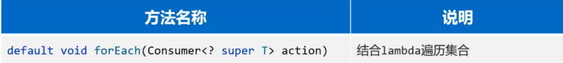

观察forEach方法的参数是一个Consumer接口，而Consumer是一个函数式接口，所以可以传递Lambda表达式简化缩写。

```java
 col.forEach(s->{ System.out.println(s);});
```


### 3.Collection分支下的List集合

##### 3.1List集合的常用方法

​		什么是List集合？List集合支持索引，所以其中提供了很多关于索引的方法，当然Collection的功能List也都继承了。   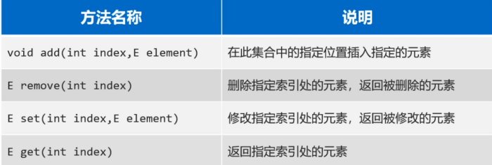

##### 3.2List几个的遍历方式

​		List集合相比于Coeclltion多了一种可以通过索引遍历的方式，所以List集合遍历方式共有四种：

+ 普通for循环（只因为List有索引）

​		list.fori

+ 迭代器

​		Iterator<String> it = list.iterator()

+ 增强for

​		list.for

+ Lambda表达式

​		list.forEach(s->{System.out.println(s)})

​		注意：**forEach遍历集合的同时删除元素会出现并发异常**，解决方法有:1.普通for循环倒序遍历集合，或者正序遍历后索引 i - - ；2.用迭代器的remove方法删除元素：Iterator.remove()。

##### 3.3ArrayList的底层原理

+ ArrayList是基于数组实现的，其特点是：**查询速度快，增删慢。**
+ ArrayList集合在被创建的时候，会利用无参构造器创建一个长度为0的数组，当该数组添加第一个元素的时候，底层会新建一个长度为10的数组，并将元素添加进去。数组存满元素后会扩容1.5倍。若1.5倍长度仍不能满足添加元素的数量，则新创建数组的长度以实际长度为准。

##### 3.4LinkedList的底层原理

​		LinkedList底层是链表结构，而且是双向链表结构。链表结构是由一个一个的节点组成，一个节点由数据值、下一个元素的地址组成。链表的特点有两个：**查询慢，无论查询哪个数据都要从头开始查询；链表的增删相对较快。**

​		链表有两种，一种是单向链表，方向是由头节点指向尾节点，只能通过头节点往尾节点方向查找元素；还有一种链表是双向链表，可以从头往尾查询也可以从尾往头查询。

LinkedList集合基于双向链表实现，所以相对于ArrayList新增了一些可以针对头尾进行操作的方法：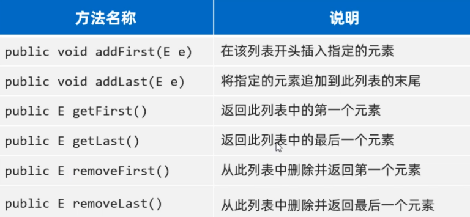

##### 3.5LinkedList集合的应用场景

​		LInkedList集合有什么用呢？可以用它来设计栈结构、队列结构。

+ 队列结构：入队可以调用LinkedList集合的addLast方法，出队可以调用removeFirst()方法。（队列结构特点是先进先出）
+ 栈结构：入栈可以调用LinkedList集合的push方法，出栈可以调用pop方法。（栈结构特点是先进后出，后进先出）

### 4.Collection分支下的Set集合

##### 4.1HashSet集合的底层原理

​		HashSet集合底层是基于哈希表实现的，哈希表根据JDK版本的不同，也有所区别：

- JDK8以前：哈希表 = 数组+链表

- JDK8以后：哈希表 = 数组+链表+红黑树

  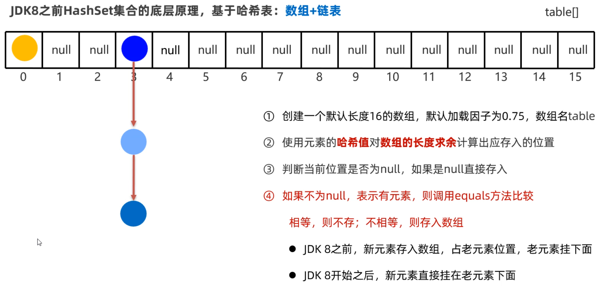

* 当创建HashSet集合时，会在底层创建一个长度为0的数组，当添加第一个元素的时候，会新建一个默认长度为16的数组，如果此时不停地存储哈希值相同但不相同地数据，数据会挂在数组地同一索引上，当该索引位置挂了8个元素时，**添加第九个元素的时候，数组会扩容到32，当添加第十个元素的时候，数组会再次扩容到64，当添加到第十一个元素的时候，索引下面挂着的11长度的链表会转化为红黑树**，如下图所示：
* 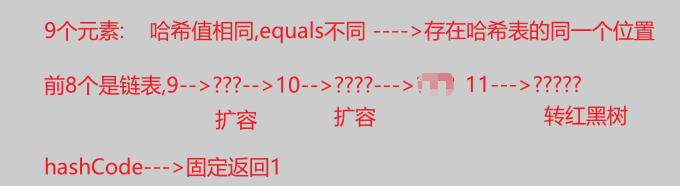

##### 4.2HashSet去重原理

​		HashSet存储元素的原理，依赖于两个方法：一个是hashCode方法用来确定在底层数组中存储的位置，另一个是用equals方法判断新添加的元素是否和集合中已有的元素相同。

```java
	可以通过快捷键生成//按快捷键生成hashCode和equals方法
	//alt+insert 选择 hashCode and equals
```

##### 4.3 LinkedHashSet底层原理

​		什么是LinkedHashSet？LinkedHashSet是HashSet的一个子类，它的底层采用的是也是哈希表结构，只不过额外新增了一个双向链表来维护元素的存取顺序，如下图所示：

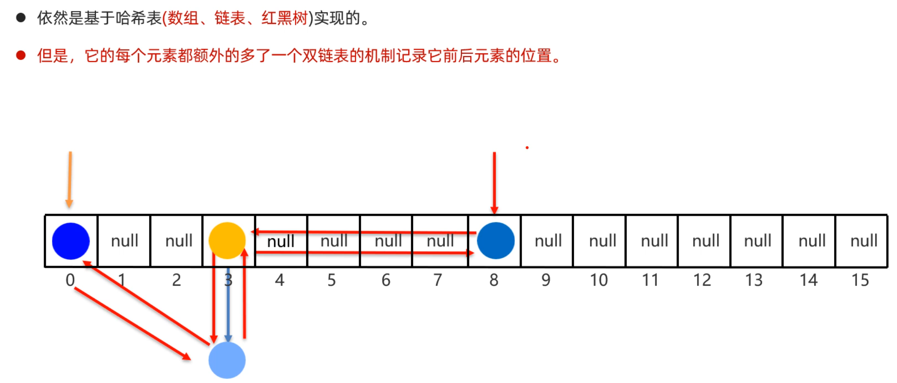

​		每次添加元素，就和上一个元素用双向链表连接一下。第一个添加的元素是双向链表的头节点，最后一个添加的元素是双向链表的尾节点。

##### 4.4TreeSet集合

​		什么是TreeSet？TreeSet集合的特点是可以对元素进行排序，但是必须指定元素的排序规则。如果往TreeSet集合中存储自定义类型的元素，比如说Student类型，则需要我们自己指定排序规则，否则会出现异常。因为TreeSet不知道按照什么条件对Strudent对象来排序。

​		有两种办法让TreeSet集合按照指定的规则排序，

+ 第一种：让元素的类实现Comparable接口，重写compareTo方法

+ 第二种：在创建TreeSet集合时，通过构造方法传递Compartor比较器对象

第一种排序方式：(结果按照年龄升序)

```java
//第一步：先让Student类，实现Comparable接口
//注意：Student类的对象是作为TreeSet集合的元素的
public class Student implements Comparable<Student>{
    private String name;
    private int age;
    private double height;
	//无参数构造方法
    public Student(){}
    //全参数构造方法
    public Student(String name, int age, double height){
        this.name=name;
        this.age=age;
        this.height=height;
    }
    //...get、set、toString()方法自己补上..
    
    //第二步：重写compareTo方法
    //按照年龄进行比较，只需要在方法中让this.age和o.age相减就可以。
    /*
    原理：
    在往TreeSet集合中添加元素时，add方法底层会调用compareTo方法，根据该方法的
    结果是正数、负数、还是零，决定元素放在后面、前面还是不存。
    */
    @Override
    public int compareTo(Student o) {
        //this：表示将要添加进去的Student对象
        //o: 表示集合中已有的Student对象
        return this.age-o.age;
    }
}
```

第二种排序方式：

```java
//创建TreeSet集合时，传递比较器对象排序
/*
原理：当调用add方法时，底层会先用比较器，根据Comparator的compare方是正数、负数、还是零，决定谁在后，谁在前，谁不存。
*/
//下面代码中是按照学生的年龄升序排序
Set<Student> students = new TreeSet<>((o1, o2) -> 1);
        Student s1 = new Student("至尊宝",20, 169.6);
        Student s2 = new Student("紫霞",23, 169.8);
        Student s3 = new Student("蜘蛛精",23, 169.6);
        Student s4 = new Student("牛魔王",48, 169.6);

//创建4个Student对象
Student s1 = new Student("至尊宝",20, 169.6);
Student s2 = new Student("紫霞",23, 169.8);
Student s3 = new Student("蜘蛛精",23, 169.6);
Student s4 = new Student("牛魔王",48, 169.6);

//添加Studnet对象到集合
students.add(s1);
students.add(s2);
students.add(s3);
students.add(s4);
System.out.println(students); //结果是按照学生年龄升序
```

##### 4.5总结Collection集合

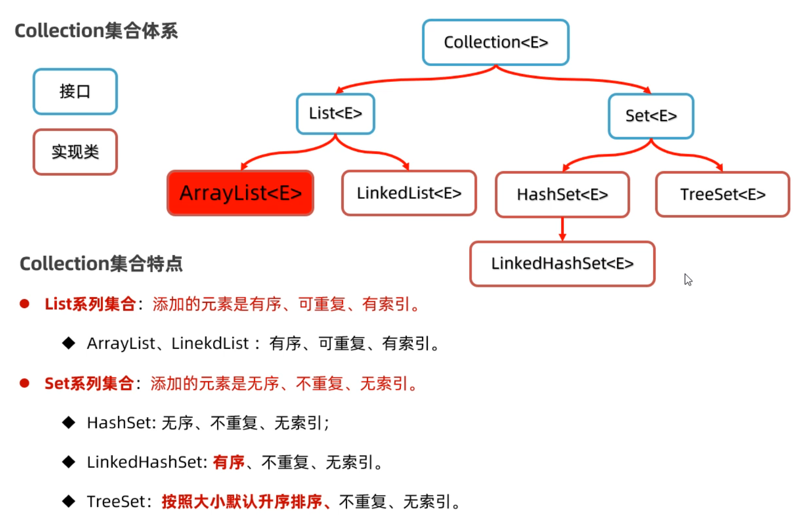

+ ###### 并发修改异常

  什么并发修改异常？就是用迭代器遍历集合的时候，同时用集合的remove()方法删除元素，就会出现并发修改异常。

  那么我们要怎么解决呢？在迭代器循环遍历的时候，**不能用集合的remove()方法删除元素，需要用Iterator迭代器自带的删除方法。**

### 5.Collection的其他操作

​		Collection的其他操作有哪些呢？是为了更加方便的对Collection集合进行操作，我们还要学习一个操作Collection集合的工具类，叫做Collections。但是Collections工具类中需要用到一个没有学过的小知识点，叫做可变参数，所以必须先学习这个前置知识可变参数，再学习Collections工具类，

##### 5.1可变参数

​		可变参数是一种特殊的形式参数，定义在方法、构造器的形参列表处，它可以让方法接收多个同类型的实际参数。

​		**可变参数在方法内部，本质上是一个数组。**

```java
public class Test {
    public static void main(String[] args) {
        //不传递参数，下面的nums长度则为0, 打印元素是[]
        test();

        //传递3个参数，下面的nums长度为3，打印元素是[10, 20, 30]
        test(10, 20, 30);

        //传递一个数组，下面数组长度为4，打印元素是[10,20,30,40]
        //可以验证可变参数int...其实就是一个数组
        int[] arr = new int[]{10, 20, 30, 40};
        test(arr);
    }

    public static void test(int... nums) {
        //可变参数在方法内部，本质上是一个数组
        System.out.println(nums.length);
        System.out.println(Arrays.toString(nums));
        System.out.println("----------------");
    }
}
```

​		注意可变参数的写法：1. 一个形参列表中，只能有一个可变参数；否则会报错。2.一个形参列表中如果多个参数，可变参数需要写在最后；否则会报错。

### 6.Map集合

​		什么是Map集合？Map集合其实就是双列集合，双列集合，就是说集合中的元素是一对一对的。Map集合中的每一个元素是以`key=value`的形式存在的，一个`key=value`就称之为一个键值对，而且在Java中有一个类叫Entry类，Entry的对象用来表示键值对对象。

​		所有的Map集合有如下的特点：**键不能重复，值可以重复，每一个键只能找到自己对应的值。**

​		Map集合也有很多种，在Java中使用不同的类来表示的，每一种Map集合其键的特点是有些差异的，值是键的一个附属值，所以我们只关注键的特点就可以了。

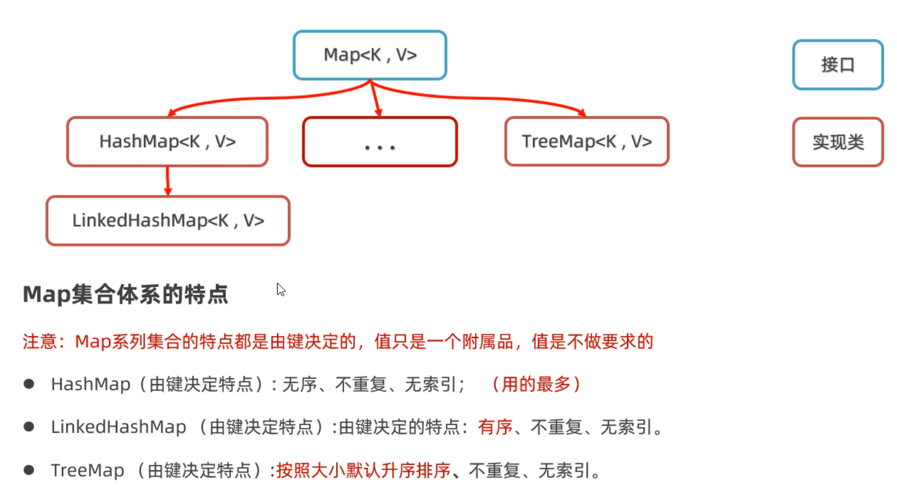

##### 6.1Map集合的常用方法

​		Map集合的常用方法有哪些？掌握了Map集合中每个方法的含义，就基本可以掌握Map方法了。


##### 6.2Map集合遍历方式

​		Map集合的遍历方式有几种？总共有三种，分别是1. 通过键找值、2. 获取Entry键值对对象，把所有的Entry存储到Set集合里，在遍历这个集合取到键和值、3. 通过forEach()方法，配合Lambda表达式可以使代码特别简洁。

+ **键找值**

```java
/**
 *  目标：掌握Map集合的遍历方式1：键找值
 */
public class MapTest1 {
    public static void main(String[] args) {
        // 准备一个Map集合。
        Map<String, Double> map = new HashMap<>();
        map.put("蜘蛛精", 162.5);
        map.put("蜘蛛精", 169.8);
        map.put("紫霞", 165.8);
        map.put("至尊宝", 169.5);
        map.put("牛魔王", 183.6);
        System.out.println(map);
        // map = {蜘蛛精=169.8, 牛魔王=183.6, 至尊宝=169.5, 紫霞=165.8}

        // 1、获取Map集合的全部键
        Set<String> keys = map.keySet();
        // System.out.println(keys);
        // [蜘蛛精, 牛魔王, 至尊宝, 紫霞]
        //         key
        // 2、遍历全部的键，根据键获取其对应的值
        for (String key : keys) {
            // 根据键获取对应的值
            double value = map.get(key);
            System.out.println(key + "=====>" + value);
        }
    }
}
```

+ **通过Entry对象取到键和值**

​		具体流程如下图：

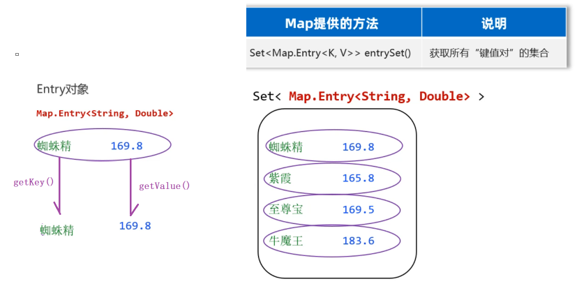

```
/**
 * 目标：掌握Map集合的第二种遍历方式：键值对。
 */
public class MapTest2 {
    public static void main(String[] args) {
        Map<String, Double> map = new HashMap<>();
        map.put("蜘蛛精", 169.8);
        map.put("紫霞", 165.8);
        map.put("至尊宝", 169.5);
        map.put("牛魔王", 183.6);
        System.out.println(map);
        // map = {蜘蛛精=169.8, 牛魔王=183.6, 至尊宝=169.5, 紫霞=165.8}
        // entries = [(蜘蛛精=169.8), (牛魔王=183.6), (至尊宝=169.5), (紫霞=165.8)]
        // entry = (蜘蛛精=169.8)
        // entry = (牛魔王=183.6)
        // ...

        // 1、调用Map集合提供entrySet方法，把Map集合转换成键值对类型的Set集合
        Set<Map.Entry<String, Double>> entries = map.entrySet();
        for (Map.Entry<String, Double> entry : entries) {
            String key = entry.getKey();
            double value = entry.getValue();
            System.out.println(key + "---->" + value);
        }
    }
}
```

+ **forEach()方法**

```java
/**
 * 目标：掌握Map集合的第二种遍历方式：键值对。
 */
public class MapTest3 {
    public static void main(String[] args) {
        Map<String, Double> map = new HashMap<>();
        map.put("蜘蛛精", 169.8);
        map.put("紫霞", 165.8);
        map.put("至尊宝", 169.5);
        map.put("牛魔王", 183.6);
        System.out.println(map);
        // map = {蜘蛛精=169.8, 牛魔王=183.6, 至尊宝=169.5, 紫霞=165.8}


        //遍历map集合，传递匿名内部类
        map.forEach(new BiConsumer<String, Double>() {
            @Override
            public void accept(String k, Double v) {
                System.out.println(k + "---->" + v);
            }
        });
        //遍历map集合，传递Lambda表达式
        map.forEach(( k,  v) -> {
            System.out.println(k + "---->" + v);
        });
    }
}
```

#####  6.3Map集合简单案例

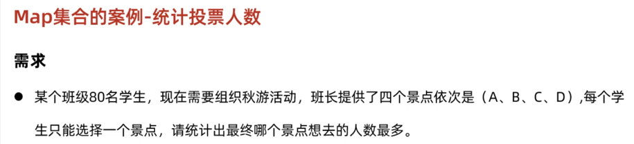

```java
/**
 * 目标：完成Map集合的案例：统计投票人数。
 */
public class MapDemo4 {
    public static void main(String[] args) {
        // 1、把80个学生选择的景点数据拿到程序中来。
        List<String> data = new ArrayList<>();
        String[] selects = {"A", "B", "C", "D"};
        Random r = new Random();
        for (int i = 1; i <= 80; i++) {
            // 每次模拟一个学生选择一个景点，存入到集合中去。
            int index = r.nextInt(4); // 0 1 2 3
            data.add(selects[index]);
        }
        System.out.println(data);

        // 2、开始统计每个景点的投票人数
        // 准备一个Map集合用于统计最终的结果
        Map<String, Integer> result = new HashMap<>();

        // 3、开始遍历80个景点数据
        for (String s : data) {
            // 问问Map集合中是否存在该景点
            if(result.containsKey(s)){
                // 说明这个景点之前统计过。其值+1. 存入到Map集合中去
                result.put(s, result.get(s) + 1);
            }else {
                // 说明这个景点是第一次统计，存入"景点=1"
                result.put(s, 1);
            }
        }
        System.out.println(result);
    }
}
```

##### 6.4HashMap

​		我们学习HashMap集合的底层原理。前面我们学习过HashSet的底层原理，实际上HashMap底层原理和HashSet是一样的。为什么这么说呢？因为我们往HashSet集合中添加元素时，实际上是把元素作为添加添加到了HashMap集合中。

​		下面是Map集合的体系结构，HashMap集合的特点是由键决定的： **它的键是无序、不能重复，而且没有索引的**。再各种Map集合中也是用得最多的一种集合。

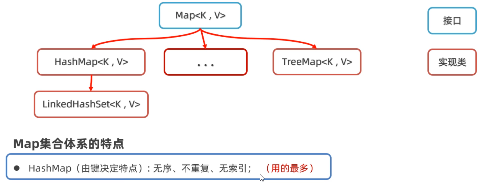

​		看过HashSet的源码就能发现，HashSet的底层就是HashMap，在创建HashSet集合是，底层帮你创建了HashMap集合；往HashSet集合中添加添加元素时，底层却是调用了Map集合的put方法把元素作为了键来存储。所以实际上根本没有什么HashSet集合，把HashMap的集合的值忽略不看就是HashSet集合。

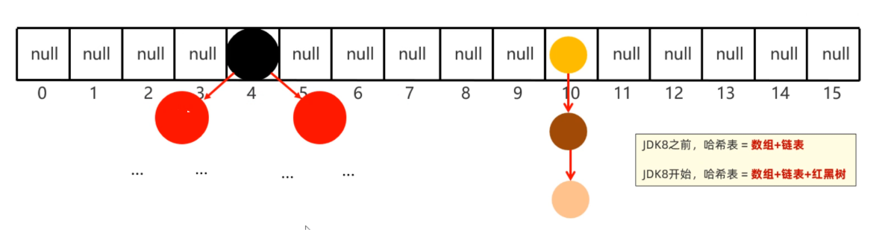

注意：

```java
HashMap底层数据结构: 哈希表结构
	JDK8之前的哈希表 = 数组+链表
	JDK8之后的哈希表 = 数组+链表+红黑树
	哈希表是一种增删改查数据，性能相对都较好的数据结构
	
往HashMap集合中存键值对数据时，底层步骤如下
	第1步：当你第一次往HashMap集合中存储键值对时，底层会创建一个长度为16的数组
	第2步：然后将键和值封装成一个对象，叫做Entry对象
	第3步：再根据Entry对象的键计算hashCode值（和值无关）
	第4步：利用hashCode值和数组的长度做一个类似求余数的算法，会得到一个索引位置
	第5步：判断这个索引的位置是否为null，如果为null,就直接将这个Entry对象存储到这个索引位置
		   如果不为null，则还需要进行第6步的判断
	第6步：继续调用equals方法判断两个对象键是否相同
		  如果equals返回false，则以链表的形式往下挂
		  如果equals方法true,则认为键重复，此时新的键值对会替换就的键值对。
	
HashMap底层需要注意这几点：
	1.底层数组默认长度为16，如果数组中有超过12个位置已经存储了元素，则会对数组进行扩容2倍
	  数组扩容的加载因子是0.75，意思是：16*0.75=12 	
   	
    2.数组的同一个索引位置有多个元素、并且在8个元素以内(包括8)，则以链表的形式存储
    	JDK7版本：链表采用头插法（新元素往链表的头部添加）
    	JDK8版本：链表采用尾插法（新元素我那个链表的尾部添加）
    	
    3.数组的同一个索引位置有多个元素、并且超过了8个，则以红黑树形式存储
```

​		所以如果我们要在Map集合种储存储自定义对象作为键，为了保证键的唯一性，我们应该重写hashCode方法和equals方法。可以使用快捷键alt＋insert快速生成。

##### 6.5 LinkedHashMap

​		什么是LinkedHashMap？LinkedHashMap集合的特点也是由键决定的：**有序的、不重复、无索引**。

它的底层其实就是HashMap外面套了一个Linkde的双向链表，保证了元素存取的有序，取元素的时候，先取头节点元素，然后再依次取下一个节点，一直到尾节点，所以能保证有序。

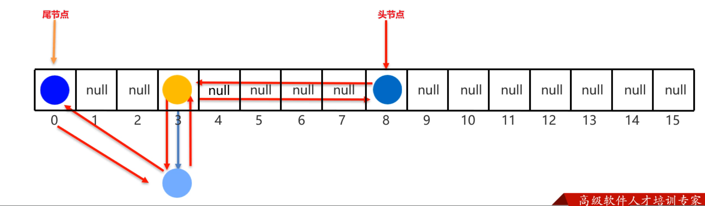

##### 6.6TreeMap

​		什么是TreeMap集合？它是Map集合下面的另一个子类，它的特点也是由键决定的，默认按照键的升序来排列，键不重复，也是无索引的。

​		TreeMap集合的底层原理和TreeSet也是一样的，**底层是红黑树实现的。**所以可以对键进行排序。

例如往TreeMap集合中存储Student对象作为键，排序方法有两种。

+ 第一种：**写一个Student类，让Student类实现Comparable接口**

```java
//第一步：先让Student类，实现Comparable接口
public class Student implements Comparable<Student>{
    private String name;
    private int age;
    private double height;
	//无参数构造方法
    public Student(){}
    //全参数构造方法
    public Student(String name, int age, double height){
        this.name=name;
        this.age=age;
        this.height=height;
    }
    //...get、set、toString()方法自己补上..
    
    //按照年龄进行比较，只需要在方法中让this.age和o.age相减就可以。
    /*
    原理：
    在往TreeSet集合中添加元素时，add方法底层会调用compareTo方法，根据该方法的
    结果是正数、负数、还是零，决定元素放在后面、前面还是不存。
    */
    @Override
    public int compareTo(Student o) {
        //this：表示将要添加进去的Student对象
        //o: 表示集合中已有的Student对象
        return this.age-o.age;
    }
}
```

+ 第二种：**在创建TreeMap集合时，直接传递Comparator比较器对象。**

```java
/**
 * 目标：掌握TreeMap集合的使用。
 */
public class Test3TreeMap {
    public static void main(String[] args) {
        Map<Student, String> map = new TreeMap<>(new Comparator<Student>() {
            @Override
            public int compare(Student o1, Student o2) {
                return Double.compare(o1.getHeight(), o2.getHeight());
            }
        });
//        Map<Student, String> map = new TreeMap<>(( o1,  o2) ->   Double.compare(o2.getHeight(), o1.getHeight()));
        map.put(new Student("蜘蛛精", 25, 168.5), "盘丝洞");
        map.put(new Student("蜘蛛精", 25, 168.5), "水帘洞");
        map.put(new Student("至尊宝", 23, 163.5), "水帘洞");
        map.put(new Student("牛魔王", 28, 183.5), "牛头山");
        System.out.println(map);
    }
}
```

​		**注意：只有TreeMap的键才能排序，HashMap键不能排序。**

##### 6.7集合嵌套

​		什么是集合嵌套？集合嵌套式把一个集合当作元素，存储到另外一个集合中去，这种用法称为集合嵌套。

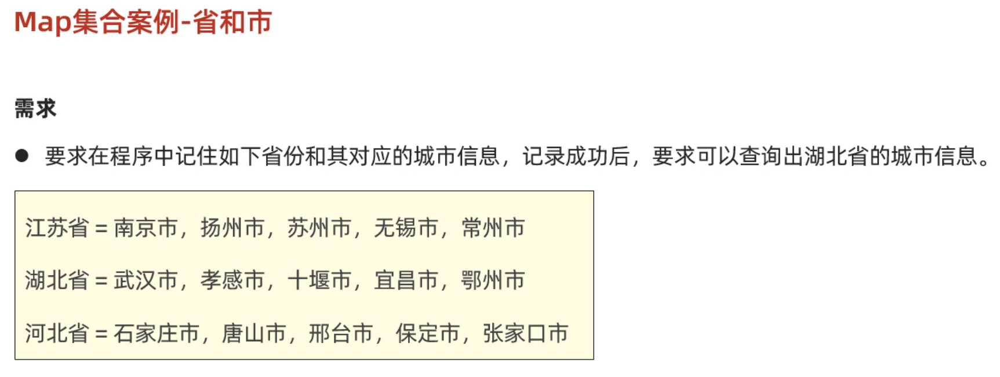


```java
/**
 * 目标：理解集合的嵌套。
 * 江苏省 = "南京市","扬州市","苏州市“,"无锡市","常州市"
 * 湖北省 = "武汉市","孝感市","十堰市","宜昌市","鄂州市"
 * 河北省 = "石家庄市","唐山市", "邢台市", "保定市", "张家口市"
 */
public class Test {
    public static void main(String[] args) {
        // 1、定义一个Map集合存储全部的省份信息，和其对应的城市信息。
        Map<String, List<String>> map = new HashMap<>();

        List<String> cities1 = new ArrayList<>();
        Collections.addAll(cities1, "南京市","扬州市","苏州市" ,"无锡市","常州市");
        map.put("江苏省", cities1);

        List<String> cities2 = new ArrayList<>();
        Collections.addAll(cities2, "武汉市","孝感市","十堰市","宜昌市","鄂州市");
        map.put("湖北省", cities2);

        List<String> cities3 = new ArrayList<>();
        Collections.addAll(cities3, "石家庄市","唐山市", "邢台市", "保定市", "张家口市");
        map.put("河北省", cities3);
        System.out.println(map);

        List<String> cities = map.get("湖北省");
        for (String city : cities) {
            System.out.println(city);
        }

        map.forEach((p, c) -> {
            System.out.println(p + "----->" + c);
        });
    }
}
```

