# 面向对象高级

### 1.枚举

​		什么是枚举？枚举是一种特殊的类，它的格式是：

```java
public enum 枚举类名{
    枚举项1,枚举项2,枚举项3;
}
```

​		括号里的枚举项其实就是枚举类的对象，以后在使用这个类的时候，就只能用这几个固定的对象。比如定义一个枚举类A，在枚举类中定义三个枚举项X，Y，Z。

```java
public enum A{
    X,Y,Z;
}
```

​		枚举类A是用class定义的，说明枚举确实是一个类，而且X，Y，Z都是A类的对象；**而且每一个枚举项都是被`public static final `修饰，所以被可以类名调用，而且不能更改。**

​		枚举有哪些应用场景呢？枚举一般表示几个固定的值，然后作为参数传输。

### 2.泛型

​		泛型是什么泛型指的是，在定义类、接口、方法时，同时声明了一个或者多个类型变量（如：<E>），称为泛型类、泛型接口、泛型方法、它们统称为泛型。

总结一下泛型的作用和本质：

- **泛型的好处：在编译阶段可以避免出现一些非法的数据。**

- **泛型的本质：把具体的数据类型传递给类型变量。**

##### 2.1自定义泛型类

​		什么是自定义泛型类？即自己定义类中的泛型个数，类似ArrayList<E>的这种，格式如下：

```java
//这里的<T,W>其实指的就是类型变量，可以是一个，也可以是多个。
public class 类名<T,W>{
    
}
```

​		下面简单定义一个MyArrayList<E>泛型类，模拟一下自定义泛型类的使用。

```java
//定义一个泛型类，用来表示一个容器
//容器中存储的数据，它的类型用<E>先代替用着，等调用者来确认<E>的具体类型。
public class MyArrayList<E>{
    private Object[] array = new Object[10];
    //定一个索引，方便对数组进行操作
    private int index;
    
    //添加元素
    public void add(E e){
        array[index]=e;
        index++;
    }
    
    //获取元素
    public E get(int index){
        return (E)array[index];
    }
}
```

​		再写一个测试类，看下刚刚定义的类可以使用不。

```java
public class Test{
    public static void main(String[] args){
        //1.确定MyArrayList集合中，元素类型为String类型
        MyArrayList<String> list = new MyArrayList<>();
        //此时添加元素时，只能添加String类型
        list.add("张三");
        list.add("李四");
        
         //2.确定MyArrayList集合中，元素类型为Integer类型
        MyArrayList<Integer> list1 = new MyArrayList<>();
        //此时添加元素时，只能添加String类型
        list.add(100);
        list.add(200);
        
    }
}
```

##### 2.2自定义泛型接口

​		什么是自定义泛型接口？泛型接口其实指的是在接口中把不确定的数据类型用`<类型变量>`表示。格式如下：

```java
//这里的类型变量，一般是一个字母，比如<E>		
public interface 接口名<类型变量>{
    
}
```

​		比如，现在要做一个系统要处理学生和老师的数据，需要提供2个功能，保存对象数据、根据名称查询数据，要求：这两个功能处理的数据既能是老师对象，也能是学生对象。首先创建一个学生类和老师类：

```java
public class Teacher{

}
```

```java
public class Student{
    
}
```

​		此时可以定义一个`Data<T>`泛型接口，T表示接口中要处理数据的类型。

```java
public interface Data<T>{
    public void add(T t);
    
    public ArrayList<T> getByName(String name);
}
```

​		下面再写一个处理老师对象的接口实现类和一个处理学生对象的接口实现类

```java
//此时确定Data<E>中的E为Teacher类型，
//接口中add和getByName方法上的T也都会变成Teacher类型
public class TeacherData implements Data<Teacher>{
   	public void add(Teacher t){
        
    }
    
    public ArrayList<Teacher> getByName(String name){
        
    }
}
```

```java
//此时确定Data<E>中的E为Student类型，
//接口中add和getByName方法上的T也都会变成Student类型
public class StudentData implements Data<Student>{
   	public void add(Student t){
        
    }
    
    public ArrayList<Student> getByName(String name){
        
    }
}
```

​		做到上面这些，就可以同时存储学生对象或者老师对象了。

##### 2.3泛型方法

​		什么是泛型方法呢？下面是泛型方法的格式：

```java
public <泛型变量,泛型变量> 返回值类型 方法名(形参列表){
    
}
```

​		举一个泛型方法的案例：

```java
public class Test{
    public static void main(String[] args){
        //调用test方法，传递字符串数据，那么test方法的泛型就是String类型
        String rs = test("test");
    
        //调用test方法，传递Dog对象，那么test方法的泛型就是Dog类型
    	Dog d = test(new Dog()); 
    }
    
    //这是一个泛型方法<T>表示一个不确定的数据类型，由调用者确定
    public static <T> T test(T t){
        return t;
    }
}
```

##### 2.4泛型限定

​		泛型限定的意思是对泛型的数据类型进行范围的限制。有如下的三种格式：

- <?> 表示任意类型
- <? extends 数据类型> 表示指定类型或者指定类型的子类
- <? super 数据类型> 表示指定类型或者指定类型的父类

​		下面举个例子：

```java
class Fu{}
class Zi extends Fu{}
class Sun extends Zi{}

public class Test{
    public static void main(String[] args){
        ArrayList<Fu> list1 = new ArrayList<>();
        ArrayList<Zi> list2 = new ArrayList<>();
        ArrayList<Sun> list3 = new ArrayList<>();

        //1.集合中的元素不管是什么类型，test1方法都能接收
        test1(list1);
        test1(list2);
        test1(list3);

        //2.集合中的元素只能是Zi或者Zi的子类类型，才能被test2方法接收
        //test2(list1);//error
        test2(list2);
        test2(list3);

        //2.集合中的元素只能是Zi或者Zi的父类类型，才能被test3方法接收
        test3(list1);
        test3(list2);
        //test3(list3);//error
    }

    public static void test1(ArrayList<?> list){

    }

    public static void test2(ArrayList<? extends Zi> list){

    }

    public static void test3(ArrayList<? super Zi> list){

    }
}
```

##### 2.5泛型擦除

​		什么是泛型擦除？**也就是说泛型只能编译阶段有效，一旦编译成字节码，字节码中是不包含泛型的**。而且泛型只支持引用数据类型，不支持基本数据类型。

​		把下面的代码的字节码进行反编译

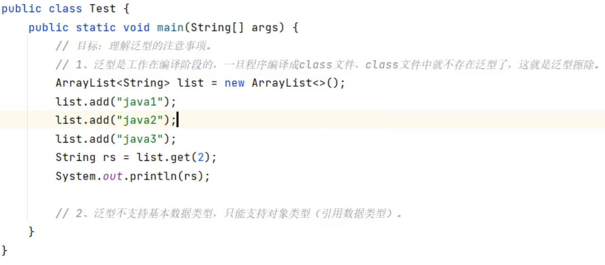

可以看到下面的ArrayList后面就没有泛型。

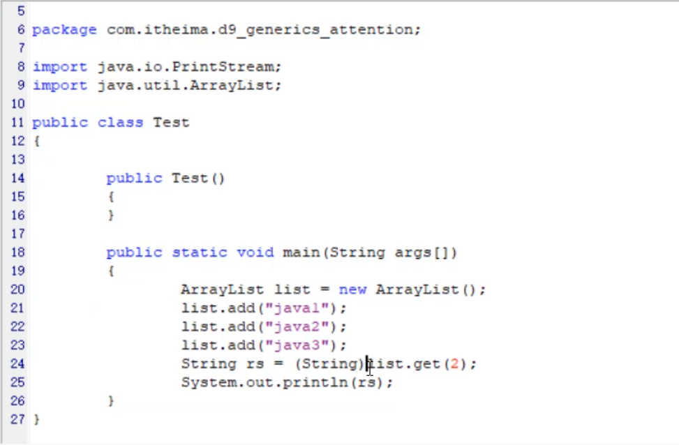

### 3.异常

##### 3.1认识异常

​		什么是异常？异常其实是一些特殊的类，因为写代码时经常会出现问题，Java的设计者们早就设计好了很多个异常类，来描述不同场景下的问题。而有些类是有共性的所以就有了异常的继承体系。

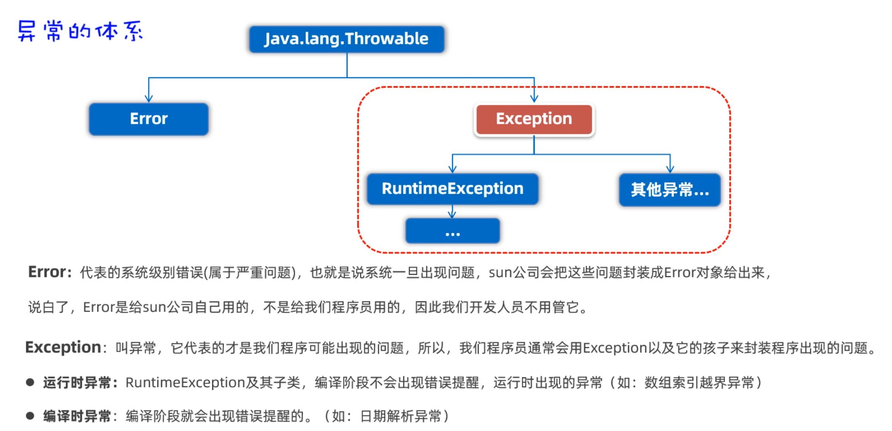

##### 3.2异常处理

​		异常处理有几种方法呢？异常处理有两种方法，第一种是**声明处理**，用throw在方法上声明，告诉调用者这里面可能有异常，需要注意。第二种是用try...catch语句块异常进行处理。

第一种：

```java
/**
 * 目标：认识异常。
 */
public class ExceptionTest1 {
    //throws ParseException可以不写
    public static void main(String[] args) throws ParseException,throws FileNotFoundException{
        //运行时异常;
        System.out.println(1/0);
        
        //编译时异常
        FileOutputStream fos = new FileOutputStream("");
    }
}
```

第二种：

```java
public class ExceptionTest1 {
   
    public static void main(String[] args) {
        //运行时异常;
         try {
            System.out.println(1/0);
        } catch (ParseException e) {
            e.printStackTrace();
        }
         
        //编译时异常
         try {
            FileOutputStream fos = new FileOutputStream("");
        } catch (ParseException e) {
            e.printStackTrace();
        }
    }
}
```

**注意：**一般异常不建议一直声明，因为在main方法里再throw异常的话，最终抛出会被JVM处理掉，程序会异常终止，并将异常信息展示给用户看，影响用户体验。

##### 3.3自定义异常

​		先写一个异常类AgeIllegalException，继承于Exception

```java
// 1、必须让这个类继承自Exception，才能成为一个编译时异常类。
public class AgeIllegalException extends Exception{
    public AgeIllegalException() {
    }

    public AgeIllegalException(String message) {
        super(message);
    }
}
```

​		再写一个测试类，在测试类中定义一个saveAge(int age)方法，对age判断如果年龄不在0~150之间，就抛出一个AgeIllegalException异常对象给调用者。

```java
public class ExceptionTest2 {
    public static void main(String[] args) {
        // 需求：保存一个合法的年
        try {
            saveAge2(225);
            System.out.println("saveAge2底层执行是成功的！");
        } catch (AgeIllegalException e) {
            e.printStackTrace();
            System.out.println("saveAge2底层执行是出现bug的！");
        }
    }

	//2、在方法中对age进行判断，不合法则抛出AgeIllegalException
    public static void saveAge(int age){
        if(age > 0 && age < 150){
            System.out.println("年龄被成功保存： " + age);
        }else {
            // 用一个异常对象封装这个问题
            // throw 抛出去这个异常对象
            throw new AgeIllegalRuntimeException("/age is illegal, your age is " + age);
        }
    }
}
```

**注意：**

+ 1.如果自定义异常类继承Excpetion，则是编译时异常。
  	特点：方法中抛出的是编译时异常，必须在方法上使用throws声明，强制调用者处理。
+ 2.如果自定义异常类继承RuntimeException，则运行时异常。
  	特点：方法中抛出的是运行时异常，不需要在方法上用throws声明。

### 4.常用API

​		什么是API？ API（Application Programming interface）意思是应用程序编程接口，说人话就是Java帮我们写好的一些程序，如：类、方法等，我们直接拿过来用就可以解决一些问题。

​		下面是Object的toString方法和equals方法。

```java
public String toString()
   	返回对象的字符串表示形式。默认的格式是：“包名.类名@哈希值16进制”
   	【子类重写后，返回对象的属性值】
   	
public boolean equals(Object o)
    判断此对象与参数对象是否"相等"。默认比较对象的地址值，和"=="没有区别
    【子类重写后，比较对象的属性值】
```

##### 4.1 clone() 方法

​		什么是clone()方法？意思就是某一个对象调用这个方法，这个方法会复制一个一模一样的新对象，并返回。

```
public Object clone()
    克隆当前对象，返回一个新对象
```

​		想要实现克隆方法，必须让被克隆的类实现Cloneable接口。如我们准备克隆User类的对象，代码如下

```java
public class User implements Cloneable{
    private String id; //编号
    private String username; //用户名
    private String password; //密码
    private double[] scores; //分数

    public User() {
    }

    public User(String id, String username, String password, double[] scores) {
        this.id = id;
        this.username = username;
        this.password = password;
        this.scores = scores;
    }

    //...get和set...方法自己加上

    @Override
    protected Object clone() throws CloneNotSupportedException {
        return super.clone();
    }
}
```

​		接着，写一个测试类，克隆User类的对象。并观察打印的结果

```java
public class Test {
    public static void main(String[] args) throws CloneNotSupportedException {
        User u1 = new User(1,"zhangsan","wo666",new double[]{99.0,99.5});
		//调用方法克隆得到一个新对象
        User u2 = (User) u1.clone();
        System.out.println(u2.getId());
        System.out.println(u2.getUsername());
        System.out.println(u2.getPassword());
        System.out.println(u2.getScores()); 
    }
}
```

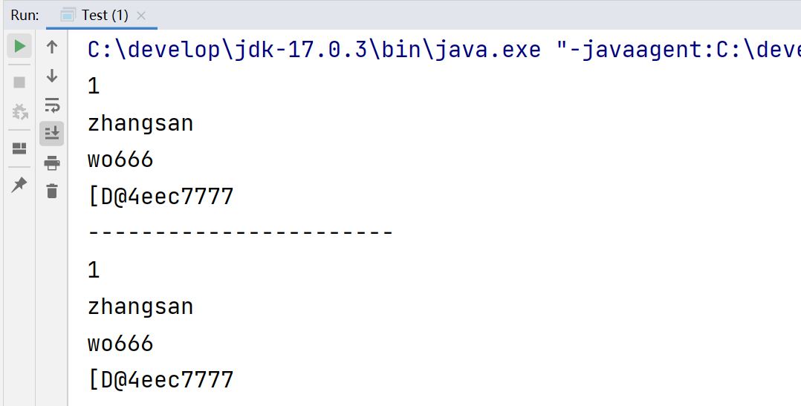

​		可以发现克隆出来的对象属性值和调用者是一样的，而且地址值也是一样，这样的就是浅克隆。浅克隆的意思：**拷贝出来的对象封装的数据与原对象封装的数据一模一样（引用类型拷贝的是地址值）**

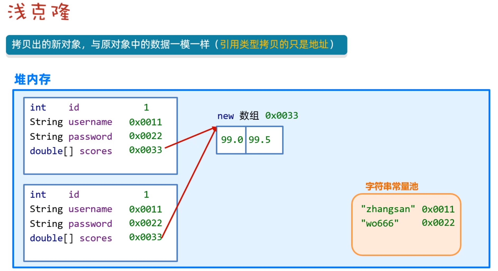

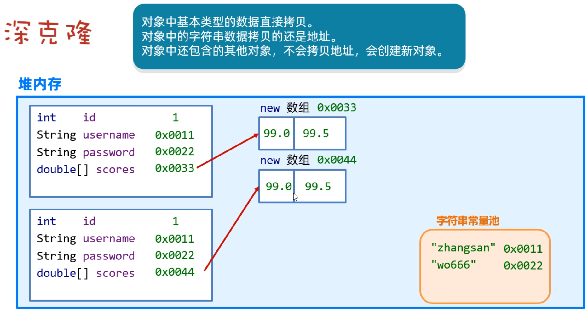

​		下面来深拷贝User对象：

```java
public class User implements Cloneable{
    private String id; //编号
    private String username; //用户名
    private String password; //密码
    private double[] scores; //分数

    public User() {
    }

    public User(String id, String username, String password, double[] scores) {
        this.id = id;
        this.username = username;
        this.password = password;
        this.scores = scores;
    }

    //...get和set...方法自己加上

	@Override
    protected Object clone() throws CloneNotSupportedException {
        //先克隆得到一个新对象
        User u = (User) super.clone();
        //再将新对象中的引用类型数据，再次克隆
        u.scores = u.scores.clone();
        return u;
    }
}
```

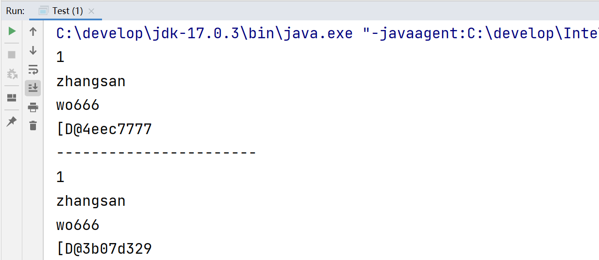

​		可以发现虽然属性值一样，但是地址值不同，说明在堆内存中new出了一个对象，把原对象的属性值赋给新对象了。

##### 4.2Objects类

​		Objects是一个工具类，提供了一些方法可以对任意对象进行操作。主要方法如下

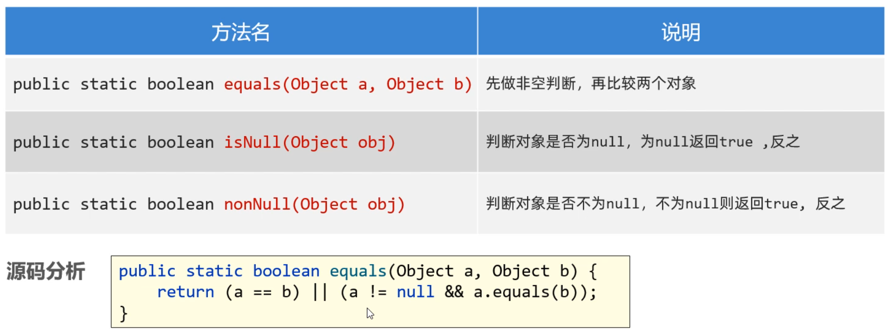

##### 4.3基本类型包装类

​		8种基本数据类型的包装类，如下图：

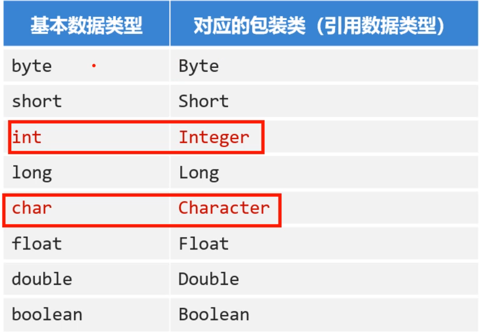

##### 4.4StringBuilder类

- StringBuilder代表可变字符串对象，相当于是一个容器，它里面的字符串是可以改变的，就是用来操作字符串的。
- 好处：StringBuilder比String更合适做字符串的修改操作，效率更高，代码也更加简洁。

##### 4.5  StringJoiner类

​		什么是StringJoiner呢？为什么有了StringBuilder还要学习这个呢？是因为我们前面使用StringBuilder拼接字符串的时，代码写起来还是有一点麻烦，而StringJoiner号称是拼接神器，不仅效率高，而且代码简洁。

​		演示一下StringJoiner的基本使用：

```java
public class Test{
    public static void main(String[] args){
        StringJoiner s = new StringJoiner(",");
        s.add("java1");
        s.add("java2");
        s.add("java3");
        System.out.println(s); //结果为： java1,java2,java3
        
        //参数1：间隔符
        //参数2：开头
        //参数3：结尾
        StringJoiner s1 = new StringJoiner(",","[","]");
        s1.add("java1");
        s1.add("java2");
        s1.add("java3");
        System.out.println(s1); //结果为： [java1,java2,java3]
    }
}
```

​		使用StirngJoiner改写前面把数组转换为字符串的案例

```java
public class Test{
    public static void main(String[] args){
        String str = getArrayData( new int[]{11,22,33});
        System.out.println(str);
    }
    
    //方法作用：将int数组转换为指定格式的字符串
    public static String getArrayData(int[] arr){
        //1.判断数组是否为null
        if(arr==null){
            return null;
        }
        //2.如果数组不为null，再遍历，并拼接数组中的元素
        StringJoiner s = new StringJoiner(", ","[","]");
        for(int i=0; i<arr.length; i++){
            //加""是因为add方法的参数要的是String类型
            s.add(String.valueOf(arr[i]));
        }
        //3、把StringJoiner转换为String，并返回。
        return s.toString();
    }
}
```

### 5.常用API(二)

##### 5.1Math类

​		Math类都是对于数字进行操作的类，大概方法如下：

```java
public class MathTest {
    public static void main(String[] args) {
        // 目标：了解下Math类提供的常见方法。
        // 1、public static int abs(int a)：取绝对值（拿到的结果一定是正数）
        //    public static double abs(double a)
        System.out.println(Math.abs(-12)); // 12
        System.out.println(Math.abs(123)); // 123
        System.out.println(Math.abs(-3.14)); // 3.14

        // 2、public static double ceil(double a): 向上取整
        System.out.println(Math.ceil(4.0000001)); // 5.0
        System.out.println(Math.ceil(4.0)); // 4.0

        // 3、public static double floor(double a): 向下取整
        System.out.println(Math.floor(4.999999)); // 4.0
        System.out.println(Math.floor(4.0)); // 4.0

        // 4、public static long round(double a)：四舍五入
        System.out.println(Math.round(3.4999)); // 3
        System.out.println(Math.round(3.50001)); // 4

        // 5、public static int max(int a, int b)：取较大值
        //   public static int min(int a, int b)：取较小值
        System.out.println(Math.max(10, 20)); // 20
        System.out.println(Math.min(10, 20)); // 10

        // 6、 public static double pow(double a, double b)：取次方
        System.out.println(Math.pow(2, 3)); // 2的3次方   8.0
        System.out.println(Math.pow(3, 2)); // 3的2次方   9.0

        // 7、public static double random()： 取随机数 [0.0 , 1.0) (包前不包后)
        System.out.println(Math.random());
    }
}
```

##### 5.2System类

​		System是什么？System类是系统类，提供了一些获取获取系统数据的方法。

```java
 // 1、public static void exit(int status):
        //    终止当前运行的Java虚拟机。
        //    该参数用作状态代码; 按照惯例，非零状态代码表示异常终止。
        System.exit(0);
        //// 2、public static long currentTimeMillis():
        //      获取当前系统的时间
        //      返回的是long类型的时间毫秒值：指的是从1970-1-1 0:0:0开始走到此刻的总的毫秒值，1s = 1000ms
        long l = System.currentTimeMillis();
```


##### 5.3RunTime类

​		什么是Runtime类？这个类可以用来获取JVM的一些信息，也可以用这个类去执行其他的程序。

```java
public class RuntimeTest {
    public static void main(String[] args) throws IOException, InterruptedException {

        // 1、public static Runtime getRuntime() 返回与当前Java应用程序关联的运行时对象。
        Runtime r = Runtime.getRuntime();

        // 2、public void exit(int status) 终止当前运行的虚拟机,该参数用作状态代码; 按照惯例，非零状态代码表示异常终止。
        // r.exit(0);

        // 3、public int availableProcessors(): 获取虚拟机能够使用的处理器数。
        System.out.println(r.availableProcessors());

        // 4、public long totalMemory() 返回Java虚拟机中的内存总量。
        System.out.println(r.totalMemory()/1024.0/1024.0 + "MB"); // 1024 = 1K     1024 * 1024 = 1M

        // 5、public long freeMemory() 返回Java虚拟机中的可用内存量
        System.out.println(r.freeMemory()/1024.0/1024.0 + "MB");

        // 6、public Process exec(String command) 启动某个程序，并返回代表该程序的对象。
        // r.exec("D:\\soft\\XMind\\XMind.exe");
        Process p = r.exec("QQ");
        Thread.sleep(5000); // 让程序在这里暂停5s后继续往下走！！
        p.destroy(); // 销毁！关闭程序！
    }
}
```

##### 5.4BigDecimal类

​		什么是BigDecimal类？BigDecimal类可以解决计算精度损失的问题，提供了一些方法可以对数据进行四则运算，而且不丢失精度，同时还可以保留指定的小数位。

```java
public class Test2 {
    public static void main(String[] args) {
        // 目标：掌握BigDecimal进行精确运算的方案。
        double a = 0.1;
        double b = 0.2;

        // 1、把浮点型数据封装成BigDecimal对象，再来参与运算。
        // a、public BigDecimal(double val) 得到的BigDecimal对象是无法精确计算浮点型数据的。 注意：不推荐使用这个，
        // b、public BigDecimal(String val)  得到的BigDecimal对象是可以精确计算浮点型数据的。 可以使用。
        // c、public static BigDecimal valueOf(double val): 通过这个静态方法得到的BigDecimal对象是可以精确运算的。是最好的方案。
        BigDecimal a1 = BigDecimal.valueOf(a);
        BigDecimal b1 = BigDecimal.valueOf(b);

        // 2、public BigDecimal add(BigDecimal augend): 加法
        BigDecimal c1 = a1.add(b1);
        System.out.println(c1);

        // 3、public BigDecimal subtract(BigDecimal augend): 减法
        BigDecimal c2 = a1.subtract(b1);
        System.out.println(c2);

        // 4、public BigDecimal multiply(BigDecimal augend): 乘法
        BigDecimal c3 = a1.multiply(b1);
        System.out.println(c3);

        // 5、public BigDecimal divide(BigDecimal b): 除法
        BigDecimal c4 = a1.divide(b1);
        System.out.println(c4);

//        BigDecimal d1 = BigDecimal.valueOf(0.1);
//        BigDecimal d2 = BigDecimal.valueOf(0.3);
//        BigDecimal d3 = d1.divide(d2);
//        System.out.println(d3);

        // 6、public BigDecimal divide(另一个BigDecimal对象，精确几位，舍入模式) : 除法，可以设置精确几位。
        BigDecimal d1 = BigDecimal.valueOf(0.1);
        BigDecimal d2 = BigDecimal.valueOf(0.3);
        BigDecimal d3 = d1.divide(d2,  2, RoundingMode.HALF_UP);  
        System.out.println(d3);

        // 7、public double doubleValue() : 把BigDecimal对象又转换成double类型的数据。
        //print(d3);
        //print(c1);
        double db1 = d3.doubleValue();
        double db2 = c1.doubleValue();
        print(db1);
        print(db2);
    }

    public static void print(double a){
        System.out.println(a);
    }
}
```

##### 5.5Date类

​		什么是Date类，Date类的对象用来表示日期或者时间，Date对象记录的时间是用毫秒值来表示的。Java语言规定，1970年1月1日0时0分0秒认为是时间的起点，此时记作0，那么1000（1秒=1000毫秒）就表示1970年1月1日0时0分1秒，依次内推。

​		下面是Date类的构造方法，和常见的成员方法，

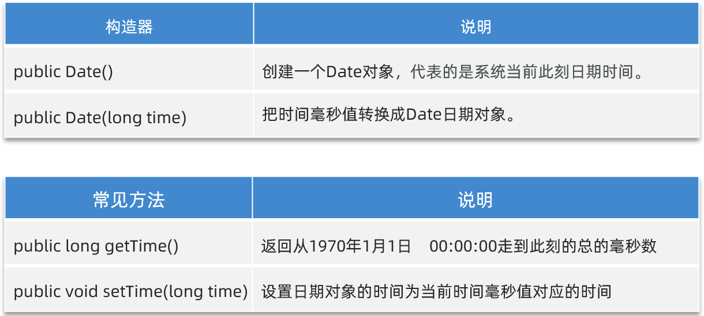

```java
public class Test1Date {
    public static void main(String[] args) {
        // 目标：掌握Date日期类的使用。
        // 1、创建一个Date的对象：代表系统当前时间信息的。
        Date d = new Date();
        System.out.println(d);

        // 2、拿到时间毫秒值。
        long time = d.getTime();
        System.out.println(time);

        // 3、把时间毫秒值转换成日期对象： 2s之后的时间是多少。
        time += 2 * 1000;
        Date d2 = new Date(time);
        System.out.println(d2);

        // 4、直接把日期对象的时间通过setTime方法进行修改
        Date d3 = new Date();
        d3.setTime(time);
        System.out.println(d3);
    }
}
```

##### 5.6  SimpleDateFormat类

​		SimpleDateFormat类就可以转换Date对象表示日期时间的显示格式。

- 我们把Date对象转换为指定格式的日期字符串这个操作，叫做**日期格式化，**

- 反过来把指定格式的日期符串转换为Date对象的操作，叫做**日期解析。**

  ​		日期格式化需要用到下面几个方法：

  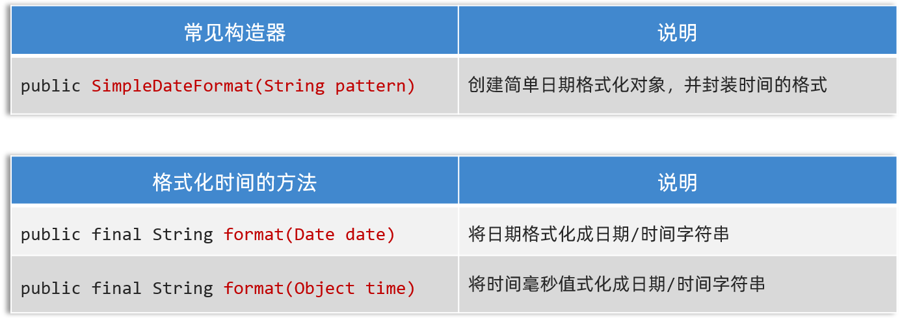

​		**注意：创建SimpleDateFormat对象时，在构造方法的参数位置传递日期格式，而日期格式是由一些特定的字母拼接而来的。**

```java
字母	   表示含义
yyyy	年
MM		月
dd		日
HH		时
mm		分
ss		秒
SSS		毫秒

"2022年12月12日" 的格式是 "yyyy年MM月dd日"
"2022-12-12 12:12:12" 的格式是 "yyyy-MM-dd HH:mm:ss"
按照上面的格式可以任意拼接，但是字母不能写错
```

##### 5.7Calendar类

​		Calendar类是一个和日期相关的类，它是Calendar类。Calendar类表示日历，它提供了一些比Date类更好用的方法。

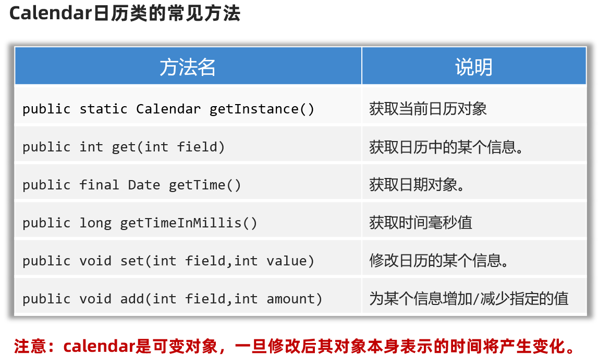

```java
public class Test4Calendar {
    public static void main(String[] args) {
        // 目标：掌握Calendar的使用和特点。
        // 1、得到系统此刻时间对应的日历对象。
        Calendar now = Calendar.getInstance();
        System.out.println(now);

        // 2、获取日历中的某个信息
        int year = now.get(Calendar.YEAR);
        System.out.println(year);

        int days = now.get(Calendar.DAY_OF_YEAR);
        System.out.println(days);

        // 3、拿到日历中记录的日期对象。
        Date d = now.getTime();
        System.out.println(d);

        // 4、拿到时间毫秒值
        long time = now.getTimeInMillis();
        System.out.println(time);

        // 5、修改日历中的某个信息
        now.set(Calendar.MONTH, 9); // 修改月份成为10月份。
        now.set(Calendar.DAY_OF_YEAR, 125); // 修改成一年中的第125天。
        System.out.println(now);

        // 6、为某个信息增加或者减少多少
        now.add(Calendar.DAY_OF_YEAR, 100);
        now.add(Calendar.DAY_OF_YEAR, -10);
        now.add(Calendar.DAY_OF_MONTH, 6);
        now.add(Calendar.HOUR, 12);
        now.set(2026, 11, 22);
        System.out.println(now);
    }
}
```

### 6.File类

​		什么是File类？File类用来表示当前系统下的文件 (也可以是文件夹) ，通过File类提供的方法可以获取文件大小、判断文件是否存在、创建文件、创建文件夹等。

​		**但是需要我们注意：**File对象只能对文件进行操作，不能操作文件中的内容。

##### 6.1File对象的创建

​		File类的构造方法如下：

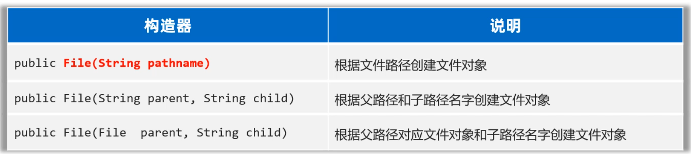

```java
/**
 * 目标：掌握File创建对象，代表具体文件的方案。
 */
public class FileTest1 {
    public static void main(String[] args) {
        // 1、创建一个File对象，指代某个具体的文件。
        // 路径分隔符
        // File f1 = new File("D:/resource/ab.txt");
        // File f1 = new File("D:\\resource\\ab.txt");
        File f1 = new File("D:" + File.separator +"resource" + File.separator + "ab.txt");
        System.out.println(f1.length()); // 文件大小

        File f2 = new File("D:/resource");
        System.out.println(f2.length());

        // 注意：File对象可以指代一个不存在的文件路径
        File f3 = new File("D:/resource/aaaa.txt");
        System.out.println(f3.length());
        System.out.println(f3.exists()); // false

        // 我现在要定位的文件是在模块中，应该怎么定位呢？
        // 绝对路径：带盘符的
        // File f4 = new File("D:\\code\\javasepromax\\file-io-app\\src\\itheima.txt");
        // 相对路径（重点）：不带盘符，默认是直接去工程下寻找文件的。
        File f4 = new File("file-io-app\\src\\itheima.txt");
        System.out.println(f4.length());
    }
}
```

​		**注意：**路径中"\"要写成"\\"， 路径中"/"可以直接用。

##### 6.2File判断和获取方法

​		File类种提供许多方法，用于判断File对象中封装的对象是否存在，如下图：

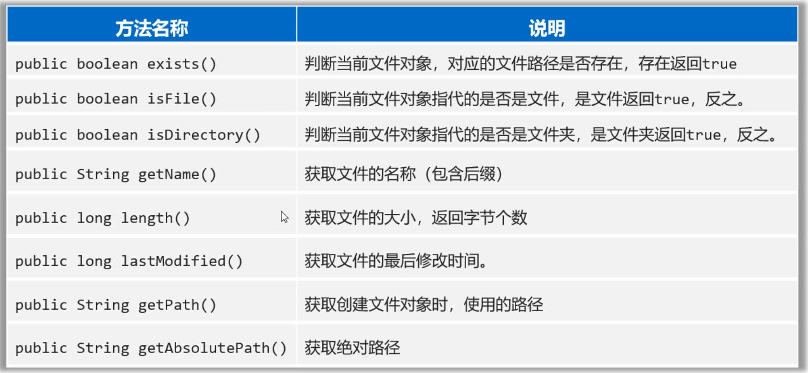

```java
/**
     目标：掌握File提供的判断文件类型、获取文件信息功能
 */
public class FileTest2 {
    public static void main(String[] args) throws UnsupportedEncodingException {
        // 1.创建文件对象，指代某个文件
        File f1 = new File("D:/resource/ab.txt");
        //File f1 = new File("D:/resource/");

        // 2、public boolean exists()：判断当前文件对象，对应的文件路径是否存在，存在返回true.
        System.out.println(f1.exists());

        // 3、public boolean isFile() : 判断当前文件对象指代的是否是文件，是文件返回true，反之。
        System.out.println(f1.isFile());

        // 4、public boolean isDirectory()  : 判断当前文件对象指代的是否是文件夹，是文件夹返回true，反之。
        System.out.println(f1.isDirectory());
    }
}
```

​		还有一些获取的功能，如下：

```java
File f1 = new File("D:/resource/ab.txt");

// 5.public String getName()：获取文件的名称（包含后缀）
System.out.println(f1.getName());

// 6.public long length()：获取文件的大小，返回字节个数
System.out.println(f1.length());

// 7.public long lastModified()：获取文件的最后修改时间。
long time = f1.lastModified();
SimpleDateFormat sdf = new SimpleDateFormat("yyyy/MM/dd HH:mm:ss");
System.out.println(sdf.format(time));

// 8.public String getPath()：获取创建文件对象时，使用的路径
File f2 = new File("D:\\resource\\ab.txt");
File f3 = new File("file-io-app\\src\\itheima.txt");
System.out.println(f2.getPath());
System.out.println(f3.getPath());

// 9.public String getAbsolutePath()：获取绝对路径
System.out.println(f2.getAbsolutePath());
System.out.println(f3.getAbsolutePath());
```

##### 6.3File创建和删除方法

```java
/**
 * 目标：掌握File创建和删除文件相关的方法。
 */
public class FileTest3 {
    public static void main(String[] args) throws Exception {
        // 1、public boolean createNewFile()：创建一个新文件（文件内容为空），创建成功返回true,反之。
        File f1 = new File("D:/resource/itheima2.txt");
        System.out.println(f1.createNewFile());

        // 2、public boolean mkdir()：用于创建文件夹，注意：只能创建一级文件夹
        File f2 = new File("D:/resource/aaa");
        System.out.println(f2.mkdir());

        // 3、public boolean mkdirs()：用于创建文件夹，注意：可以创建多级文件夹
        File f3 = new File("D:/resource/bbb/ccc/ddd/eee/fff/ggg");
        System.out.println(f3.mkdirs());

        // 3、public boolean delete()：删除文件，或者空文件，注意：不能删除非空文件夹。
        System.out.println(f1.delete());
        System.out.println(f2.delete());
        File f4 = new File("D:/resource");
        System.out.println(f4.delete());
    }
}
```

**注意：**

​		1.mkdir(): 只能创建单级文件夹。
​		2.mkdirs(): 才能创建多级文件夹。
​		3.delete(): 文件可以直接删除，但是文件夹只能删除空的文件夹，文件夹有内容删除不了。

##### 6.4遍历文件夹方法

​		熟悉并掌握遍历文件夹的方法，遍历前思考一下遍历以及判断的流程！

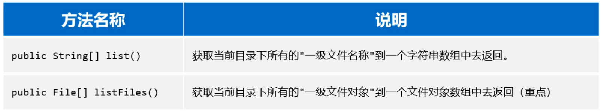

```java
/**
 * 目标：掌握File提供的遍历文件夹的方法。
 */
public class FileTest4 {
    public static void main(String[] args) {
        // 1、public String[] list()：获取当前目录下所有的"一级文件名称"到一个字符串数组中去返回。
        File f1 = new File("D:\\course\\待研发内容");
        String[] names = f1.list();
        for (String name : names) {
            System.out.println(name);
        }

        // 2、public File[] listFiles():（重点）获取当前目录下所有的"一级文件对象"到一个文件对象数组中去返回（重点）
        File[] files = f1.listFiles();
        for (File file : files) {
            System.out.println(file.getAbsolutePath());
        }

        File f = new File("D:/resource/aaa");
        File[] files1 = f.listFiles();
        System.out.println(Arrays.toString(files1));
    }
}
```

**注意：**

​		1.当主调是文件时，或者路径不存在时，返回null
​		2.当主调是空文件夹时，返回一个长度为0的数组
​		3.当主调是一个有内容的文件夹时，将里面所有一级文件和文件夹路径放在File数组中，并把数组返回
​		4.当主调是一个文件夹，且里面有隐藏文件时，将里面所有文件和文件夹的路径放在File数组中，包含隐藏文件
​		5.当主调是一个文件夹，但是没有权限访问时，返回null
